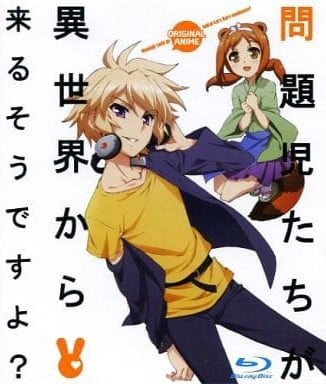
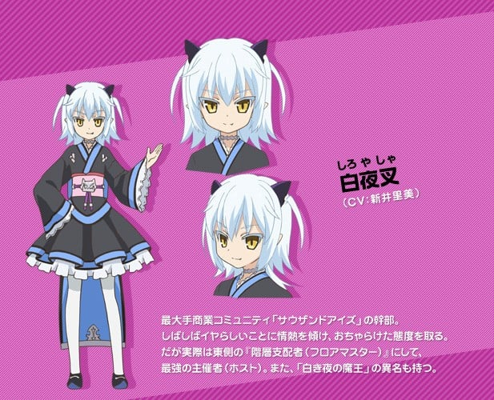
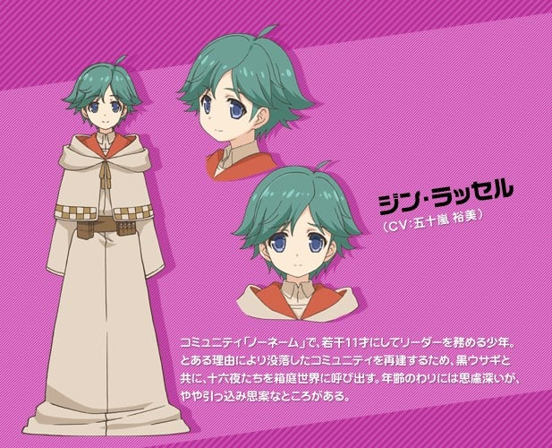
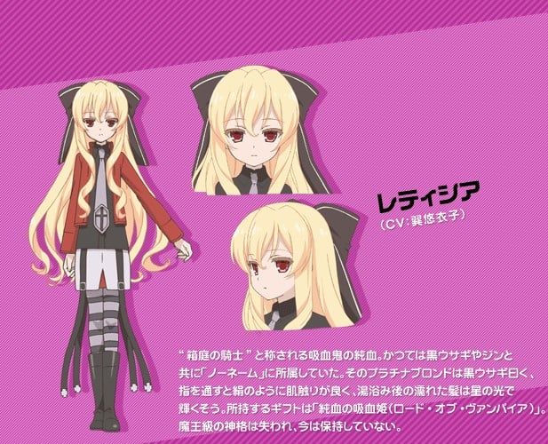

> [!bookinfo|noicon]+ **问题儿童都来自异世界？ OAD**
> 
>
| 日文名 | 問題児たちが異世界から来るそうですよ? OAD |
|:------: |:------------------------------------------: |
| 类型 | 小说改 |
| 新番 | 2013 年 7 月 |
| 集数 | 共1话 |
| 官网 |  |
| 制作 | diomedéa |
| 导演 | 山本靖貴 |
| 脚本 | 白根秀樹 |
| 评分 | 6.4|
| 制片人 | 關山晃弘 |

> [!abstract]+ **简介**
> 白夜叉からの招待を受け、コミュニティ「スクナビコナ」のゲームに参加する十六夜たち。たどり着いた温泉街では、枯渇した水源を復活させるゲームが催されていた。クリアして温泉を堪能しようと意気込むが、難問珍問が、飛鳥に！耀に！黒ウサギの前に立ちハダカる!? 

> [!tip]+ **章节列表**
>- [ ] 第1话：问题儿童都来自异世界? 〜温泉漫游记〜 (2013-07-21)

> [!tip]+ **主要角色**
> 
| 角色 | CV | 简介| 角色图片 |
|:----:|:---:|:---:|:--------:|
| 逆廻十六夜 | 浅沼晋太郎 | 問題児その１ とにかく何でも拳で倒す、傲岸不遜な少年。彼のギフトネームは"正体不明（コード・アンノウン）"と呼ばれ、他人のギフトを砕くというこの世界ではありえない力を持っている。 来到箱庭的问题儿童之一。17岁。持有恩赐为真相不明（Code Unknown），恩赐卡（正式名称是「拉普拉斯纸片」）是钴蓝色。 |  |
| 久遠飛鳥 | ブリドカットセーラ恵美 | 問題児その２ 美貌のお嬢さま。彼女のギフトネームは"威光"と呼ばれ、発した言葉で相手やギフトを操ることができる。ただし格下の相手やアイテムにしか通用しない。 来到箱庭的问题儿童之一。15岁，来自194x年的日本。持有恩赐为威光，恩赐卡是酒红色。 |  |
| 春日部耀 | 中島愛 | 問題児その３ 動物と話すことができる無口な少女。ギフトネームは"生命の目録（ゲノム・ツリー）"と"ノーフォーマー"。"生命の目録（ゲノム・ツリー）"は耀の父親が作ったらしく、謎に包まれている。 来到箱庭的问题儿童之一。14岁。持有恩赐为‘生命目录（Genome Tree）、‘No Former，恩赐卡是祖母绿色。 |  |
| 黒ウサギ | 野水伊織 | 容姿端麗・天真爛漫・強靭不屈で献身的という何処かの誰かの愛玩趣味を詰め込んだような種族である、黒ウサギ。問題児たちを異世界に呼んじゃった張本人。  把十六夜等3人召唤至箱庭世界的人。帝释天的眷属—被称「箱庭贵族」月兔后人，具有名为「审判权限」的特权。被当作赏玩用的小动物。使用力量时发色及兔耳会改变颜色，一般是蓝色转变成粉红色，使用因陀罗之矛时进而变成蓝色。 |  |
| リリ | 三上枝織 | 代掌管共同体农田家系之狐狸一族。祖先是宇迦之御魂神的眷属，拥有其所赐予的神格。母亲继承了神格，在三年前被魔王夺走。 |  |
| 白夜叉 | 新井里美 | 白夜魔王——太阳与白夜的星灵。东区的阶层支配者。常常在‘No Name’陷入危机时伸出援手。五卷时辞掉了东区的阶层支配者的职务取回了封印的力量。未解放力量的情况下外型为和服萝莉但在取回力量后为成熟的美女。性格非常好色，喜欢让黑兔穿各种色色的衣服。 |  |
| ジン・ラッセル | 五十嵐裕美 | No Name’的领导者。11岁。持有恩赐‘精灵役使者’。 |  |
| レーティシア・ドラクレア | 巽悠衣子 | 纯种吸血鬼。三年前被魔王夺走的同伴之一。外型平时为金发萝莉，在某些场合外表会变成大人。 |  |
| アーシャ=イグ=ファトゥス | 積田かよ子 | 地精。在地灾中死亡的自缚灵，被维拉·札·伊格尼法特斯收留，成长为大地精灵。 |  |
| ジャック・オー・ランタン | 速水奨 | 由维拉·札·伊格尼法特斯制作，世界最古老的南瓜鬼怪。 有主办者权限，使用了会招开他的游戏，会现出他的真身，从孩子的朋友南瓜头杰克，变成杀人魔开膛手杰克。 |  |