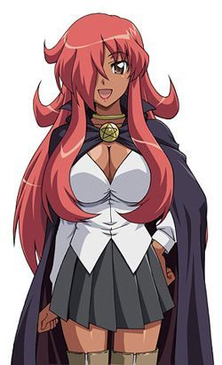
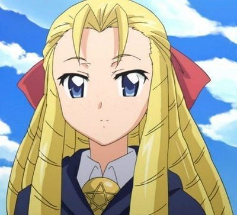

> [!bookinfo|noicon]+ **零之使魔**
> 
>
| 日文名 | ゼロの使い魔 |
|:------: |:------------------------------------------: |
| 类型 | 小说改 |
| 新番 | 2006 年 7 月 |
| 集数 | 共13话 |
| 官网 | [[{'v': 'https://www.zero-tsukaima.com/'}, {'v': 'https://mediafactory.co.jp/anime/zero-tsukaima/zero/index.html'}]](https://[{'v': 'https://www.zero-tsukaima.com/'}, {'v': 'https://mediafactory.co.jp/anime/zero-tsukaima/zero/index.html'}]) |
| 制作 | J.C.STAFF |
| 导演 | 岩崎良明 |
| 脚本 | 吉岡たかを |
| 评分 | 7|
| 制片人 | 松倉友二 |

> [!abstract]+ **简介**
> 　　在异世界哈尔凯尼亚被当作“使魔”被召唤出来的高中生平贺才人卷入了一场满载这四种元素的幻想罗曼史大冒险中。将才人召唤至异世界的是长相可爱却没有丝毫魔法才能的主人样·露易丝。面对突然出现的迷之美少女，满心疑惑的才人在听她讲完契约内容之后，遭遇了突如其来的强吻……之后，他的手背上浮现出了不可思议的文字，才人就这样莫名其妙的成为了露易丝的使魔……
　　以全寄宿制的托丽斯汀魔法学院为舞台，主人样美少女魔法使露易丝与使魔才人在争吵、责备、爱恋中开始了充满了勇气与屈辱的学园生活……在异世界波澜万丈的交流之中，露易丝和才人的命运会怎么样呢？

> [!tip]+ **章节列表**
>- [ ] 第1话：零之露易丝 (2006-07-02)
>- [ ] 第2话：身为平民的使魔 (2006-07-09)
>- [ ] 第3话：微热的诱惑 (2006-07-16)
>- [ ] 第4话：女仆的危机 (2006-07-23)
>- [ ] 第5话：托里斯汀的公主 (2006-07-30)
>- [ ] 第6话：盗贼的真正身份 (2006-08-06)
>- [ ] 第7话：露易丝的打工 (2006-08-13)
>- [ ] 第8话：塔帕莎的秘密 (2006-08-20)
>- [ ] 第9话：露易丝的变心 (2006-08-27)
>- [ ] 第10话：公主的请托 (2006-09-03)
>- [ ] 第11话：露易丝的结婚 (2006-09-10)
>- [ ] 第12话：零之秘宝 (2006-09-17)
>- [ ] 第13话：虚无之露易丝 (2006-09-24)
>- [ ] 第1话：First kiss
>- [ ] 第1话：ホントノキモチ

> [!tip]+ **主要角色**
> 
| 角色 | CV | 简介| 角色图片 |
|:----:|:---:|:---:|:--------:|
| ルイズ・フランソワーズ・ル・ブラン・ド・ラ・ヴァリエール | 釘宮理恵 | 故事的女主角。有着夹杂金色的粉红长发、茶褐色的眼瞳。在特雷丝特因东北拥有领土的名门拉.瓦里艾尔公爵家的三女儿、特雷丝特因魔法学院的二年级学生。因为魔法糟糕而总是被同学取笑。她的每次施法都以失败告终，因为零成功率和零属性，她被戏称为“零之露易兹”。实际上是少见的“虚无”。 |  |
| 平賀才人 | 日野聡 | 平贺才人是故事的男主角，从地球的日本东京来到故事里的世界。在他被露易兹召唤出来的时候，才人正在秋叶原维修他的手提电脑。突然才人面前出现一个通往故事所在世界的入口，当他用手触摸这个空间时即被吸进去。初时，才人完全不知道发生甚么事，而且他和那里的人也语言不通。后来露易兹觉得才人很烦，试图向他施以令他沉默的魔法，虽然施咒失败，却意外地使他能够听懂对方的说话，就像能自动翻译一样；并且使露易兹那边世界的人，能够听得懂才人的语言。才人手上的印记是卢恩字母的 Gandalfr，以平假名写出来是“ガンダールヴ”发音为Gandāruvu。他的印记使他有能力随心操控所有武器，包括剑、火箭炮(正式名称为:M72反战车火箭炮)、零式战机。 |  |
| シエスタ | 堀江由衣 | 学院里服侍贵族学生和一切杂役的女仆，在故事刚登场时与大部分的平民一样畏惧着贵族，在目睹才人在与基修的决斗中英勇的表现，不但有了不再对贵族畏惧的勇气，也因而对才人产生了爱慕之心。  谢丝塔的祖父佐佐木武雄是二战期间日本海军少尉，在执行任务期间因不明原因连同所驾驶的零战一起被传送到哈尔克基尼亚这个世界来，在找不到回去的方法后在零战迫降的村落落地生根终老，也因此谢丝塔可说是日本与特雷丝特尼亚的混血儿。  谢丝塔的本性善良温和，但只要牵扯到与才人恋爱有关的事物，就会展现出平时没有的积极甚至可以称之为激烈的性格，由于身材不输给丘鲁克，且因有日本血统和日本女性的外貌，在思乡情结的才人眼中特别有亲近感觉，也因此在众女角中一直被露易丝视为强大的竞争对手。 |  |
| キュルケ・アウグスタ・フレデリカ・フォン・アンハルツ・ツェルプストー | 井上奈々子 |  |  |
| アンリエッタ・ド・トリステイン | 川澄綾子 | 托里斯汀的公主。她被她的子民们所爱戴，同时她也是露易丝的老朋友。后来，在阿爾比昂的威尔士王子遭到暗杀后，她成为了托里斯汀的女王，并且下定决心要从阿爾比昂的侵略中保卫托里斯汀。 |  |
| タバサ | いのくちゆか | 使用风属性魔法的少女。她是露易丝和齐儿可的同学，亦是齐儿可的好朋友，拥有见习骑士之称号。在整篇故事中一直读著一本书。塔帕莎是她的别名（是她妈妈送给她的玩偶名字），其真名为夏洛特・奥尔良。她妈妈因为要保护塔帕莎而中了水魔法之毒而变得疯癫，所以塔帕莎一直都封闭自己的话语和表情，塔帕莎的父亲是戈里亚国王之弟，原为戈里亚王位正统继承人之一，但在塔帕莎年幼时被刺杀。她的专长是风系魔法。她的使魔风韵龙希儿菲朵可幻化为人形，称塔帕莎为姊姊，本名伊露库库。     小说10集后被才人所救因而喜欢上才人，还被假才人欺骗成为戈里亚国王。小说第18集将王位及“夏洛特”这个身分让给她的双胞胎妹妹——约塞特，现以“塔帕莎”这个身份住在才人的封地。 |  |
| モンモランシー・マルガリタ・ラ・フェール・ド・モンモランシ | 高橋美佳子 | 如同其他托里斯汀的贵族一般，拥有相当高雅的气质。拥有一头金黄色的长卷发，和基修是恋人的关系。同时，她也是露易丝的同班同学。兴趣是制作恢复药，虽然很会游泳，但是因为会弄湿头发，所以并不喜欢。 |  |
| ギーシュ・ド・グラモン | 櫻井孝宏 | 露易丝的同学。父亲则是托里斯汀的元帅。尽管爱上了蒙莫朗西，却是个花花公子，总是不能决定自己喜欢谁。总是带着一枝艺术气质的玫瑰花在身边，花茎同时也是他的魔杖。他相当宠爱他的使魔：一只名为维儿丹蒂的巨大鼹鼠。而他拥有这样的使魔正表示，他的专长是土系魔法。 |  |