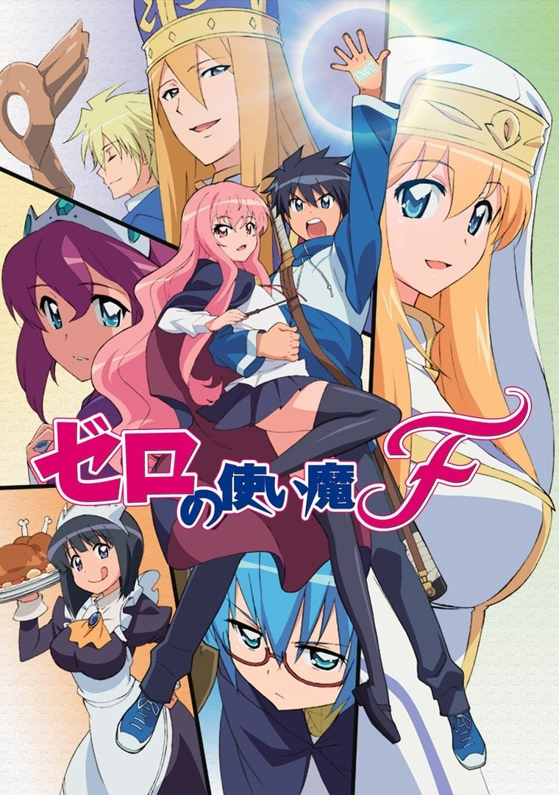
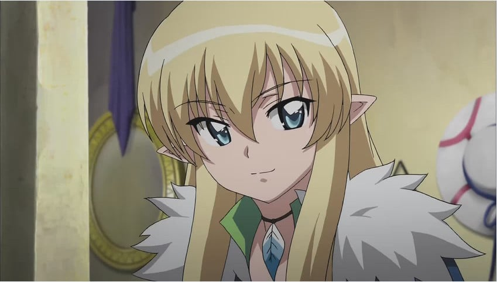

> [!bookinfo|noicon]+ **零之使魔F**
> 
>
| 日文名 | ゼロの使い魔F |
|:------: |:------------------------------------------: |
| 类型 | 小说改 |
| 新番 | 2012 年 1 月 |
| 集数 | 共12话 |
| 官网 | [[{'v': 'https://www.zero-tsukaima.com/'}, {'v': 'https://mediafactory.co.jp/anime/zero-tsukaima/'}]](https://[{'v': 'https://www.zero-tsukaima.com/'}, {'v': 'https://mediafactory.co.jp/anime/zero-tsukaima/'}]) |
| 制作 | J.C.STAFF |
| 导演 | 岩崎良明 |
| 脚本 | 國澤真理子,ヤスカワショウゴ,ヤスカワショウゴ[主脚本]、國澤真理子 |
| 评分 | 6.7|
| 制片人 | 大橋正夫 |

> [!abstract]+ **简介**
> 在异世界“哈尔凯尼亚”，被露易丝当作使魔召唤出来的日本高中生平贺才人被卷入了这个世界的一切。召唤才人出来的是长相可爱但完全没有魔法才能的露易丝。一脸茫然的才人突然被露易丝强吻之后，他的手背出现了一个卢恩字母(符文)，才人自此变成了露易丝的使魔。
故事主要围绕在托里斯汀（即露易丝等人所在的王国）所发生的大小事情，并描述露易丝和才人从最差的主仆关系逐渐亲近的成长过程。

> [!tip]+ **章节列表**
>- [ ] 第1话：圣国的露易丝 (2012-01-07)
>- [ ] 第2话：水都市的巫女 (2012-01-14)
>- [ ] 第3话：无能王的疯狂 (2012-01-21)
>- [ ] 第4话：女王陛下的恩赏 (2012-01-28)
>- [ ] 第5话：德・奥尔尼埃尔的少女们 (2012-02-04)
>- [ ] 第6话：波澜的露天浴池 (2012-02-11)
>- [ ] 第7话：沙漠的精灵 (2012-02-18)
>- [ ] 第8话：逃亡的地下水道 (2012-02-25)
>- [ ] 第9话：塔巴萨的加冕仪式 (2012-03-03)
>- [ ] 第10话：灾难降临 (2012-03-10)
>- [ ] 第11话：露易丝的选择 (2012-03-17)
>- [ ] 第12话：零之使魔 (2012-03-24)

> [!tip]+ **主要角色**
> 
| 角色 | CV | 简介| 角色图片 |
|:----:|:---:|:---:|:--------:|
| ルイズ・フランソワーズ・ル・ブラン・ド・ラ・ヴァリエール | 釘宮理恵 | 故事的女主角。有着夹杂金色的粉红长发、茶褐色的眼瞳。在特雷丝特因东北拥有领土的名门拉.瓦里艾尔公爵家的三女儿、特雷丝特因魔法学院的二年级学生。因为魔法糟糕而总是被同学取笑。她的每次施法都以失败告终，因为零成功率和零属性，她被戏称为“零之露易兹”。实际上是少见的“虚无”。 |  |
| 平賀才人 | 日野聡 | 平贺才人是故事的男主角，从地球的日本东京来到故事里的世界。在他被露易兹召唤出来的时候，才人正在秋叶原维修他的手提电脑。突然才人面前出现一个通往故事所在世界的入口，当他用手触摸这个空间时即被吸进去。初时，才人完全不知道发生甚么事，而且他和那里的人也语言不通。后来露易兹觉得才人很烦，试图向他施以令他沉默的魔法，虽然施咒失败，却意外地使他能够听懂对方的说话，就像能自动翻译一样；并且使露易兹那边世界的人，能够听得懂才人的语言。才人手上的印记是卢恩字母的 Gandalfr，以平假名写出来是“ガンダールヴ”发音为Gandāruvu。他的印记使他有能力随心操控所有武器，包括剑、火箭炮(正式名称为:M72反战车火箭炮)、零式战机。 |  |
| シエスタ | 堀江由衣 | 学院里服侍贵族学生和一切杂役的女仆，在故事刚登场时与大部分的平民一样畏惧着贵族，在目睹才人在与基修的决斗中英勇的表现，不但有了不再对贵族畏惧的勇气，也因而对才人产生了爱慕之心。  谢丝塔的祖父佐佐木武雄是二战期间日本海军少尉，在执行任务期间因不明原因连同所驾驶的零战一起被传送到哈尔克基尼亚这个世界来，在找不到回去的方法后在零战迫降的村落落地生根终老，也因此谢丝塔可说是日本与特雷丝特尼亚的混血儿。  谢丝塔的本性善良温和，但只要牵扯到与才人恋爱有关的事物，就会展现出平时没有的积极甚至可以称之为激烈的性格，由于身材不输给丘鲁克，且因有日本血统和日本女性的外貌，在思乡情结的才人眼中特别有亲近感觉，也因此在众女角中一直被露易丝视为强大的竞争对手。 |  |
| キュルケ・アウグスタ・フレデリカ・フォン・アンハルツ・ツェルプストー | 井上奈々子 |  |  |
| イルククゥ | 井口裕香 |  |  |
| アンリエッタ・ド・トリステイン | 川澄綾子 | 托里斯汀的公主。她被她的子民们所爱戴，同时她也是露易丝的老朋友。后来，在阿爾比昂的威尔士王子遭到暗杀后，她成为了托里斯汀的女王，并且下定决心要从阿爾比昂的侵略中保卫托里斯汀。 |  |
| カトレア・イヴェット・ラ・ボーム・ル・ブラン・ド・ラ・フォンティーヌ |  |  |  |
| タバサ | いのくちゆか | 使用风属性魔法的少女。她是露易丝和齐儿可的同学，亦是齐儿可的好朋友，拥有见习骑士之称号。在整篇故事中一直读著一本书。塔帕莎是她的别名（是她妈妈送给她的玩偶名字），其真名为夏洛特・奥尔良。她妈妈因为要保护塔帕莎而中了水魔法之毒而变得疯癫，所以塔帕莎一直都封闭自己的话语和表情，塔帕莎的父亲是戈里亚国王之弟，原为戈里亚王位正统继承人之一，但在塔帕莎年幼时被刺杀。她的专长是风系魔法。她的使魔风韵龙希儿菲朵可幻化为人形，称塔帕莎为姊姊，本名伊露库库。     小说10集后被才人所救因而喜欢上才人，还被假才人欺骗成为戈里亚国王。小说第18集将王位及“夏洛特”这个身分让给她的双胞胎妹妹——约塞特，现以“塔帕莎”这个身份住在才人的封地。 |  |
| モンモランシー・マルガリタ・ラ・フェール・ド・モンモランシ | 高橋美佳子 | 如同其他托里斯汀的贵族一般，拥有相当高雅的气质。拥有一头金黄色的长卷发，和基修是恋人的关系。同时，她也是露易丝的同班同学。兴趣是制作恢复药，虽然很会游泳，但是因为会弄湿头发，所以并不喜欢。 |  |
| ギーシュ・ド・グラモン | 櫻井孝宏 | 露易丝的同学。父亲则是托里斯汀的元帅。尽管爱上了蒙莫朗西，却是个花花公子，总是不能决定自己喜欢谁。总是带着一枝艺术气质的玫瑰花在身边，花茎同时也是他的魔杖。他相当宠爱他的使魔：一只名为维儿丹蒂的巨大鼹鼠。而他拥有这样的使魔正表示，他的专长是土系魔法。 |  |
| ティファニア・ウエストウッド | 能登麻美子 | 在第三期正式露面的半妖精，她使用了母亲留给她的魔法戒指使才人复活。由于蒂法的父亲是公主殿下的叔父，即作为阿尔比昂的大公，负责管辖索斯格塔地区的那位大人，所以成了公主的堂妹。在动画第三季第四话及小说十二卷之中，在众学生面前披露自己身为半妖精的身份，被库鲁登荷鲁夫大公国的公主殿下“贝儿朵莉丝”在无罗马利亚大教主的审问许可书下向蒂法进行异端审问，才人为了阻止蒂法被审问与“贝儿朵莉丝”求情，之后“基修・杜・格拉蒙”制止才人并告诉才人妨碍审问的话会被当作异端的同伙，会使与自己有关系的人招遇麻烦，才人便向“贝儿朵莉丝”下跪请求不要审问蒂法，“贝儿朵莉丝”不同意，于是才人便对其出手，与其龙骑士团对抗，露易丝正在做美梦被打斗的声音吵醒，出现在众人前用虚无魔法阻止了众人，并且揭穿“贝儿朵莉丝”在无罗马利亚大教主的审问许可书下向蒂法进行异端审问，蒂法不与其计较并说希望能当朋友，之后以本人真诚的性格获得众人的接受。 |  |
| ルクシャナ | 金元寿子 | 精灵族学者，以研究“蛮人（其实是人类）文化”为主要研究科目，比塔夏尔的侄女     阿里的未婚妻，为自己的未婚夫对人类反感感到烦恼，是个好奇心强的人     拥有能够控制植物的能力     动画版第四部第八集，在东方号与比塔夏尔商量后，决定偕同阿里一起跟随才人一行在外避难，与蒙莫兰希等众魔法学院女学生建立了良好关系     动画版第十二话，与露易丝众人协同作战，并与比塔夏尔、阿里在罗马尼亚大圣堂见证露易丝与才人的婚礼。 |  |