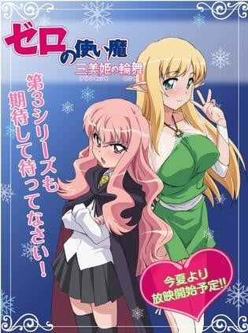

> [!bookinfo|noicon]+ **零之使魔 三美姬的轮舞 OVA**
> 
>
| 日文名 | ゼロの使い魔 ～三美姫の輪舞～OVA |
|:------: |:------------------------------------------: |
| 类型 | 小说改 |
| 新番 | 2008 年 12 月 |
| 集数 | 共1话 |
| 官网 |  |
| 制作 | J.C.STAFF |
| 导演 | 森川滋 |
| 脚本 | 國澤真理子 |
| 评分 | 6.5|
| 制片人 |  |

> [!abstract]+ **简介**
>       魔法学院决定去海边度假？连女王都要来？好色的才人等人怎能放过这么好的机会。可是到了海边，才人才知道露易丝这个世界的泳装是这么的保守。这时，校长以“水精灵”的谎言开始了他们的计划，让她们先穿上了标准游泳衣（虽然不是比基尼，但是能很好的暴露身材）。然后是比基尼，最后让她们开始沙滩排球比赛。两人一组，那一队赢了，就可以穿女巫装。但其实那个女巫装就是用贝壳做成的比基尼（超暴露）。路易斯她们会怎么做呢？

> [!tip]+ **章节列表**
>- [ ] 第1话：诱惑的海滩 (2008-12-25)

> [!tip]+ **主要角色**
> 
| 角色 | CV | 简介| 角色图片 |
|:----:|:---:|:---:|:--------:|
| ルイズ・フランソワーズ・ル・ブラン・ド・ラ・ヴァリエール |  | 故事的女主角。有着夹杂金色的粉红长发、茶褐色的眼瞳。在特雷丝特因东北拥有领土的名门拉.瓦里艾尔公爵家的三女儿、特雷丝特因魔法学院的二年级学生。因为魔法糟糕而总是被同学取笑。她的每次施法都以失败告终，因为零成功率和零属性，她被戏称为“零之露易兹”。实际上是少见的“虚无”。 |  |
| 平賀才人 |  | 平贺才人是故事的男主角，从地球的日本东京来到故事里的世界。在他被露易兹召唤出来的时候，才人正在秋叶原维修他的手提电脑。突然才人面前出现一个通往故事所在世界的入口，当他用手触摸这个空间时即被吸进去。初时，才人完全不知道发生甚么事，而且他和那里的人也语言不通。后来露易兹觉得才人很烦，试图向他施以令他沉默的魔法，虽然施咒失败，却意外地使他能够听懂对方的说话，就像能自动翻译一样；并且使露易兹那边世界的人，能够听得懂才人的语言。才人手上的印记是卢恩字母的 Gandalfr，以平假名写出来是“ガンダールヴ”发音为Gandāruvu。他的印记使他有能力随心操控所有武器，包括剑、火箭炮(正式名称为:M72反战车火箭炮)、零式战机。 |  |
| シエスタ |  | 学院里服侍贵族学生和一切杂役的女仆，在故事刚登场时与大部分的平民一样畏惧着贵族，在目睹才人在与基修的决斗中英勇的表现，不但有了不再对贵族畏惧的勇气，也因而对才人产生了爱慕之心。  谢丝塔的祖父佐佐木武雄是二战期间日本海军少尉，在执行任务期间因不明原因连同所驾驶的零战一起被传送到哈尔克基尼亚这个世界来，在找不到回去的方法后在零战迫降的村落落地生根终老，也因此谢丝塔可说是日本与特雷丝特尼亚的混血儿。  谢丝塔的本性善良温和，但只要牵扯到与才人恋爱有关的事物，就会展现出平时没有的积极甚至可以称之为激烈的性格，由于身材不输给丘鲁克，且因有日本血统和日本女性的外貌，在思乡情结的才人眼中特别有亲近感觉，也因此在众女角中一直被露易丝视为强大的竞争对手。 |  |
| アンリエッタ・ド・トリステイン |  | 托里斯汀的公主。她被她的子民们所爱戴，同时她也是露易丝的老朋友。后来，在阿爾比昂的威尔士王子遭到暗杀后，她成为了托里斯汀的女王，并且下定决心要从阿爾比昂的侵略中保卫托里斯汀。 |  |
| モンモランシー・マルガリタ・ラ・フェール・ド・モンモランシ |  | 如同其他托里斯汀的贵族一般，拥有相当高雅的气质。拥有一头金黄色的长卷发，和基修是恋人的关系。同时，她也是露易丝的同班同学。兴趣是制作恢复药，虽然很会游泳，但是因为会弄湿头发，所以并不喜欢。 |  |
| ティファニア・ウエストウッド |  | 在第三期正式露面的半妖精，她使用了母亲留给她的魔法戒指使才人复活。由于蒂法的父亲是公主殿下的叔父，即作为阿尔比昂的大公，负责管辖索斯格塔地区的那位大人，所以成了公主的堂妹。在动画第三季第四话及小说十二卷之中，在众学生面前披露自己身为半妖精的身份，被库鲁登荷鲁夫大公国的公主殿下“贝儿朵莉丝”在无罗马利亚大教主的审问许可书下向蒂法进行异端审问，才人为了阻止蒂法被审问与“贝儿朵莉丝”求情，之后“基修・杜・格拉蒙”制止才人并告诉才人妨碍审问的话会被当作异端的同伙，会使与自己有关系的人招遇麻烦，才人便向“贝儿朵莉丝”下跪请求不要审问蒂法，“贝儿朵莉丝”不同意，于是才人便对其出手，与其龙骑士团对抗，露易丝正在做美梦被打斗的声音吵醒，出现在众人前用虚无魔法阻止了众人，并且揭穿“贝儿朵莉丝”在无罗马利亚大教主的审问许可书下向蒂法进行异端审问，蒂法不与其计较并说希望能当朋友，之后以本人真诚的性格获得众人的接受。 |  |