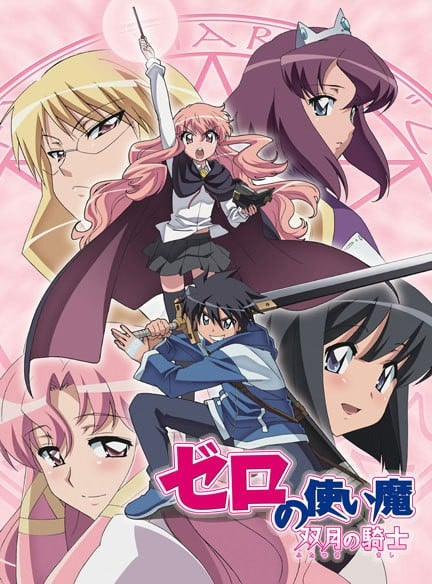
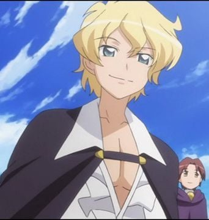
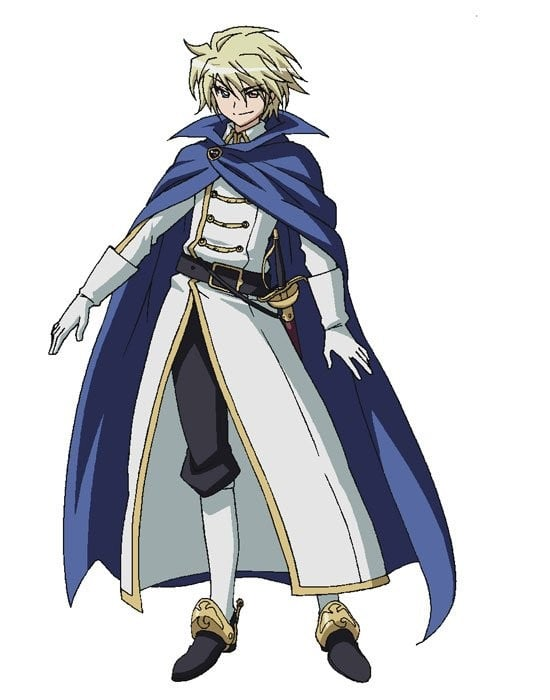
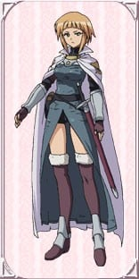

> [!bookinfo|noicon]+ **零之使魔 双月骑士**
> 
>
| 日文名 | ゼロの使い魔 双月の騎士 |
|:------: |:------------------------------------------: |
| 类型 | 小说改 |
| 新番 | 2007 年 7 月 |
| 集数 | 共12话 |
| 官网 | [[{'v': 'https://www.zero-tsukaima.com/'}, {'v': 'https://mediafactory.co.jp/anime/zero-tsukaima/zero2/index.html'}]](https://[{'v': 'https://www.zero-tsukaima.com/'}, {'v': 'https://mediafactory.co.jp/anime/zero-tsukaima/zero2/index.html'}]) |
| 制作 | J.C.STAFF |
| 导演 | 森川滋,紅優 |
| 脚本 | 杉浦真夕,河原ゆうじ,北条千夏 |
| 评分 | 6.9|
| 制片人 | 松倉友二 |

> [!abstract]+ **简介**
> 　　被卷入异世界的才人，一直寻找着回到原来世界的方法。终于有一天，他遇到了能够回到日本的千年一遇的好机会，但是，才人为了拯救陷入危机的主人露依斯，果断地放弃了这个机会留了下来，最终依然选择作为贫乳的使魔生活下去。
　　路易丝认同了才人作为自己一个人的使魔！？虽然过的是成为狗狗，被鞭子伺候的生活，但才人对路易丝的调教依然逆来顺受，静静地享受着鞭子呼啦呼啦的声音。一旦触碰到了御主人样路易丝的禁忌之处，就会遭到了严重的惩罚。这样平和的日子会一直持续下去么……

> [!tip]+ **章节列表**
>- [ ] 第1话：女王殿下的ZERO (2007-07-08)
>- [ ] 第2话：风与水的誓言 (2007-07-15)
>- [ ] 第3话：圣职者之剑 (2007-07-22)
>- [ ] 第4话：瓦利埃尔家三姊妹 (2007-07-29)
>- [ ] 第5话：间谍的刻印 (2007-08-05)
>- [ ] 第6话：女王的假日 (2007-08-12)
>- [ ] 第7话：地底的秘密文书 (2007-08-19)
>- [ ] 第8话：魔法学院的危机 (2007-08-26)
>- [ ] 第9话：炎之赎罪 (2007-09-02)
>- [ ] 第10话：雪岭之敌 (2007-09-09)
>- [ ] 第11话：银之降临祭 (2007-09-16)
>- [ ] 第12话：诀别的婚礼 (2007-09-23)
>- [ ] 第1话：I SAY YES
>- [ ] 第1话：スキ? キライ!? スキ!!!

> [!tip]+ **主要角色**
> 
| 角色 | CV | 简介| 角色图片 |
|:----:|:---:|:---:|:--------:|
| ルイズ・フランソワーズ・ル・ブラン・ド・ラ・ヴァリエール | 釘宮理恵 | 故事的女主角。有着夹杂金色的粉红长发、茶褐色的眼瞳。在特雷丝特因东北拥有领土的名门拉.瓦里艾尔公爵家的三女儿、特雷丝特因魔法学院的二年级学生。因为魔法糟糕而总是被同学取笑。她的每次施法都以失败告终，因为零成功率和零属性，她被戏称为“零之露易兹”。实际上是少见的“虚无”。 |  |
| 平賀才人 | 日野聡 | 平贺才人是故事的男主角，从地球的日本东京来到故事里的世界。在他被露易兹召唤出来的时候，才人正在秋叶原维修他的手提电脑。突然才人面前出现一个通往故事所在世界的入口，当他用手触摸这个空间时即被吸进去。初时，才人完全不知道发生甚么事，而且他和那里的人也语言不通。后来露易兹觉得才人很烦，试图向他施以令他沉默的魔法，虽然施咒失败，却意外地使他能够听懂对方的说话，就像能自动翻译一样；并且使露易兹那边世界的人，能够听得懂才人的语言。才人手上的印记是卢恩字母的 Gandalfr，以平假名写出来是“ガンダールヴ”发音为Gandāruvu。他的印记使他有能力随心操控所有武器，包括剑、火箭炮(正式名称为:M72反战车火箭炮)、零式战机。 |  |
| シエスタ | 堀江由衣 | 学院里服侍贵族学生和一切杂役的女仆，在故事刚登场时与大部分的平民一样畏惧着贵族，在目睹才人在与基修的决斗中英勇的表现，不但有了不再对贵族畏惧的勇气，也因而对才人产生了爱慕之心。  谢丝塔的祖父佐佐木武雄是二战期间日本海军少尉，在执行任务期间因不明原因连同所驾驶的零战一起被传送到哈尔克基尼亚这个世界来，在找不到回去的方法后在零战迫降的村落落地生根终老，也因此谢丝塔可说是日本与特雷丝特尼亚的混血儿。  谢丝塔的本性善良温和，但只要牵扯到与才人恋爱有关的事物，就会展现出平时没有的积极甚至可以称之为激烈的性格，由于身材不输给丘鲁克，且因有日本血统和日本女性的外貌，在思乡情结的才人眼中特别有亲近感觉，也因此在众女角中一直被露易丝视为强大的竞争对手。 |  |
| キュルケ・アウグスタ・フレデリカ・フォン・アンハルツ・ツェルプストー | 井上奈々子 |  |  |
| アンリエッタ・ド・トリステイン | 川澄綾子 | 托里斯汀的公主。她被她的子民们所爱戴，同时她也是露易丝的老朋友。后来，在阿爾比昂的威尔士王子遭到暗杀后，她成为了托里斯汀的女王，并且下定决心要从阿爾比昂的侵略中保卫托里斯汀。 |  |
| カトレア・イヴェット・ラ・ボーム・ル・ブラン・ド・ラ・フォンティーヌ | 山川琴美 |  |  |
| タバサ | いのくちゆか | 使用风属性魔法的少女。她是露易丝和齐儿可的同学，亦是齐儿可的好朋友，拥有见习骑士之称号。在整篇故事中一直读著一本书。塔帕莎是她的别名（是她妈妈送给她的玩偶名字），其真名为夏洛特・奥尔良。她妈妈因为要保护塔帕莎而中了水魔法之毒而变得疯癫，所以塔帕莎一直都封闭自己的话语和表情，塔帕莎的父亲是戈里亚国王之弟，原为戈里亚王位正统继承人之一，但在塔帕莎年幼时被刺杀。她的专长是风系魔法。她的使魔风韵龙希儿菲朵可幻化为人形，称塔帕莎为姊姊，本名伊露库库。     小说10集后被才人所救因而喜欢上才人，还被假才人欺骗成为戈里亚国王。小说第18集将王位及“夏洛特”这个身分让给她的双胞胎妹妹——约塞特，现以“塔帕莎”这个身份住在才人的封地。 |  |
| モンモランシー・マルガリタ・ラ・フェール・ド・モンモランシ | 高橋美佳子 | 如同其他托里斯汀的贵族一般，拥有相当高雅的气质。拥有一头金黄色的长卷发，和基修是恋人的关系。同时，她也是露易丝的同班同学。兴趣是制作恢复药，虽然很会游泳，但是因为会弄湿头发，所以并不喜欢。 |  |
| ギーシュ・ド・グラモン | 櫻井孝宏 | 露易丝的同学。父亲则是托里斯汀的元帅。尽管爱上了蒙莫朗西，却是个花花公子，总是不能决定自己喜欢谁。总是带着一枝艺术气质的玫瑰花在身边，花茎同时也是他的魔杖。他相当宠爱他的使魔：一只名为维儿丹蒂的巨大鼹鼠。而他拥有这样的使魔正表示，他的专长是土系魔法。 |  |
| ジュリオ·チェザーレ | 平川大輔 | 双月骑士中登场的罗马利亚转学生，是传说中虚无使魔神之右手温道夫。特征为双眼不同色，左眼是跟露易丝相近的红色， 右眼则是清澄透明的蓝色，身为平民出身的他并不会魔法，但操控龙的技术无人可及（神之右手能操控任何的野兽，所以应该不受限于龙）。 |  |
| エレオノール・アルベルティーヌ・ル・ブラン・ド・ラ・ブロワ・ド・ラ・ヴァリエール | 井上喜久子 | 露易丝的大姐。 她比露易丝大11岁。 她有一张像她父亲一样严厉的脸，但很美丽。 她的头发是金黄色的，像她父亲一样。 她性格严厉，有男人的气质。 她是露易丝绝对疯狂地爱着的人之一。 王立魔法研究所 "学院 "的优秀研究人员。 |  |
| アニエス・シュヴァリエ・ド・ミラン | 根谷美智子 | 火枪士队队长，领导著一支只有女性的部队，相当擅长使用剑和枪。 原本是个平民，不过，因为某些事件以能得到骑士的称号，成为贵族，是一个效忠于女王的"剑"。 |  |