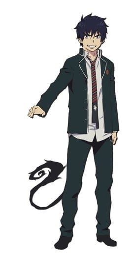
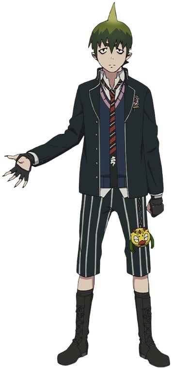
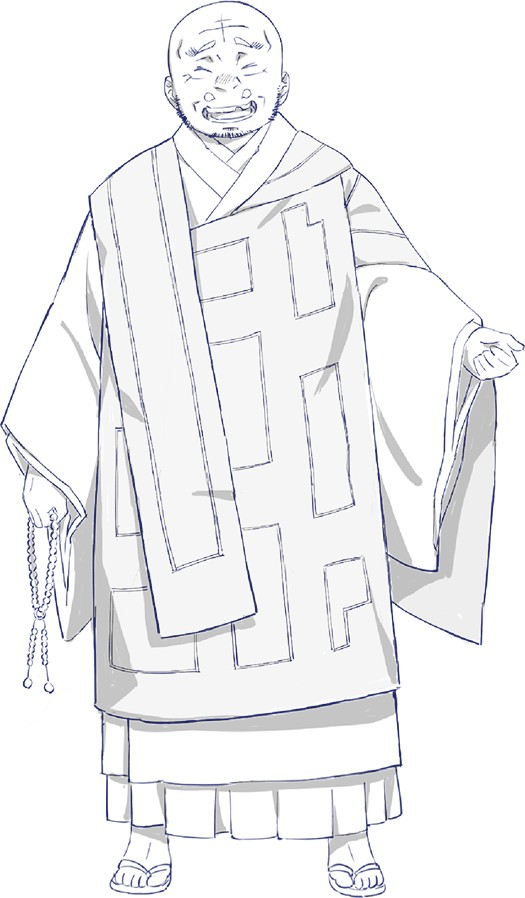
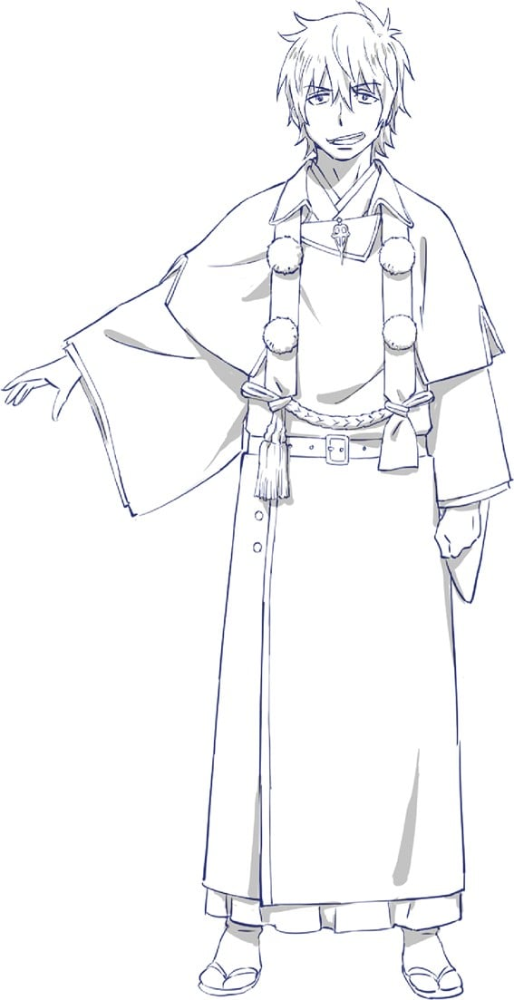

> [!bookinfo|noicon]+ **青之驱魔师 OAD**
> 
>
| 日文名 | 青の祓魔師 OAD |
|:------: |:------------------------------------------: |
| 类型 | 漫改 |
| 新番 | 2017 年 4 月 |
| 集数 | 共2话 |
| 官网 |  |
| 制作 | A-1 Pictures |
| 导演 | 初見浩一 |
| 脚本 | 大野敏哉,渡辺雄介 |
| 评分 | 6.2|
| 制片人 | 清田穣二 |

> [!abstract]+ **简介**
> 单行本第19卷限定版同捆OAD。

单行本第20卷限定版同捆OAD

> [!tip]+ **章节列表**
>- [ ] 第13话：蛇与毒 (2017-04-03)
>- [ ] 第14话：间谍游戏 (2017-10-04)

> [!tip]+ **主要角色**
> 
| 角色 | CV | 简介| 角色图片 |
|:----:|:---:|:---:|:--------:|
| 奥村燐 | 岡本信彦 | 背负着魔神撒旦之血统的15岁少年，外表看似粗暴，实际性格温和开朗。 在受到恶魔袭击时因养父狮郎的牺牲而得救，为替养父报仇以及证明自身的存在价值而立志成为驱魔师。 |  |
| 奥村雪男 | 福山潤 | 燐的双胞胎弟弟，才华卓越的天才少年驱魔师，性格温和认真，将来的志向是当医生。 |  |
| 杜山しえみ | 花澤香菜 | 在驱魔用品店驱魔屋工作的少女，暗恋雪男，喜欢种植花草，性格相当天然，然而却有过一段黑历史。 |  |
| メフィスト・フェレス | 神谷浩史 | 自称是藤本狮郎的朋友的谜男子。 所属于正十字骑士团的名誉骑士，引导着燐向驱魔师的道路前进。 在公众面前的身份是正十字学园的理事长。 为了锻炼燐成为能够与魔神战斗的武器，让燐接受了一个又一个不同的试炼。他的真实意图依旧是一个谜团。 |  |
| アマイモン | 柿原徹也 | 「地の王」の名を冠する虚無界の第七権力者。「規則正しい学生生活を送る」条件で、メフィストに自由を許可され正十字学園の生徒に。 |  |
| 神木出雲 | 喜多村英梨 | 驱魔塾塾生的少女。性格强硬，说白了就是性格傲娇。 巫女血统，生来就有着平安时代贵族般的眉毛。 虽然语气很硬，但也有着顾念伙伴们的一面。 有着手骑士的才能，能够一次性同时召唤「御馔津」&「保食」两只白狐。 |  |
| 志摩廉造 | 遊佐浩二 | 以粉色的头发为特征的少年。 胜吕龙士的父亲的弟子，在驱魔塾中基本上是与胜吕一同行动。  性格轻飘飘自由奔放，不擅长那些严肃的仪式化的事物。最喜欢女孩子。 统筹明陀宗门徒的僧正血统·志摩家的五男。 |  |
| 勝呂龍士 | 中井和哉 | 虽然有着像是不良少年的野性外形，实际上是成绩优秀性格认真的努力家。 有着感情化的一面，常常与燐发生争执。不过也有着善于照顾人的大哥气质。 拥有着京都的历史古寺·明陀宗的座主血统，为了再建自家的寺而目标成为驱魔师。 对自己的父亲，明陀现任头领·达摩的与自己的身份不相符的行动抱有反感的模样…。 |  |
| 三輪子猫丸 | 梶裕貴 | 胜吕龙士的父亲的弟子。与胜吕和志摩一同上京，成为了驱魔塾的塾生。 温和的性格，胜吕的消火担当。特征是小小的个子、和尚头以及大框眼镜。 在「青之夜」失去了双亲，故而当得知燐是魔神撒旦的儿子之时，比起谁都显露出了对燐的恐惧与拒绝。 |  |
| 宝生蝮 | M・A・O | 宝生家长女。可以从手中召唤出使魔的“蛇”，中一级佛教系驱魔师。京都事务所深部一番队队长。取得到的称号是手骑士·咏唱骑士。24岁。 讨厌着志摩家，尤其是和柔造的关系特别差。 |  |
| 勝呂達磨 | 稲垣隆史 | 龙士的父亲，明陀宗的现首领。没有加入正十字骑士团，故而没有驱魔师的称号。 白天就开始喝酒等等，身为首领却没有首领的样子，被别人背后称呼为酒肉和尚。 因此，和目标再建寺院的龙士之间的关系不太好。 |  |
| 志摩金造 | 谷山紀章 | 志摩家四儿子，和柔造一样是那种马上就容易和别人打起架的急躁性格。染了一头金发。 中二级佛教系驱魔师。京都事务所警逻二番队队员。取得骑士·咏唱骑士的称号。20岁。 |  |