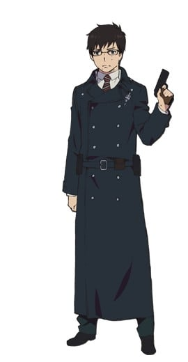
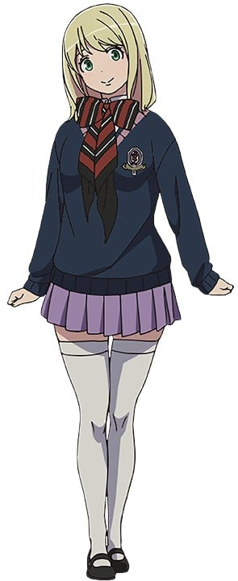
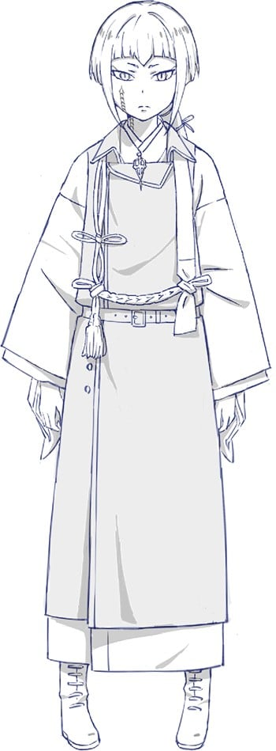

> [!bookinfo|noicon]+ **青之驱魔师 京都不净王篇**
> 
>
| 日文名 | 青の祓魔師 京都不浄王篇 |
|:------: |:------------------------------------------: |
| 类型 | 漫改 |
| 新番 | 2017 年 1 月 |
| 集数 | 共12话 |
| 官网 | [https://ao-ex.com/tv2017/](https://https://ao-ex.com/tv2017/) |
| 制作 | A-1 Pictures |
| 导演 | 初見浩一 |
| 脚本 | 木戸雄一郎,高木聖子,大野敏哉,渡辺雄介 |
| 评分 | 6.5|
| 制片人 | 清田穣二 |

> [!abstract]+ **简介**
> 人类居住的“物质界”和恶魔居住的“虚无界”本来是互不干涉的两个次元，但是因为恶魔出于对物质的凭依，对物质界有了干涉。于是人类之中便有了驱除恶魔的“驱魔师”存在。
魔神（撒旦）的孩子奥村燐，隐藏了自己的出身，决意成为驱魔师，前往正十字学园内部存在的驱魔师培训机构·驱魔补习班学习。在地之王袭击的时候，奥村燐魔神私生子的身份败露。因为畏惧魔神的“蓝炎”，同伴们与奥村燐之间的距离……
就在此时，被封印于学园最深部的“不净王的左眼”遭到不明人员的窃取，奥村燐等人也随之卷入无法预料的事态——

> [!tip]+ **章节列表**
>- [ ] 第1话：嚆矢滥觞 (2017-01-06)
>- [ ] 第2话：吴越同舟 (2017-01-13)
>- [ ] 第3话：疑心暗鬼 (2017-01-20)
>- [ ] 第4话：背信弃义 (2017-01-27)
>- [ ] 第5话：一缘一会 (2017-02-03)
>- [ ] 第6话：绵里藏针 (2017-02-10)
>- [ ] 第7话：气焰万丈 (2017-02-17)
>- [ ] 第8话：父子相传 (2017-02-24)
>- [ ] 第9话：雪中松柏 (2017-03-03)
>- [ ] 第10话：不屈不挠 (2017-03-10)
>- [ ] 第11话：光辉灿然 (2017-03-17)
>- [ ] 第12话：虚心坦怀 (2017-03-24)

> [!tip]+ **主要角色**
> 
| 角色 | CV | 简介| 角色图片 |
|:----:|:---:|:---:|:--------:|
| 奥村燐 | 渡辺明乃 | 背负着魔神撒旦之血统的15岁少年，外表看似粗暴，实际性格温和开朗。 在受到恶魔袭击时因养父狮郎的牺牲而得救，为替养父报仇以及证明自身的存在价值而立志成为驱魔师。 |  |
| 奥村雪男 | 福山潤 | 燐的双胞胎弟弟，才华卓越的天才少年驱魔师，性格温和认真，将来的志向是当医生。 |  |
| 杜山しえみ | 花澤香菜 | 在驱魔用品店驱魔屋工作的少女，暗恋雪男，喜欢种植花草，性格相当天然，然而却有过一段黑历史。 |  |
| メフィスト・フェレス | 神谷浩史 | 自称是藤本狮郎的朋友的谜男子。 所属于正十字骑士团的名誉骑士，引导着燐向驱魔师的道路前进。 在公众面前的身份是正十字学园的理事长。 为了锻炼燐成为能够与魔神战斗的武器，让燐接受了一个又一个不同的试炼。他的真实意图依旧是一个谜团。 |  |
| 神木出雲 | 喜多村英梨 | 驱魔塾塾生的少女。性格强硬，说白了就是性格傲娇。 巫女血统，生来就有着平安时代贵族般的眉毛。 虽然语气很硬，但也有着顾念伙伴们的一面。 有着手骑士的才能，能够一次性同时召唤「御馔津」&「保食」两只白狐。 |  |
| 藤本獅郎 | 平田広明 |  |  |
| クロ | 高垣彩陽 | 曾经是作为蚕神被人们祭祀着的猫又。 原来是狮郎的使魔，现在是身为燐的使魔和燐同吃同住。 平时是小猫的样子，也能够变得巨大化。 |  |
| 霧隠シュラ | 佐藤利奈 | 正十字骑士团的上一级驱魔师，狮郎的弟子。 教授燐剑术、给雪男提出劝言等，很理解着奥村兄弟。 性格非常随便，大酒鬼。 |  |
| 志摩廉造 | 遊佐浩二 | 以粉色的头发为特征的少年。 胜吕龙士的父亲的弟子，在驱魔塾中基本上是与胜吕一同行动。  性格轻飘飘自由奔放，不擅长那些严肃的仪式化的事物。最喜欢女孩子。 统筹明陀宗门徒的僧正血统·志摩家的五男。 |  |
| 勝呂龍士 | 高木礼子 | 虽然有着像是不良少年的野性外形，实际上是成绩优秀性格认真的努力家。 有着感情化的一面，常常与燐发生争执。不过也有着善于照顾人的大哥气质。 拥有着京都的历史古寺·明陀宗的座主血统，为了再建自家的寺而目标成为驱魔师。 对自己的父亲，明陀现任头领·达摩的与自己的身份不相符的行动抱有反感的模样…。 |  |
| 三輪子猫丸 | 梶裕貴 | 胜吕龙士的父亲的弟子。与胜吕和志摩一同上京，成为了驱魔塾的塾生。 温和的性格，胜吕的消火担当。特征是小小的个子、和尚头以及大框眼镜。 在「青之夜」失去了双亲，故而当得知燐是魔神撒旦的儿子之时，比起谁都显露出了对燐的恐惧与拒绝。 |  |
| 宝生蝮 | M・A・O | 宝生家长女。可以从手中召唤出使魔的“蛇”，中一级佛教系驱魔师。京都事务所深部一番队队长。取得到的称号是手骑士·咏唱骑士。24岁。 讨厌着志摩家，尤其是和柔造的关系特别差。 |  |