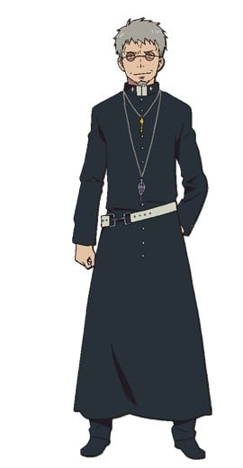
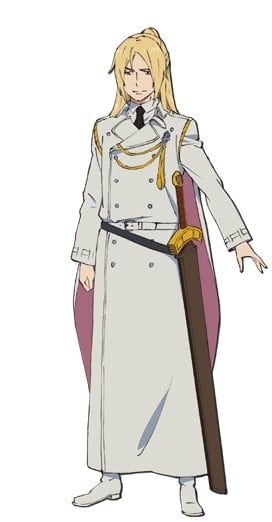

> [!bookinfo|noicon]+ **青之驱魔师 终夜篇**
> 
>
| 日文名 | 青の祓魔師 終夜篇 |
|:------: |:------------------------------------------: |
| 类型 | 漫改 |
| 新番 | 2025 年 1 月 |
| 集数 | 共12话 |
| 官网 | [http://www.ao-ex.com/](https://http://www.ao-ex.com/) |
| 制作 | studio VOLN |
| 导演 | 吉田大輔 |
| 脚本 | 何万字角蔵,高木聖子,渡辺雄介,大野敏哉,稲葉大斗 |
| 评分 | 6.6|
| 制片人 | 青木誠 |

> [!abstract]+ **简介**
> 雪男は燐に決別を告げ、イルミナティへと向かってしまった。
強さを求め、真実を求める雪男と向き合うためには、
自分たちの出生の秘密を知る必要があると決意した燐は、
メフィストの手引きで過去へと旅立つ。

燐は、育ての父である藤本獅郎と実の母である
ユリ・エギンの足跡を辿っていくが、
二人が生きた道筋は、想像を超える過酷なものだった――

なぜ、悪魔の神であるサタンと
人との間に仔が生まれたのか。
〝青い夜〟とは何だったのか。
すべてを知ったとき、燐が出す答えとは……。
物語はいよいよ「青の祓魔師」の核心を暴き出す――

> [!tip]+ **章节列表**
>- [ ] 第1话：狮郎与尤莉 (2025-01-04)
>- [ ] 第2话：真相 (2025-01-11)
>- [ ] 第3话：孤单一人 (2025-01-18)
>- [ ] 第4话：撒旦觉醒 (2025-01-25)
>- [ ] 第5话：比身体更重要的东西 (2025-02-01)
>- [ ] 第6话：如果没有我在 (2025-02-08)
>- [ ] 第7话：前夜 (2025-02-15)
>- [ ] 第8话：青色之夜 (2025-02-22)
>- [ ] 第9话：死斗 (2025-03-01)
>- [ ] 第10话：光 (2025-03-08)
>- [ ] 第11话：约定 (2025-03-15)
>- [ ] 第12话：谢谢 (2025-03-22)

> [!tip]+ **主要角色**
> 
| 角色 | CV | 简介| 角色图片 |
|:----:|:---:|:---:|:--------:|
| 奥村燐 | 渡辺明乃 | 背负着魔神撒旦之血统的15岁少年，外表看似粗暴，实际性格温和开朗。 在受到恶魔袭击时因养父狮郎的牺牲而得救，为替养父报仇以及证明自身的存在价值而立志成为驱魔师。 |  |
| 奥村雪男 | 福山潤 | 燐的双胞胎弟弟，才华卓越的天才少年驱魔师，性格温和认真，将来的志向是当医生。 |  |
| 杜山しえみ | 花澤香菜 | 在驱魔用品店驱魔屋工作的少女，暗恋雪男，喜欢种植花草，性格相当天然，然而却有过一段黑历史。 |  |
| メフィスト・フェレス | 神谷浩史 | 自称是藤本狮郎的朋友的谜男子。 所属于正十字骑士团的名誉骑士，引导着燐向驱魔师的道路前进。 在公众面前的身份是正十字学园的理事长。 为了锻炼燐成为能够与魔神战斗的武器，让燐接受了一个又一个不同的试炼。他的真实意图依旧是一个谜团。 |  |
| アマイモン | 柿原徹也 | 「地の王」の名を冠する虚無界の第七権力者。「規則正しい学生生活を送る」条件で、メフィストに自由を許可され正十字学園の生徒に。 |  |
| 神木出雲 | 喜多村英梨 | 驱魔塾塾生的少女。性格强硬，说白了就是性格傲娇。 巫女血统，生来就有着平安时代贵族般的眉毛。 虽然语气很硬，但也有着顾念伙伴们的一面。 有着手骑士的才能，能够一次性同时召唤「御馔津」&「保食」两只白狐。 |  |
| 藤本獅郎 | 平田広明 |  |  |
| 志摩廉造 | 遊佐浩二 | 以粉色的头发为特征的少年。 胜吕龙士的父亲的弟子，在驱魔塾中基本上是与胜吕一同行动。  性格轻飘飘自由奔放，不擅长那些严肃的仪式化的事物。最喜欢女孩子。 统筹明陀宗门徒的僧正血统·志摩家的五男。 |  |
| 勝呂龍士 | 中井和哉 | 虽然有着像是不良少年的野性外形，实际上是成绩优秀性格认真的努力家。 有着感情化的一面，常常与燐发生争执。不过也有着善于照顾人的大哥气质。 拥有着京都的历史古寺·明陀宗的座主血统，为了再建自家的寺而目标成为驱魔师。 对自己的父亲，明陀现任头领·达摩的与自己的身份不相符的行动抱有反感的模样…。 |  |
| 三輪子猫丸 | 梶裕貴 | 胜吕龙士的父亲的弟子。与胜吕和志摩一同上京，成为了驱魔塾的塾生。 温和的性格，胜吕的消火担当。特征是小小的个子、和尚头以及大框眼镜。 在「青之夜」失去了双亲，故而当得知燐是魔神撒旦的儿子之时，比起谁都显露出了对燐的恐惧与拒绝。 |  |
| イゴール・ネイガウス | 置鮎龍太郎 | 祓魔塾講師（魔法円・印章術担当）。上一級祓魔師。取得称号は手騎士・医工騎士・詠唱騎士。39歳。アニメではポーランド出身。 左目に眼帯を着けた男性。屍系の悪魔を数多く従えており、両腕に魔法円の刺青を刻んでいる。得物は巨大なコンパス。「青い夜」の生き残りの一人であり、その際サタンに取り憑かれ、自身の左目と同時に家族をも失った。サタンを含む悪魔を憎悪している。 メフィストの命で燐を襲うが、失敗に終わった。現在は講師を停職処分中。 |  |
| アーサー・オーギュスト・エンジェル | 小野大輔 | 現「聖騎士（パラディン）」。ヴァチカン本部勤務の上一級祓魔師。シュラの上司。イギリス人。30歳。 魔剣「カリバーン」（声 - 東山奈央）を振るう。「聖天使團（エンジェリックレギオン）」という部隊を率いる。聖人のように振舞うが、悪魔に対しては全く容赦はない。頭脳戦はあまり得意ではないらしく、込み入った戦闘のサポートはライトニング辺りに任せている。 |  |