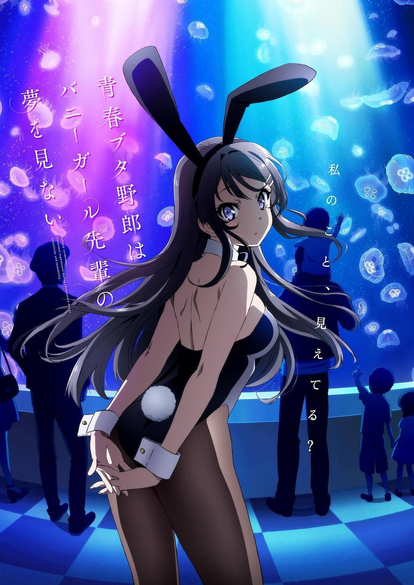
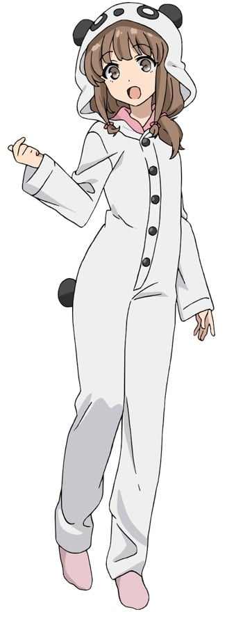

> [!bookinfo|noicon]+ **青春猪头少年不会梦到兔女郎学姐**
> 
>
| 日文名 | 青春ブタ野郎はバニーガール先輩の夢を見ない |
|:------: |:------------------------------------------: |
| 类型 | 小说改 |
| 新番 | 2018 年 10 月 |
| 集数 | 共13话 |
| 官网 | [http://ao-buta.com/](https://http://ao-buta.com/) |
| 制作 | CloverWorks |
| 导演 | 増井壮一 |
| 脚本 | 横谷昌宏 |
| 评分 | 7.4|
| 制片人 | 木田和哉 |

> [!abstract]+ **简介**
> 思春期症候群——这是一种只发生在易敏感和不稳定的青春期的、不可思议的现象。
例如，在梓川咲太面前出现的野生兔女郎。
她的真实身份是高中高年级学生，明星活动休止的女演员樱岛麻衣。她迷人的身姿，不知为何在周围的人眼里看不出来。
咲太决定解开这一谜题。在于麻衣一起度过的时间里，咲太知道了她秘密的想法……
女主人公们一个接一个地出现在咲太的周围，她们都有着“青春期症候群”。在天空和大海都很闪耀的小镇上，开始了令人激动的故事。

> [!tip]+ **章节列表**
>- [ ] 第1话：学姐是兔女郎 (2018-10-03)
>- [ ] 第2话：初次约会难免风波 (2018-10-10)
>- [ ] 第3话：只有你不在的世界 (2018-10-17)
>- [ ] 第4话：猪头少年没有明天 (2018-10-24)
>- [ ] 第5话：将全部谎言献给你 (2018-10-31)
>- [ ] 第6话：你选择的这个世界 (2018-11-07)
>- [ ] 第7话：青春是悖论 (2018-11-14)
>- [ ] 第8话：大雨之夜冲洗一切 (2018-11-21)
>- [ ] 第9话：姐妹恐慌 (2018-11-28)
>- [ ] 第10话：百感交集的祝贺 (2018-12-05)
>- [ ] 第11话：枫任务 (2018-12-12)
>- [ ] 第12话：活在不醒梦之中 (2018-12-19)
>- [ ] 第13话：长夜黎明 (2018-12-26)

> [!tip]+ **主要角色**
> 
| 角色 | CV | 简介| 角色图片 |
|:----:|:---:|:---:|:--------:|
| 桜島麻衣 | 瀬戸麻沙美 | ちょっぴりSなバニーガール先輩  峰ヶ原高校に通う3年生。 国民的な人気タレントだったが、現在は芸能活動を休止している。  芸能活動を中心とした生活を送ってきたため学校では孤立している。 真面目で礼儀正しいが、気が強い。 |  |
| 梓川咲太 | 石川界人 | 青春ブタ野郎  今時、携帯電話を持っていない変わり者の高校2年生。 暴力事件を起こしたという噂のせいで学校では浮いた存在になっているが、本人はあまり気にしていない。 |  |
| 双葉理央 | 種﨑敦美 | 冷静沈着な理系女子  冷静沈着な咲太の同級生。 たった一人の科学部の部員で校内では変人として知られている。 咲太の数少ない友人の一人で思春期症候群についてもいろいろとアドバイスをしてくれる。 |  |
| 梓川かえで | 久保ユリカ | おうち大好きブラコン妹  咲太の妹。  過去のいじめが原因で外に出られず、常に家でお留守番をしている。 パンダとお兄ちゃんが大好きで、理想の妹になるため日々邁進する。 毎朝、咲太を起こすことを日課としている。 |  |
| 古賀朋絵 | 東山奈央 | 小悪魔な後輩  峰ヶ原高校の1年生。 空気の読めるイマドキ女子高生だが、少しそそっかしいところがある。 周りの目を気にして博多弁訛りを隠しているが、慌てたり、気を抜いたときには博多弁がでる。 |  |
| 国見佑真 | 内田雄馬 | 咲太の数少ない友人の1人。  咲太の周囲の評判を気にせずに友人として咲太に接する。 |  |
| 牧之原翔子 | 水瀬いのり | 謎多き健気な中学生  咲太の初恋の女性と同姓同名の少女。 恥ずかしがり屋だが、しっかり者で心の優しい中学生。 雨の中、捨て猫に傘をさしてあげていたところで咲太と出会う。 |  |
| 豊浜のどか | 内田真礼 | 現役女子高校生アイドル  麻衣の母親違いの妹。 アイドルグループ『スイートバレット』のメンバーでおしゃれ担当。 派手な見た目に似合わず、お嬢様高校に通っている。とても強気で負けず嫌い。 |  |
| 上里沙希 | 茜屋日海夏 | 佑真の彼女。 佑真の評判が悪くなるとして咲太が佑真に近づくことを嫌悪している。 |  |
| 南条文香 | 佐藤聡美 | 女子アナウンサー。 |  |
| 女の子 | 丸岡和佳奈 |  |  |
| 広川卯月 | 雨宮天 | 第10巻「青春ブタ野郎は迷えるシンガーの夢を見ない」のヒロイン。初登場は4巻。「スイートバレット」のメンバーかつリーダーで「づっきー」という愛称で呼ばれている。 普段からテンションが高い性格。良くも悪くも「空気読めない」と言われており、マイペースで天然ボケな面があり、いつも予想外の言動をすることで知られる。また、他人との距離の取り方が個性的で、最初から近く接する。花楓のことがきっかけで親しくなったため、咲太のことを「お兄さん」と呼んでいる。 元々は全日制の高校に通っていたが、アイドル活動を始めてから学校の友達と馴染めず学校に行くのがつまらなくなり不登校になったため、通信制の高校に編入した。 大学進学を早々に宣言していたのどかに感化され、咲太や麻衣、のどかと同じ大学に進学した。大学では咲太同じ統計科学学部に所属しており必修科目や一般教養科目で咲太とは顔を合わせているが、いつも行動を共にしているわけではなく、普段は卯月を含めた6人組の女子グループで行動する。 アイドル活動と同時にモデルもやっており、最近ではテレビ出演も増えている。スイートバレットのメンバー中で一番女性ファンが多い。10巻ではワイヤレスイヤホンのCMに起用され、その歌唱力などで一躍、時の人となった。 先述のようにマイペース、天然で「空気が読めない」ことが特徴の人物だったが、10巻にて突然周囲の「空気が読める」ようになり、同時に自分が今までどう思われていたかや、また自分でも気づかなかった心の内の感情などに気がつくという、思春期症候群と思われる現象に見舞われる。だが過去の自分と向き合い続けるという選択を選び、再び「空気が読めない」状態に戻った。また、ソロデビューすると同時にスイートバレットの活動も続けていくと宣言し、大学に退学届を出した。 |  |