> [!bookinfo|noicon]+ **青春猪头少年不会梦到怀梦美少女**
> 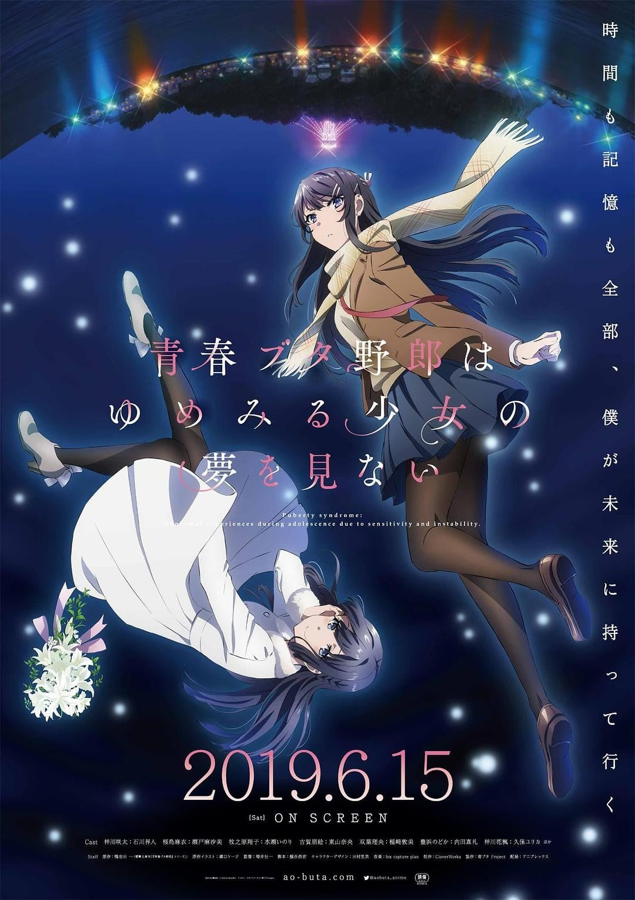
>
| 日文名 | 青春ブタ野郎はゆめみる少女の夢を見ない |
|:------: |:------------------------------------------: |
| 类型 | 小说改 |
| 新番 | 2019 年 6 月 |
| 集数 | 共1话 |
| 官网 | [https://ao-buta.com/themovie](https://https://ao-buta.com/themovie) |
| 制作 | CloverWorks |
| 导演 | 増井壮一 |
| 脚本 | 横谷昌宏 |
| 评分 | 7.4|
| 制片人 | 木田和哉 |

> [!abstract]+ **简介**
> 居住在天空与海洋辉映的城镇“藤泽”的梓川咲太，就读高中二年级。 
他与既是学姐又是恋人的樱岛麻衣所度过的令人雀跃的日常，随着初恋对象牧之原翔子的出现而改变。 
不知为何，存在着“中学生”和“大人”两个翔子。 
出于无奈开始和翔子住在一起的咲太，受到“大人翔子”的捉弄，和麻衣的关系也变得尴尬。
此时，“中学生翔子”身患重病的事实被发现，咲太的伤痕开始隐隐作痛——。

> [!tip]+ **章节列表**
>- [ ] 第1话：青春期笨蛋不做怀梦少女的梦 (2019-06-15)

> [!tip]+ **主要角色**
> 
| 角色 | CV | 简介| 角色图片 |
|:----:|:---:|:---:|:--------:|
| 桜島麻衣 | 瀬戸麻沙美 | ちょっぴりSなバニーガール先輩  峰ヶ原高校に通う3年生。 国民的な人気タレントだったが、現在は芸能活動を休止している。  芸能活動を中心とした生活を送ってきたため学校では孤立している。 真面目で礼儀正しいが、気が強い。 | 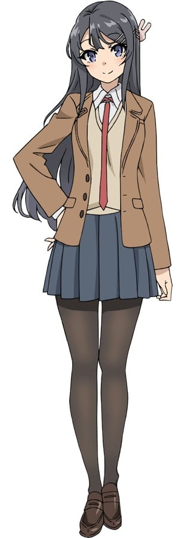 |
| 梓川咲太 | 石川界人 | 青春ブタ野郎  今時、携帯電話を持っていない変わり者の高校2年生。 暴力事件を起こしたという噂のせいで学校では浮いた存在になっているが、本人はあまり気にしていない。 | 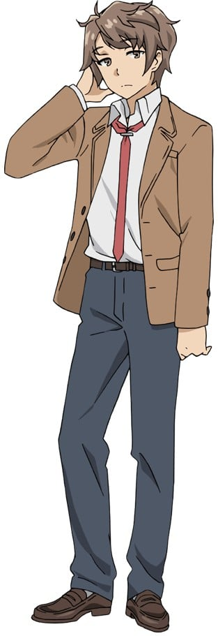 |
| 双葉理央 | 種﨑敦美 | 冷静沈着な理系女子  冷静沈着な咲太の同級生。 たった一人の科学部の部員で校内では変人として知られている。 咲太の数少ない友人の一人で思春期症候群についてもいろいろとアドバイスをしてくれる。 | 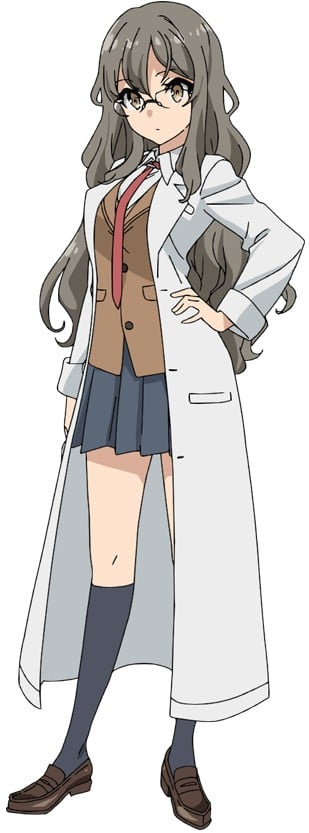 |
| 古賀朋絵 | 東山奈央 | 小悪魔な後輩  峰ヶ原高校の1年生。 空気の読めるイマドキ女子高生だが、少しそそっかしいところがある。 周りの目を気にして博多弁訛りを隠しているが、慌てたり、気を抜いたときには博多弁がでる。 | 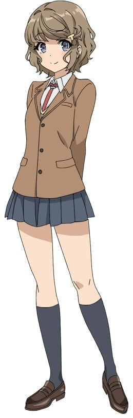 |
| 国見佑真 | 内田雄馬 | 咲太の数少ない友人の1人。  咲太の周囲の評判を気にせずに友人として咲太に接する。 | 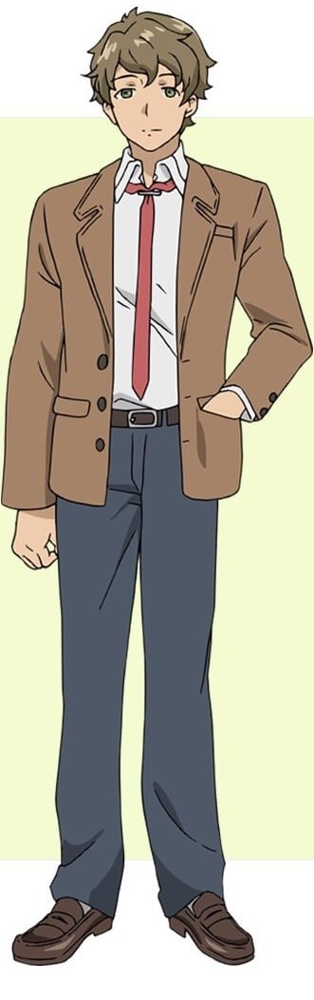 |
| 牧之原翔子 | 水瀬いのり | 謎多き健気な中学生  咲太の初恋の女性と同姓同名の少女。 恥ずかしがり屋だが、しっかり者で心の優しい中学生。 雨の中、捨て猫に傘をさしてあげていたところで咲太と出会う。 | 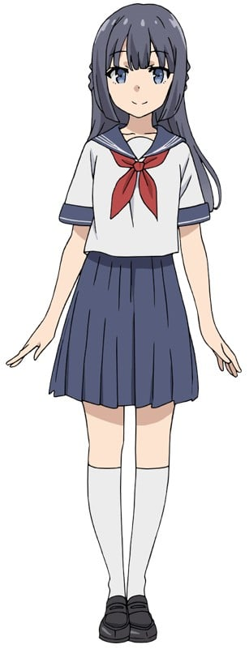 |
| 豊浜のどか | 内田真礼 | 現役女子高校生アイドル  麻衣の母親違いの妹。 アイドルグループ『スイートバレット』のメンバーでおしゃれ担当。 派手な見た目に似合わず、お嬢様高校に通っている。とても強気で負けず嫌い。 | 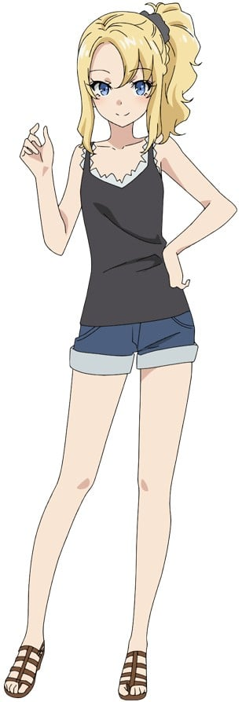 |
| 上里沙希 |  | 佑真の彼女。 佑真の評判が悪くなるとして咲太が佑真に近づくことを嫌悪している。 |  |
| 南条文香 | 佐藤聡美 | 女子アナウンサー。 | 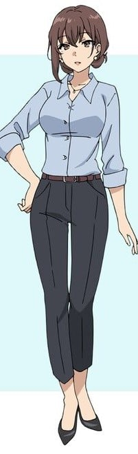 |
| 広川卯月 |  | 第10巻「青春ブタ野郎は迷えるシンガーの夢を見ない」のヒロイン。初登場は4巻。「スイートバレット」のメンバーかつリーダーで「づっきー」という愛称で呼ばれている。 普段からテンションが高い性格。良くも悪くも「空気読めない」と言われており、マイペースで天然ボケな面があり、いつも予想外の言動をすることで知られる。また、他人との距離の取り方が個性的で、最初から近く接する。花楓のことがきっかけで親しくなったため、咲太のことを「お兄さん」と呼んでいる。 元々は全日制の高校に通っていたが、アイドル活動を始めてから学校の友達と馴染めず学校に行くのがつまらなくなり不登校になったため、通信制の高校に編入した。 大学進学を早々に宣言していたのどかに感化され、咲太や麻衣、のどかと同じ大学に進学した。大学では咲太同じ統計科学学部に所属しており必修科目や一般教養科目で咲太とは顔を合わせているが、いつも行動を共にしているわけではなく、普段は卯月を含めた6人組の女子グループで行動する。 アイドル活動と同時にモデルもやっており、最近ではテレビ出演も増えている。スイートバレットのメンバー中で一番女性ファンが多い。10巻ではワイヤレスイヤホンのCMに起用され、その歌唱力などで一躍、時の人となった。 先述のようにマイペース、天然で「空気が読めない」ことが特徴の人物だったが、10巻にて突然周囲の「空気が読める」ようになり、同時に自分が今までどう思われていたかや、また自分でも気づかなかった心の内の感情などに気がつくという、思春期症候群と思われる現象に見舞われる。だが過去の自分と向き合い続けるという選択を選び、再び「空気が読めない」状態に戻った。また、ソロデビューすると同時にスイートバレットの活動も続けていくと宣言し、大学に退学届を出した。 | 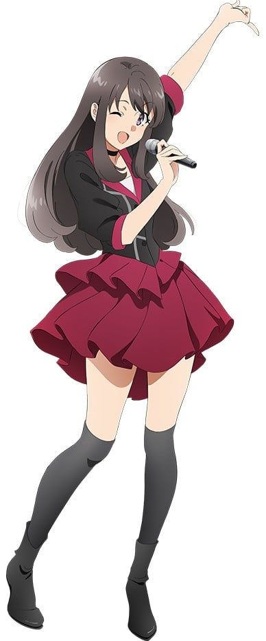 |
| 桜島麻衣の母親 | 大津愛理 | のどかの母に見せつけるために麻衣を子役としてデビューさせ、芸能事務所を立ち上げた。後に麻衣の意思にそぐわない仕事を引き受け、麻衣の芸能活動休止のきっかけを作った。それ以来、麻衣とは不仲の状態が続いている。 | 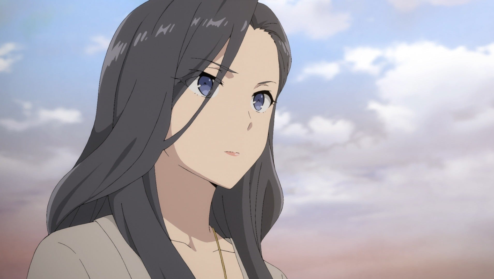 |
| 安濃八重 |  | やや明るい色の髪でショートカット。「スイートバレット」のサブリーダーでしっかり者であり、天然な卯月のサポート役。愛称は「やんやん」。後にスポーツ系バラエティ番組に出ることが多くなっているという。 | 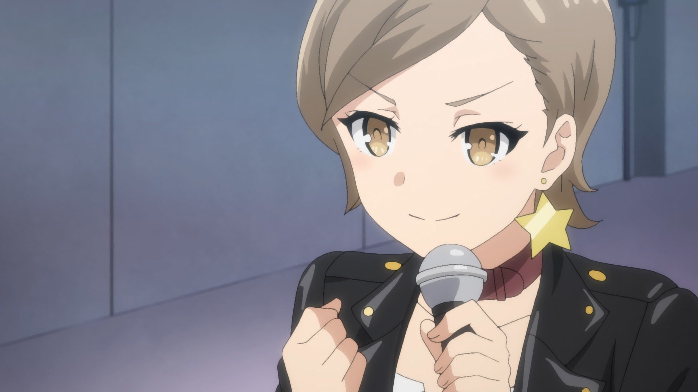 |