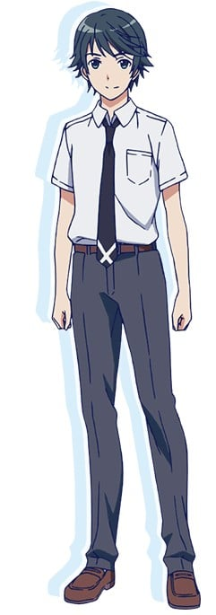
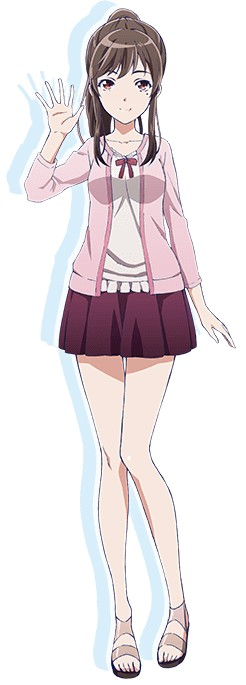
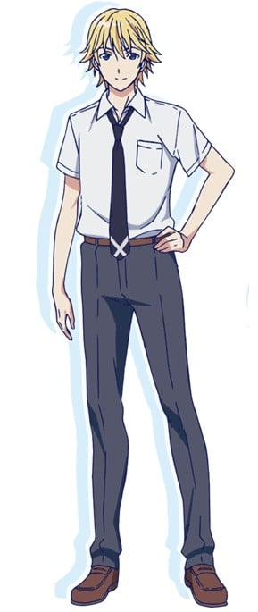
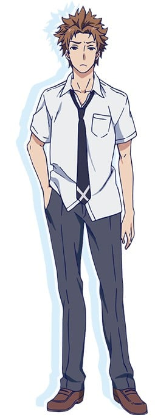
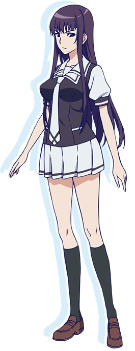

> [!bookinfo|noicon]+ **风夏**
> 
>
| 日文名 | 風夏 |
|:------: |:------------------------------------------: |
| 类型 | 漫改 |
| 新番 | 2017 年 1 月 |
| 集数 | 共12话 |
| 官网 | [http://fuuka.tv/](https://http://fuuka.tv/) |
| 制作 | diomedéa |
| 导演 | 草川啓造 |
| 脚本 | 朱白あおい,待田堂子 |
| 评分 | 5.4|
| 制片人 | 天野翔太 |

> [!abstract]+ **简介**
> 由于双亲前往美国而与姐妹一同生活，因此转学到东京的高中的榛名优。
内向且不擅与人交往的他，交流的主要领域只有推特上的互相来往而已。
在搬来的街道上散步的优正在刷推特时，与出现在自己面前的少女秋月风夏相遇……。
内向且不擅与人交往的榛名优，与拥有不可思议魅力的少女秋月风夏。
出现在两人面前的优的青梅竹马，冰无小雪。
由音乐编织而成的全新恋爱物语，就此开始——。

> [!tip]+ **章节列表**
>- [ ] 第1话：风夏！ (2017-01-06)
>- [ ] 第2话：展翅高飞！ (2017-01-06)
>- [ ] 第3话：三角关系！ (2017-01-13)
>- [ ] 第4话：演唱会！ (2017-01-20)
>- [ ] 第5话：伙伴！ (2017-01-27)
>- [ ] 第6话：冰无小雪 (2017-02-03)
>- [ ] 第7话：炸开！ (2017-02-10)
>- [ ] 第8话：Top！ (2017-02-17)
>- [ ] 第9话：约会！ (2017-02-24)
>- [ ] 第10话：命运 (2017-03-10)
>- [ ] 第11话：乐队 (2017-03-17)
>- [ ] 第12话：Fair wind (2017-03-24)

> [!tip]+ **主要角色**
> 
| 角色 | CV | 简介| 角色图片 |
|:----:|:---:|:---:|:--------:|
| 秋月大和 | 中村太亮 | 15岁的高一新生，与凉风结婚时18岁，个性草率随便，做事不经考虑。从故乡广岛县来到东京求学，所就读的私立青羽高中是一所田径名校。看到朝比奈凉风跳高后对她一见钟情。从未受过体育训练，但入学后以自己脚程飞快的本领与欲接近凉风的心意成为田径社短跑选手，为追求凉风而努力锻炼。曾一度改变主意与樱井萌果交往，但仅一个月即回归初衷，在凉风回国后，再度表白心意。因为迟钝又不懂女孩子的心，常常与朝比奈吵架，所以波折不断。最终与凉风开花结果。 姓名来自旧日本海军秋月型驱逐舰的一号舰秋月与大和型战舰的一号舰大和。 |  |
| 藤川美穂 | 明坂聡美 |  |  |
| 枝葉柚希 | 中島愛 | 东京都出生，和青大同龄，也在同一个学校同一个班级。因为有着和青大相反的很开朗很容易亲近别人的性格所以特别直率。作为父亲的故乡，曾经来青大所在的小镇时候，特别中意这座小镇的高中，所以想在这座小镇读高中。 |  |
| 朝比奈涼風 | 三橋加奈子 | 15岁的高一新生，与大和结婚时18岁，来自横滨，国中时期便是跳高选手，并以此被保送至青羽高中就读，住在大和宿舍的隔壁间。蛮横娇羞型的角色，有些好强、任性、男孩子气，是个完美主义者，讨厌大和做事草率的个性，加上本身不擅表达，经常对以冷淡的态度，但基本上把大和当做好朋友，常找他一起去购物。曾经遭遇心仪对象意外丧生的打击而对爱情却步，被大和追求时相当彷徨，最终接受大和追求，并与他奉子成婚。不擅长做菜，曾以微波炉做出蛋结块的蛋酒与会爆炸的水煮蛋给大和吃。不时会带着女儿出现在小镇有你中。名字来自旧日本海军白露型驱逐舰凉风。 |  |
| 秋月風夏 | Lynn | 秋月大和与朝比奈凉风的长女，外表酷似凉风，但大和坚持说她的眼神似自己。 |  |
| 榛名優 | 小林裕介 | 手不离手机，整日刷twitter的少年，因父母出国而搬到东京和姐姐妹妹住在一起。一次买完东西回家的路上邂逅了后来成为同学的秋月风夏，为了达成风夏的音乐梦想而参与组建了乐团，担任贝斯手。 |  |
| 氷無小雪 | 早見沙織 | 売れっ子の歌手。小学生のころは優と仲が良く、優とは「たまちゃん」、「ニコ君」と呼び合っていた。 優に対して好意的で、Twitterで優と連絡を取っている。 歌手を突然引退。しかし、ウサギの着ぐるみ姿の覆面バンド･ラビッツのボーカルとして復活する。 |  |
| 秋月春風 | 大和田仁美 | 秋月风夏的妹妹。秋月大和与凉风的第二个孩子。 |  |
| 三笠真琴 | 斉藤壮馬 | イギリス系ドイツ人のクォーターの少年。優と風夏のクラスメイトで人気者。また、同性愛者でもあり、周囲にそのことを公言している。 風夏とは仲がよく、「真琴君」と呼ばれており、たまに買い物に行くほどである。風夏がなにか物足りないと感じているのを見抜く。 家業を継がせたい父親に背き音楽の道を選んだため、勘当された。 The fallen moon（ザ フォールン ムーン）のキーボード。また、ギタリストとしての才能もある事を公言している。 |  |
| 那智一矢 | 興津和幸 | 优与风夏的学长。原本想要请风夏加入田径社，却反而被风夏强拉入The fallen moon（ザ フォールン ムーン）乐队当爵士鼓手。 |  |
| 石見沙羅 | 小松未可子 | 優と風夏の高校の先輩でバンドメンバー。ギターの腕には自信あり。兄はヘッジボックスのギターリスト。 実は優とツイッターのフォロワー同士。 The fallen moon（ザ フォールン ムーン）のギター。 |  |
| 榛名麻耶 | 高橋美佳子 | 榛名优的姐姐，榛名家的长女。在东京的广告代理店工作，性格温厚。 |  |