> [!bookinfo|noicon]+ **魔弹之王与战姫**
> 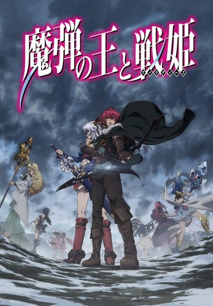
>
| 日文名 | 魔弾の王と戦姫 |
|:------: |:------------------------------------------: |
| 类型 | 小说改 |
| 新番 | 2014 年 10 月 |
| 集数 | 共13话 |
| 官网 | [http://www.madan-anime.jp](https://http://www.madan-anime.jp) |
| 制作 | サテライト |
| 导演 | 佐藤竜雄 |
| 脚本 | 佐藤竜雄 |
| 评分 | 6.2|
| 制片人 | 金子文雄 |

> [!abstract]+ **简介**
> 　　布琉努王国里有块位于边境的弹丸之地亚尔萨斯，而这里的领导人是个随遇而安的贵族少年堤格尔维尔穆德·冯伦。因为王国的征招，堤格尔被迫上到战场上，双方人数相差快5倍，原本以为这场是必胜的战争，然而对手是吉斯塔特中的“七战姬”之一、拥有“银闪的风姬”名号的艾蕾欧诺拉·维尔塔利亚，在她出奇不意的战略下，击破了布琉努大军。战乱中堤格尔虽然尝试利用最擅长的弓击杀敌人主将，但却反而被她高超的剑技打败。就在堤格尔绝望的做好受死准备之时。“你从现在开始就是我的人了。”因为对方意外的一句话，堤格尔往后的命运将彻底改写。 

> [!tip]+ **章节列表**
>- [ ] 第1话：战场的风姬 (2014-10-04)
>- [ ] 第2话：归还 (2014-10-11)
>- [ ] 第3话：苏醒的魔弹 (2014-10-18)
>- [ ] 第4话：冻涟的雪姬 (2014-10-25)
>- [ ] 第5话：塔特拉山攻城战 (2014-11-01)
>- [ ] 第6话：黑骑士 (2014-11-08)
>- [ ] 第7话：为了守护 (2014-11-15)
>- [ ] 第8话：二千对二万 (2014-11-22)
>- [ ] 第9话：雷涡与煌炎 (2014-11-29)
>- [ ] 第10话：奥尔梅亚会战 (2014-12-06)
>- [ ] 第11话：战姬二人 (2014-12-13)
>- [ ] 第12话：圣窟宫 (2014-12-20)
>- [ ] 第13话：更广阔的世界 (2014-12-27)
>- [ ] 第0话：与战姬的相遇 (2014-10-03)
>- [ ] 第1话：激烈的攻击！ (2014-10-10)
>- [ ] 第2话：一路游街的战姬 (2014-10-17)
>- [ ] 第3话：睡醒的小熊 (2014-10-24)
>- [ ] 第4话：喜欢熊的一人 (2014-10-31)
>- [ ] 第5话：可爱的熊熊和某软乎乎的东西 (2014-11-07)
>- [ ] 第6话：温暖的东西和漂亮的东西 (2014-11-14)
>- [ ] 第7话：天然的耀姫 (2014-11-21)
>- [ ] 第8话：挖苦对秃头 (2014-11-28)
>- [ ] 第9话：悄悄地集结 (2014-12-05)
>- [ ] 第10话：眼看就要被揭露的真相 (2014-12-12)
>- [ ] 第11话：不小心暴露的事实 (2014-12-19)
>- [ ] 第12话：幕间 (2014-12-26)
>- [ ] 第13话：还有一个结局 (2015-01-06)

> [!tip]+ **主要角色**
> 
| 角色 | CV | 简介| 角色图片 |
|:----:|:---:|:---:|:--------:|
| ティグルヴルムド=ヴォルン | 瀬戸麻沙美 | 管辖布琉努王国北部的边境,，亚尔萨斯领地的年轻伯爵。 由于这里自然环境相当丰富，幼年时的堤格尔经常狩猎日往夜来，使得他掌握了以人类而言的弓箭技术堪称无人能及的水准，能够将一般最大射程只有250阿尔昔（1阿尔昔约1米）准确无误地射中300阿尔昔之外的目标，可以用自然环境与单纯的弓箭发挥活用最大能耐的战术，然而除了弓箭以外的武艺却是挂蛋。 在布琉努王国中因为他们注重于骑士突击的战术，所以像堤格尔这样使用弓箭的人是被鄙视的存在，被视为胆小鬼一般。 堤格尔相当重视自身的领地故乡，也与当地人民的交情非常好，一心想守护这块领地。 对于兴趣是午睡和狩猎的提格尔而言，野心并不是那么重要的一件事。 | 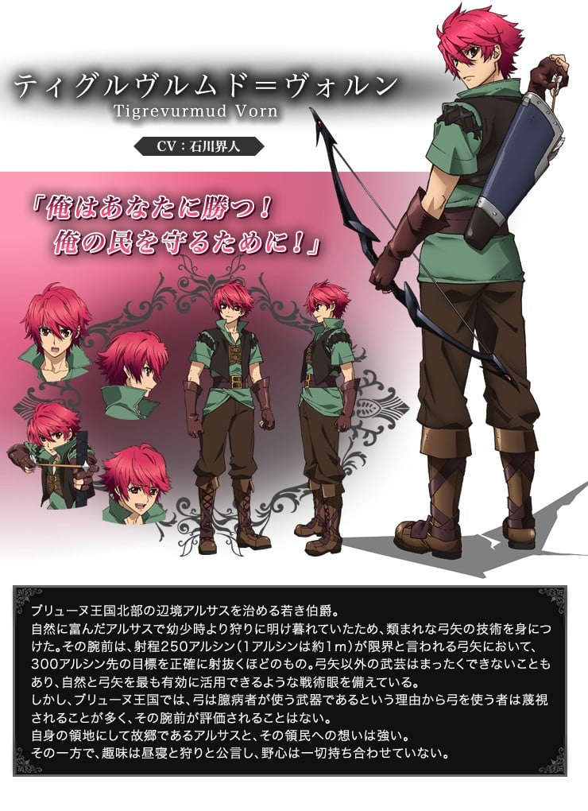 |
| エレオノーラ=ヴィルターリア | 戸松遥 | 吉斯塔特的七战姬之一，是能够操作风的常见龙具「银闪艾利菲尔」选上的战姬，现任莱特梅里兹公国领主，由于经常在战场上如同风一般的冲锋陷阵的姿态，又被称为「银闪的风姬」。 原为佣兵出生的身份，不过因为被龙具选上而成为了战姬，亲昵的人称呼她为「艾莲」， 在迪南特平原战役对上提格尔，并对于堤格尔只身一人面对她依旧能冷静地射出精湛的弓术感到中意，并以俘虏的身份将提格尔带回国。 | 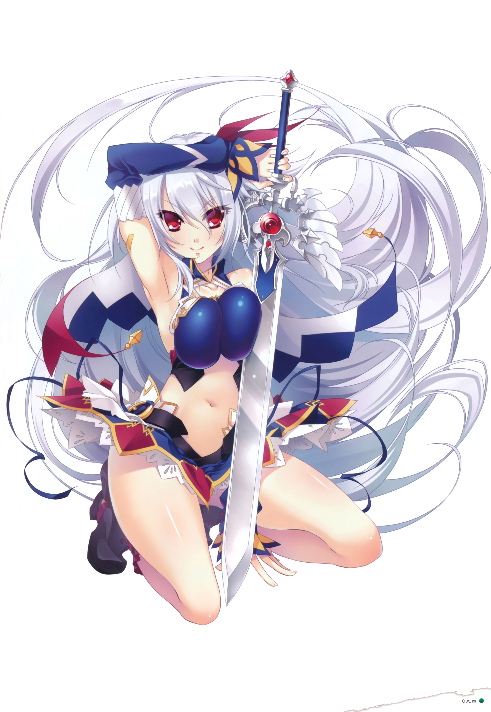 |
| リュドミラ=ルリエ | 伊瀬茉莉也 | 吉斯塔特的七战姬之一，负责管辖著在莱特梅里兹南部、墨吉涅王国北部的奥尔里兹公国，持有能够操纵冰霜的短枪型龙具「冻涟拉斐亚斯」，因此有着「冻涟的雪姬」这个别名，战姬的地位并非世袭制，然而露利叶家却是罕见地能够一直保持血缘继承战姬地位的家族，所以米拉也接受着与战姬相应的教育而被培养著，与突然从佣兵变成战姬的艾莲处于水火不容的关系，喜欢喝添加自制果酱的红茶以及有着自己泡红茶的兴趣，昵称「米拉」。 | 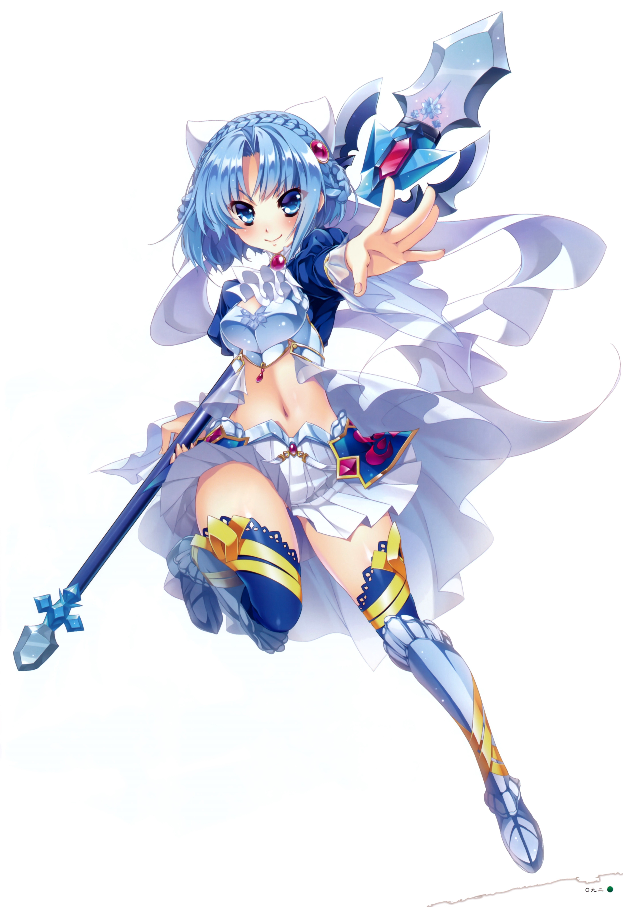 |
| ソフィーヤ=オベルタス | 茅野愛衣 | 吉斯塔特的七战姬之一，波利西亚公国的领主，持有可以操纵光的锡杖型龙具龙具「光华」，因此持有「光华的耀姬」的别名，是个美丽聪明的女性，给人一种平易近人的柔软氛围，作为年长者也经常担当艾莲与米拉之间的调停者，常常作为特使而前往各国，所以也对各式各样的消息有着清楚的情报掌握，非常喜欢龙，尤其偏爱艾莲饲养的幼龙，昵称为「苏菲」。 | 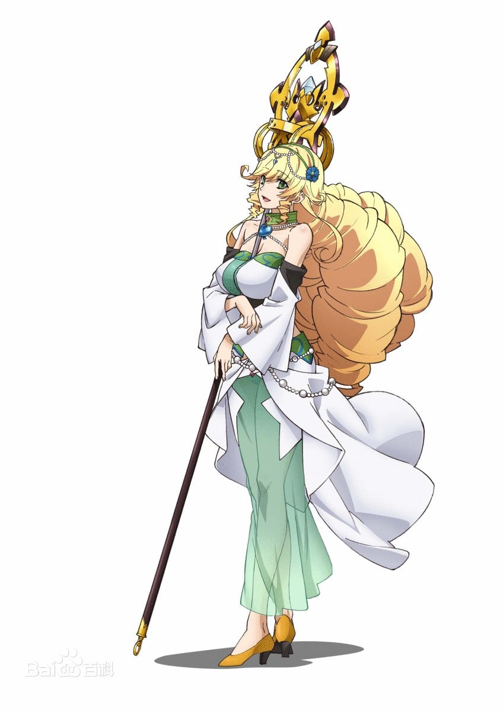 |
| リムアリーシャ | 井口裕香 | 艾莲最信赖，推心置腹的副官，昵称莉姆，在艾莲成为战姬以前两人就是佣兵时期的好友，个性严格且一本正经，不只是对堤格尔，连艾莲也不会用昵称称呼。 在君王的宫殿或在战场上也经常作为艾莲的左右手帮助她。对于自由奔放的艾莲经常责骂着。此外有着非常喜欢熊玩偶的一面，甚至会对着布偶取名字，不过因为很害羞所以是秘密。 | 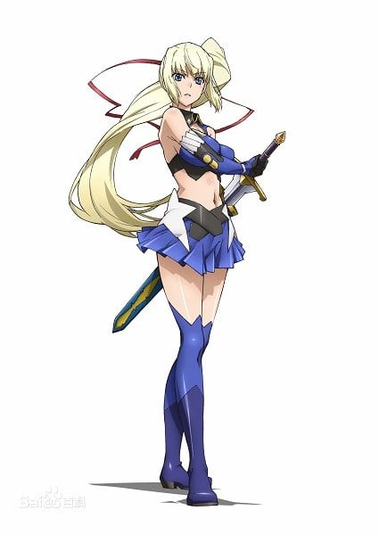 |
| ヴァレンティナ=グリンカ=エステス | 原田ひとみ |  | 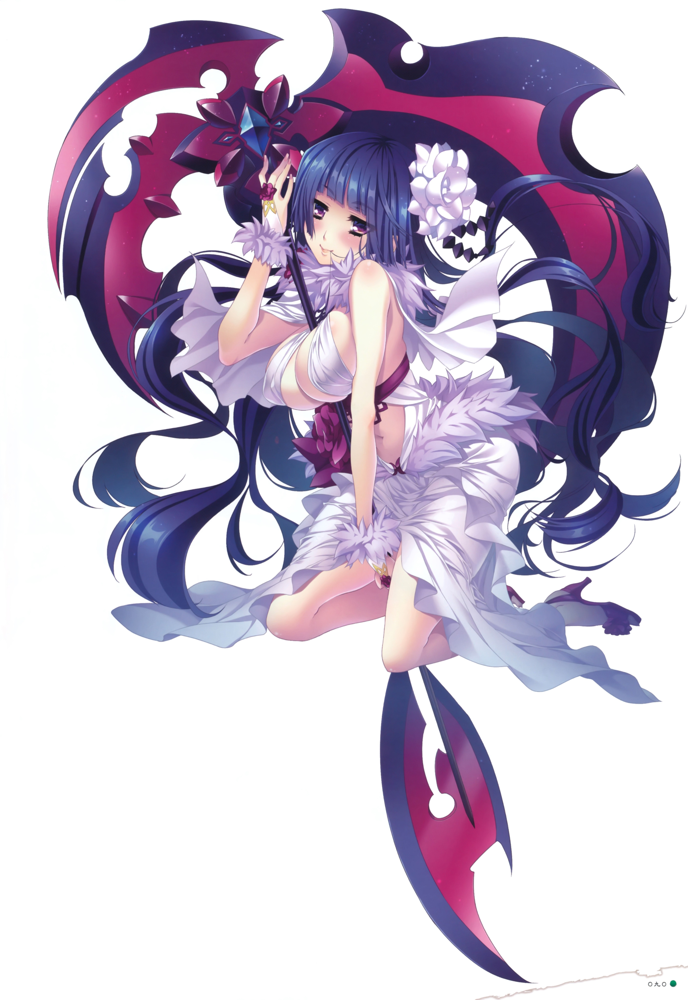 |
| ティッタ | 上坂すみれ | 服侍于冯伦伯爵家，专门照顾堤格尔的仕女。 堤格尔的青梅竹马，自小因为经常往来的关系，发展成与其说是主从不如像是兄妹之间的关系 原为是一名巫女的女儿，自小便进行巫女的修行然而却对其不感兴趣，甚至很喜欢去正在领主宅邸工作的伯母那里，也萌生想成为仕女的想法，虽然被母亲反对但在堤格尔的说服下得以实现这样的想法，并且还是会修习关于巫女的必修学问。 现在在堤格尔的房子里工作的侍女只有她而已，并担负着堤格尔身边的所有大小事务。 | 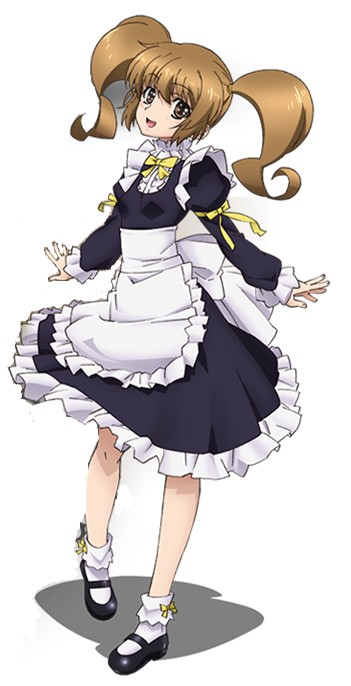 |
| バートラン | 菅生隆之 | 自堤格尔幼年时期便在亚尔萨斯领主，堤尔格之父乌鲁斯底下工作，对堤格尔有着像对待儿子般的爱情，称呼堤格尔为少主。 参与战争的经验相较于堤格尔丰富，出兵之际一手包办堤格尔的士兵们。 | 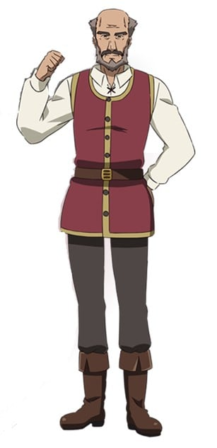 |
| マスハス＝ローダント | 飯島肇 | 布琉努国王北部奥特地区领地的伯爵，前领主乌鲁斯的好友，同时也是在各方面对堤格尔多加照顾，有如监护人般的存在，是个与普遍共通价值观有着不同想法的少数贵族派，由于人脉广阔的缘故，在其他贵族与王宫的人里头相当有面子。 | 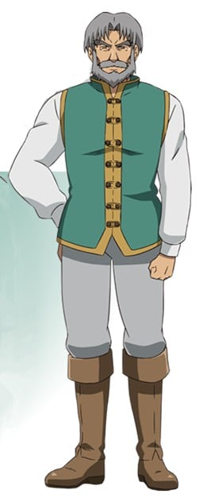 |
| ザイアン＝テナルディエ | 木村良平 | 泰纳尔迪耶公爵的独生子兼继承人。 虽然具备优异的武艺但品性方面却有缺陷，对地位比自己低的人妄自尊大而且极其无礼，但在应对突发状况方面却疲软无力。和父亲泰纳帝迪耶公爵一样蔑视泰格勒这一存在。在入侵阿尔萨斯后与泰格勒和艾伦率领的吉斯塔特军交战，并最终战死于莫尔塞姆平原。 |  |
| フェリックス＝アーロン＝テナルディエ | 松本大 | 布鲁奈王国的上流贵族，两大公爵之一，42岁。拥有和艾伦不相上下的剑技实力。 泰纳帝迪耶公爵势力庞大，并且拥有广阔的领土和数量极多的可动员兵力，是泰格勒这种边境贵族所望尘莫及的一种存在。 他锐利的眼神中蕴含着对自己力量的自信和毫无所惧的高傲，不论在王国主办的马上对战中还是和与邻国萨克斯坦的战争中都立下过显赫战功，几遍已经是42岁的高龄但却依旧持续锻炼著自己的身体。曾娶国王的侄女为妻，成为王家姻戚。可是其自信却逐渐转变为高傲自大而导致他出现残虐的性格，开始理所当然地蹂躏领民。是个能够面不改色十分坦然地下达冷酷无情命令的人，另外亦保留理性判断能力，至少不会对有利用价值的人施以严厉惩罚。同时还具备着强烈的野心，时刻窥视着敌对者的动静。 | 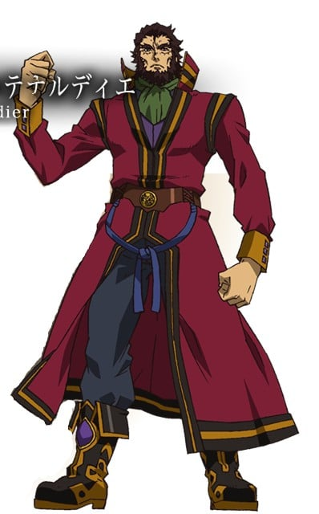 |
| マクシミリアン＝ベンヌッサ＝ガヌロン | 飛田展男 | 与泰纳帝齐名的布鲁奈王国上流贵族，两大公爵之一。其权势之强就连国王法隆也无法忽视。 个子相当矮小，大约与十四、五岁的少年相当，就连华服下的身躯也很瘦小，手脚如孩童般纤细。头上没有半点毛发，总是戴着丝质帽子。 没有任何可以讨人喜欢一面、令人生厌的丑恶小人。在故事中表现出残忍的一面，并坚持“无论是领地还是财产，向来都是多多益善，而来分一杯羹的同伙则是愈少愈好”的主张。 | 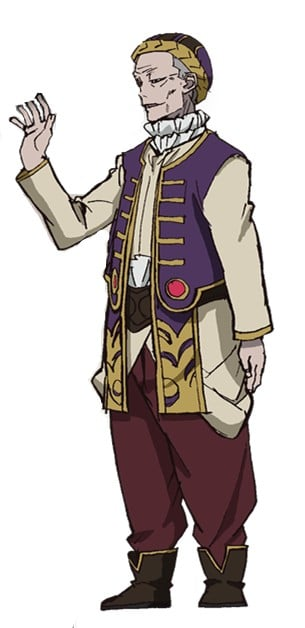 |