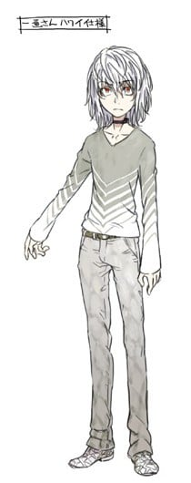

> [!bookinfo|noicon]+ **魔法禁书目录 第二季**
> 
>
| 日文名 | とある魔術の禁書目録Ⅱ |
|:------: |:------------------------------------------: |
| 类型 | 小说改 |
| 新番 | 2010 年 10 月 |
| 集数 | 共24话 |
| 官网 | [http://toaru-project.com/index_1_2/](https://http://toaru-project.com/index_1_2/) |
| 制作 | J.C.STAFF |
| 导演 | 錦織博 |
| 脚本 | 赤星政尚,砂山蔵澄,水上清資,浅川美也 |
| 评分 | 6.7|
| 制片人 | 田部谷昌宏 |

> [!abstract]+ **简介**
> 主人公上条当麻是一名平凡的高中生，作为无能力者的他并非完全没有能力，而是他名为“幻想杀手”的特殊能力能够将一切异能（包括超能力和魔法）无效化。在宿舍阳台上他遇见了一位纯白修女。这位少女自称“茵蒂克丝（Index）”，是从魔法世界逃了出来，现在正在被魔法师追赶中。就这样，掌握了十万三千本魔道书的少女与拥有抹杀一切幻想的“幻想杀手”右手的少年一起，经历了一系列惊险故事。
转眼间，暑假临近结束，新的故事也由此开始。在新的故事中，罗马正教的登场将魔法侧的故事拓展到了学园都市，而上条他们的战斗舞台也将走向世界。另一方面，通过描述学园都市的学生生活和潜伏在其背后的黑暗，科学侧的故事也将会逐步开。

> [!tip]+ **章节列表**
>- [ ] 第1话：8月31日(最后之日) (2010-10-08)
>- [ ] 第2话：法之书 (2010-10-15)
>- [ ] 第3话：天草式 (2010-10-22)
>- [ ] 第4话：魔灭之声(Sheol Fear) (2010-10-29)
>- [ ] 第5话：莲之杖(Lotus Wand) (2010-11-05)
>- [ ] 第6话：残骸(Remnant) (2010-11-12)
>- [ ] 第7话：座标移动(Move Point) (2010-11-19)
>- [ ] 第8话：大霸星祭 (2010-11-26)
>- [ ] 第9话：追踪封锁(Route Disturb) (2010-12-03)
>- [ ] 第10话：速记原典(Short Hand) (2010-12-10)
>- [ ] 第11话：刺突抗剑(Stab Sword) (2010-12-17)
>- [ ] 第12话：天文台(Belvedere) (2010-12-24)
>- [ ] 第13话：使徒十字(Croce di Pietro) (2011-01-07)
>- [ ] 第14话：水之都 (2011-01-14)
>- [ ] 第15话：女王舰队 (2011-01-21)
>- [ ] 第16话：刻限的十字架 (2011-01-28)
>- [ ] 第17话：惩罚游戏 (2011-02-04)
>- [ ] 第18话：检体编号(serial number) (2011-02-11)
>- [ ] 第19话：木原数多(研究者) (2011-02-18)
>- [ ] 第20话：猎犬部队(hound dock) (2011-02-25)
>- [ ] 第21话：学习装置(testament) (2011-03-04)
>- [ ] 第22话：天罚术式 (2011-03-11)
>- [ ] 第23话：开战前 (2011-03-25)
>- [ ] 第24话：武装集团(skill out) (2011-04-01)

> [!tip]+ **主要角色**
> 
| 角色 | CV | 简介| 角色图片 |
|:----:|:---:|:---:|:--------:|
| インデックス | 井口裕香 | 隶属于英国清教第零圣堂区“必要之恶教会”的修女。正式名称为“Index-Librorum-Prohibitorum”（禁书目录），年龄约14-15岁，外表是12-13岁的幼儿体型。平常穿着有金色刺绣的纯白修女服。描写时经常使用纯白修女。 她是使用完全记忆能力记忆了10万3000本魔道书的魔道图书馆。虽然书籍内容是一般人只要看就会发疯的危险物品，却能够改写世界的常识，企图夺取内容的人前仆后继的到来。逃亡途中从屋顶上摔下来，挂在上条房间的阳台上，在此和上条相遇。 有生气时咬别人头的坏习惯（都是上条）。喜欢吃东西的食欲少女。因为必须读各种语言的魔道书，精通各种语言。反之，拿科学与机械没辄。 魔法名为“Dedicatus545”（献身的羔羊守护强者的知识）。本身无法使用魔术，不过可以使用介入他人咏唱阻碍发动与效果的“强制咏唱”与抓出对手教义的矛盾之处，使对方的精神暂时受到破坏的“魔灭之声”。 能够做出某种程度的自卫行为。同时能够从广大的魔道书知识中取得情报，把握局势和定订作战计划。 |  |
| 上条当麻 | 阿部敦 | 高中1年级生，拥有能消除一切异能之力的右手“幻想杀手”（Imagine Breaker）。由于机器无法测量，被当作LV0的无能力者。（科学势力所重点“看护”的原石之一）因其右手，接二连三被卷入各种灾难事件。如果用守恒定律解释的话、他的好运并不是无缘无故的消失了，而是转移给别人（桃花运的原因）。常用“让我打碎这个幻想！”作为使用“幻想杀手”时的台词。其“幻想杀手”被亚雷斯塔认为阻碍自我计划的误差与意外，在保持着中立态度的同时用其右手帮助并救赎了不少角色（收入后宫），目前仍对其真实能力不明，上条当麻也开始准备去了解自己的右手（新约2结尾）目前与一方通行滨面一同面对新的敌人~ |  |
| 御坂美琴 | 佐藤利奈 | 在学园都市中只有七人的等级五超能力者排行第三。拥有“超电磁炮(Railgun)”称号的电击超能力者。对电流和电磁力的控制出神入化。独有招牌特技“超电磁炮”，以电磁力将金属作为电磁炮以3倍音速射出，一般使用方便携带的游戏币，但也可控制更大的物体。使用电击产生的电磁波对机器有不好的影响，在本作中破坏了手机、有线电视，警备机器人等无数机械。还可放出高压电流枪、使用电磁力自由控制金属，招来真正的雷击或是制造电磁爆。  即使在贵族女校就读，行动却相当粗鲁，有以“四十五度斜角攻击机械维修法”（主要是踹自动贩卖机喝免钱饮料）的行为，对年纪较大的上条依旧口气狂妄。因此，主角曾说她完全没有大小姐该有的风范。但实际上是直率单纯且暗藏着自己特有的笨拙温柔（傲娇）的人。  性格好胜，每次向上条当麻挑战都被随便应付过去。随着屡次的接触，变得相当在意上条。  初期上条称她为“放电国中妹（Bilibili）”，茵蒂克丝则称她为“短发”。相当喜欢呱太为主题的饰品，爱好很低龄化，喜欢穿孩子气的内裤，或是在常盘台初中的制服裙下穿白色短裤。受到学妹白井黑子的爱慕。很喜欢动物，尤其是猫。其实每天都会偷偷去喂聚集在宿舍后面的野猫，但由于身体会放出微弱电磁波的关系被猫讨厌，每次野猫都跑的一只不剩，只剩美琴自己孤单一人拿着猫食，不过本人仍然不肯放弃的每天都去喂猫。  “这本轻小说真厉害！2010年”年度人气女角色首名。 “这本轻小说真厉害！2011年”人气女性角色排名首名。  在2010年拿下国际最萌联盟比赛的亚军。 在华人读者群中的绰号是“傲娇超电磁炮”，简称“傲娇炮”。 |  |
| 白井黒子 | 新井里美 | 《魔法禁书目录》系列配角、外传《科学超电磁炮》主角，学园都市中名校常盘台女子中学的一年级生，御坂美琴的学妹兼室友，能力为Level 4的空间移动，双马尾茶色头发的少女。 平常举止都很“淑女”，句尾有“~ですの（是哦）”的独特大小姐腔调。非常仰慕御坂美琴，甚至到近乎变态的程度，称呼美琴为“姐姐大人”。喜欢冲击力极强、布料很少的泳衣和内衣裤。第177活动支部所属风纪委员，具有很强的责任感和正义感。 |  |
| 姫神秋沙 | 能登麻美子 | 就读学园都市名校“雾之丘女子学院”。穿着巫女服的长发美人。拥有非常稀有的原石类能力“吸血杀手（Deep Blood）”，血液能吸引吸血鬼，但吸血鬼一接触她的血就会被立刻死去（母亲、好友也因此被害），小时候住在京都的小村，但因吸血杀手的能力而引来外来的吸血鬼，因此村民被吸血而成为吸血鬼村民后也去吸姬神的血，所以全部村民也死亡，后来姬神被三泽补习班带走（因想研究吸血杀手），因而被卷入三泽补习班的争斗。事件结束后，配戴简易版的“移动教会”凯尔特十字架，封住能力并寄住小萌老师家中（小说SS时搬入学生宿舍），同时转入上条班上。在大霸星季被欧莉安娜·汤森误认为敌人而被打成重伤[2]。虽然表情变化少，但也不是完全面无表情，否认自己是电波系，最初和上条等人见面时自称是魔法师，原因是因为有带着魔杖（但其实这魔杖是一根警棍）以及因为小时候的梦想是成为魔法师，声称自己的魔杖（警棍）是新素材。拥有十分强劲的医疗知识（特别有关血液方面）及医疗技术。 对上条当麻怀有类似恋爱般的情感，不过本人其实对此没有什么自觉。 之所以穿巫女服是因为在三泽补习班中是以巫女为学习课程。 每天在午休时都是吃自己带的便当，料理能力十分之好。 |  |
| 月詠小萌 | こやまきみこ | 上条的班导（所教的科目是化学）。外表怎么看都是个小学生（身高135厘米），实际是二十岁以上、早已大学毕业的成人，被誉为学院都市七大不可思议事件之一。喜欢抽烟喝酒，被黄泉川称为“堆积如山的人体烟灰缸”，酒量非常好，能轻松饮最少5升的酒。主要教授的科目是化学，喜欢照顾别人，兴趣是保护离家出走的少女，因本人精通社会心理学、环境心理学、行动心理学及交通心理学，所以经常出现在离家出走的少女的场所，找到离家出走的少女就会去帮助。一般的车脚踩不到油门和煞车，只能开残障者用车。非常喜欢教导学生，失去教学机会时会相当难过。上条曰：“越看到坏孩子就越开心”。经常和黄泉川和铁装一起去澡堂以及去酒会。 记得救茵蒂克丝及姬神的治愈魔法，但因为本身并不懂使用魔法，所以就算记得也不能用。 史提尔·马格努斯曾说过小萌是一位十分厉害的人，因为在史提尔·马格努斯所设置的不让人接着的符文中，只要史提尔一走出符文的有效范围，小萌就能立即找到，以及史提尔曾想过，小萌和茵蒂克丝非常相似，身材娇小，天真烂漫，为了他人而生气，为了他人而哭泣，染上了他人的血，因此泪流不止的样子，及是完全不在意体格的差别，无视人与人之间的距离来踏入他人心中，看似旁若无人的举动，其实都在为他人着想，为了阻止他人受伤，会一直执著地大声骂人。 用了“薛定谔猫箱”来解释超能力的原理。 目前让结标淡希住在她家。现在受到史提尔的影响，抽烟时会用嘴角叼著烟。 |  |
| 初春飾利 | 豊崎愛生 | 栅川初中一年级，和黑子同为第177支部的风纪委员。留着黑色短发，头戴花圈，远看好像头顶着花瓶。白井的好友兼拍挡。对贵族大小姐的生活相当憧憬，很喜欢婚后光子所饲养名叫爱卡迪莉娜的蟒蛇。害羞谦逊，喜欢吃甜食，体能很差。但对风纪委员这项工作很认真。 能力为等级一的定温保存（Thermal Hand），只能做到使拿着的物体保持一定温度。黑客能力高超，工作时负责运用电脑处理信息，技术让专业人员都为之吃惊。独力设计“书库”的防火墙，击败许多网络黑客的入侵，是都市传说中“守护神（Gatekeeper）”的正体（但本人并不知晓）。 |  |
| 黄泉川愛穂 | 甲斐田裕子 |  |  |
| 一方通行 | 岡本信彦 | 本名不明。身高168cm。学园都市仅仅七人的等级五第一位，意即学园都市最强的超能力者。能力名“一方通行（Accelerator）”（同时也是他的代号），能力为矢量控制，只要接触到皮肤，能够自由操纵一切形式矢量（vector）的方向（平常使用反射），同时头脑也具有相当高的演算能力，其能力也依靠着演算能力而运作。但其实本质不明，还有未被发觉的秘密。因为连直射日光里的紫外线都反射，导致缺乏外部刺激使激素分泌异常。不但原本要变黑的头发和皮肤都呈现白色，瞳孔颜色也接近红色，就连体型无法分辨是男是女。与上条当麻为正反对照，在本作里是Dark Hero般的存在。  “这本轻小说真厉害！2011年”人气男性角色排名第二位。 |  |
| 神裂火織 | 伊藤静 | 英国清教“必要之恶教会”的魔术师。18岁（小说第七集本人所说）。伦敦排行前五的魔导师。以前是天草式十字凄教的女教皇（已复任），魔法名是由这段经历得来。身穿T恤与牛仔裤的高窕美女。此外，为象征不对称而使T恤在肚脐附近打结，牛仔裤露出半边大腿，色气程度相当高。 魔法名为“Salvere000”（拉丁文：拯救），寄托的意义为“受遗弃者的救赎之手”，世界上不到20名的圣人之一，强大到以一挡万都不为过的地步，谣传唯有真正的神和天使才有打败她的实力。实际上在第四集里曾和天使短暂对抗（虽然如此，面对天使不可言表的恐怖能这样已经是无法想象的巨大成功了）。一直疑惑为何自己是神的宠儿，其他人却得不到拯救，故树立起了要以自己所得神力“受遗弃者的救赎之手”的博爱精神，绝不杀人。这种信念也成为她领导的天草式十字凄教所坚持。 在天草式事件中欠上条 当麻相当大的人情。也有为了回报人情，对土御门半开玩笑的提出的堕天使女仆角色扮演相当烦恼并践行之的认真一面。喜欢热带鱼。不擅长机械（尤其是最新型机械）。 擅长用钢丝攻击的“七闪”和以称作“令刀”的日本刀“七天七刀”攻击的必杀技“唯闪”。之所以使用拔刀术“唯闪”做为必杀技，原因在于虽然因身为圣人而可以使用部分的“神之子”的力量，但是人类的肉体无法长时间负荷如此庞大的力量，所以才选用“唯闪”这种只需在一瞬间使用神之子力量的招式。实际上在面对大天使“神之力”加百列和后方之水的时候，都因为长时间使用身为圣人的力量而使身体濒临崩溃边缘。 认为茵蒂克丝是重要的朋友。 |  |
| 結標淡希 | 櫻井浩美 | 就读雾之丘女子学院二年级，平常身穿制服短裙，身上罩着制服外套，以绷带缠绕胸部，学园都市58个空间移动能力者中的最强者，曾有进化至Level 5的可能。 和白井黑子不同，能力是把物品从A点移到B点的“座标移动（Move Point）”，无需接触，并可多物体同时传送，重量上限为4520公斤，距离上限则为800米，使用军用手电筒作为瞄准的基准点。由于一般性较高，较难控制，容易产生座标点的误差，以前有过移动自己失败，脚卡在墙壁中的经验。受此创伤后，能力在Level 4时停止成长，但在10月9日于拘留所跟手盐惠未的对峙中，渐渐地摆脱心理障碍了。 曾负责带领别人进入没有门窗的建筑中，因此被称为学园都市传说中的“带路人”。多使用拔栓器卡入对方手脚中的方法战斗。 曾协同都市外的敌对组织意欲偷出“树形图设计者”的核心碎片“残骸”，但被一方通行击败身受重伤，被事后赶到现场的上条当麻送医急救，之后为保护被牵连的同伴加入“Group”。目前寄住在小萌老师家。 在9月14日的那起事件里面和白井黑子交手之后，由于心理障碍陷入了无法使用能力的状态，而现在却能恢复到这个程度是多得“Group”的技术部所制造的小型低周波震动治疗器，现在两肩和背部有像膏药外观的电池，这是来连结小型低周波震动治疗器，其效果是让电流能通过体内的按摩器对结标的脑电波进行测定来发出最有效果的脉冲，虽然不完美，但有一定的减压效果。 |  |
| 打ち止め | 日高里菜 | 小说第5卷首度登场。在御坂妹妹中的地位最高， 是御坂网络的管理者。检体编号20001。是为了防止“妹妹们”反叛、失控而制作出来的。身体调整尚未完成，原本不该离开培养器，却因某些原因流落街头，正彷徨时遇见了一方通行。 　　外表是10岁左右的小女孩。第一次登场只包着一条脏毛巾，现在则穿着合身的衣服。 　　人格资料设定上，脱逃时会下意识躲避身穿白色长褂的研究员装扮人士，在处处都有电磁纪录的学园都市中，拥有能够完全躲避追踪的生存本能。 性格像一般的小孩子一样，喜欢去游乐场，对一切的新鲜事物都很感兴趣。而且还会到处乱跑，常常让寻找她的一方通行感到十分无奈。 |  |