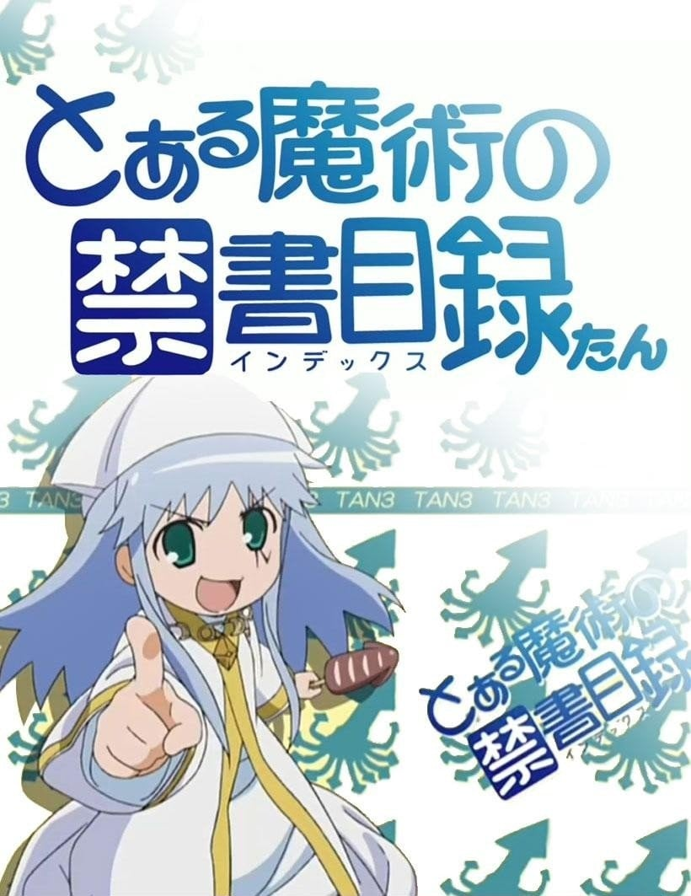
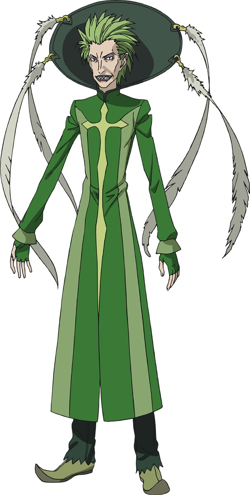

> [!bookinfo|noicon]+ **魔法禁书目录炭**
> 
>
| 日文名 | とある魔術の禁書目録たん |
|:------: |:------------------------------------------: |
| 类型 | 小说改 |
| 新番 | 2009 年 1 月 |
| 集数 | 共7话 |
| 官网 |  |
| 制作 | J.C.STAFF |
| 导演 |  |
| 脚本 | 浅沼晋太郎,松倉友二 |
| 评分 | 6.6|
| 制片人 |  |

> [!abstract]+ **简介**
> 

> [!tip]+ **章节列表**
>- [ ] 第1话：魔法禁书目录炭 (2009-01-23)
>- [ ] 第2话：魔法禁书目录炭2 (2009-05-29)
>- [ ] 第3话：魔法禁书目录炭3 (2011-01-26)
>- [ ] 第4话：魔法禁书目录炭4 (2011-06-22)
>- [ ] 第6话：魔法禁书目录炭6 (2018-12-26)
>- [ ] 第7话：魔法禁书目录炭7 (2019-04-30)

> [!tip]+ **主要角色**
> 
| 角色 | CV | 简介| 角色图片 |
|:----:|:---:|:---:|:--------:|
| 左方のテッラ | 大塚芳忠 | “神之右席”的一员。具有“神之药”（拉斐尔）的性质。“Terra”在拉丁文代表“大地”。相貌丑陋的矮个白种人。 擅长的术式是“光之处刑”，是能任意设定事物上下位，如“优先，枪于下位，空气于上位”，则枪无法刺穿空气，也就是被固定了。理论上能弑神的超天使级术式，但最多只可指定一对目标，若是重新指定其他目标，则之前的指定就会失效。 狂热的信徒，不将异教徒视为人类，并用非信仰罗马正教的观光客小孩做魔法实验。 |  |
| ナイトリーダー | 子安武人 | 本名不明，骑士团团长。36岁的金发男子，穿着西装，个性傲慢。武器是柄长1米的处刑用斧和长剑。因为仪典剑而拥有超高的攻击与移动速度。 曾经邀请神裂去舞会，却被建宫以“女教皇只喜欢年纪比她小的”这句话驳回。已被当作八卦传遍了半个伦敦。 体技超群。利用所罗门术式破解唯闪，不用武器就打倒神裂。说其原因除其本身实力外，“正统卡提纳”所赋予的天使之力才是最大主因。当然，神裂因为轻敌在开战时有所保留也有一点关系。 认为“王牌不能只有一张”，因而准备了许多种强力的战斗手段，但为了展现忠诚而自己将所有的术式设定为对王室无效。使用北欧传说中贝武夫佩带的魔剑“格尔弗”，本来是借由吸收敌人的鲜血强化的剑，但在压入仪典剑给予的天使之力后能把魔剑本身的力量完全释放。融合了各式各样复杂的“骑士道”术式，能够发动各式各样的强化术式，射程、防御、攻击强化等等，然而一次只能操纵一种。擅长使用“索罗门的术式”，能让十分钟内某样攻击的破坏力完全归零，不能重复指定。 与后方之水是好友，但十年前意图与后方之水一同前往救助第三公主时被后方之水击昏，失去意识前约定好自己从国内、后方之水从国外，以各自的方式守护英国（不过完全是后方之水强加的约定，骑士团长本人并没有明确答应）。 |  |
| 御坂妹 | ささきのぞみ | 以御坂美琴为原型的体细胞克隆体全体的统称。原本是为了超电磁炮量产计划设计，但由于能力不及正版的百分之一，该计划被废弃；之后为了一方通行的能力进化Level 6 Shift计划重新开始量产；后来学园都市高层为抹杀一方通行而开启“第三次克隆人计划”，专门制造出的新的“妹妹”，代号“番外个体”（Misaka Worst）。 根据目前剧情共制造了20003名个体，其中试造原型1名，网络管理个体1名，特殊用途1名。但从1号至10031号均已死于一方通行的进化实验。 与御坂美琴同为发电系能力者，但大多只有Level 2，少数达到Level 3和Level 4，统称“缺陷电力（Radio Noise）”［欠陥電気(レディオノイズ)］。因无法目视电磁波，通常佩戴军用目视镜。 所有妹妹的脑波彼此相连，构成“御坂网络”，可共享记忆、完成并行运算等功能。因为共享记忆所以全体对上条当麻都很有好感。 根据小说中的描述，御坂妹妹会把目光均匀发散到自己能够看到的每个物体上，这就是为什么御坂妹妹的瞳孔看起来与御坂美琴有些许的差别。此差别在动画版第一部中是以放大的瞳孔具体化，但在外传动画中被取消。 基于现在实验已经终止了，所有妹妹们也开始过安稳和平的生活，但因为入世未深所以对很多事缺乏常识。  特别提到的个体 ミサカ0号 御坂0号：http://bgm.tv/character/21608 ミサカ1号 御坂1号：http://bgm.tv/character/21609 ミサカ9982号 御坂9982号：http://bgm.tv/character/21610 ミサカ10031号 御坂10031号：http://bgm.tv/character/21611 ミサカ10032号 御坂10032号：http://bgm.tv/character/21612 ミサカ10777号 御坂10777号：http://bgm.tv/character/21613 ミサカ19090号 御坂19090号：http://bgm.tv/character/21614 ミサカネットワークの総体としての意思 御坂网络的整体意志：http://bgm.tv/character/21615   其他出现过的个体  ・树状设计图残骸篇的妹妹 10854号是驻扎于西班牙塞维利亚的妹妹，在小说第八集为10032号提供情报。 18770号是驻扎于德国的什勒斯威格的妹妹，在小说第八集为10032号提供情报。 19999号是驻扎于俄罗斯新西伯利亚的妹妹，在小说第八集为10032号提供情报。 20000号是驻扎于俄罗斯新西伯利亚的妹妹，在小说第八集为10032号提供情报。 10044号是驻扎于学园都市的妹妹，在小说第八集为10032号提供情报。 14002号是驻扎于学园都市的妹妹，在小说第八集为10032号提供情报。 18820号是驻扎于学园都市的妹妹，在小说第八集为10032号提供情报。 10774号是驻扎于学园都市的妹妹，在小说第八集中，忧心10032号能否行动。 14458号是驻扎于学园都市的妹妹，在小说第八集中，支持10032号行动。 19002号是驻扎于学园都市的妹妹，在小说第八集中，支持10032号行动。  ・前方之风篇的妹妹 13577号是驻扎于学园都市的妹妹，在小说第十二集中，和10032号及10039以及19090一起出院。 10039号是驻扎于学园都市的妹妹，在小说第十二集中，和10032号及13577以及19090一起出院。 19090号是驻扎于学园都市的妹妹，在小说第十二集中，和10032号及13577以及10039一起出院。  ・原石回收篇的妹妹 17000号是驻扎于英国加拉希尔斯的妹妹，在小说第SS2集中，参于了拯救原石及收集原石到学园都市的任务。 18022号是驻扎于瑞士洛桑的妹妹，在小说第SS2集中，参于了拯救原石及收集原石到学园都市的任务。 14333号是驻扎于墨西哥的瓜达拉哈拉的妹妹，在小说第SS2集中，参于了拯救原石及收集原石到学园都市的任务。 15110号是驻扎于阿根廷德赛阿多的妹妹，在小说第SS2集中，参于了拯救原石及收集原石到学园都市的任务。 10090号是驻扎于菲律宾达沃的妹妹，在小说第SS2集中，参于了拯救原石及收集原石到学园都市的任务。 12053号是驻扎于印度艾哈迈德纳格尔的妹妹，在小说第SS2集中，参于了拯救原石及收集原石到学园都市的任务。 11899号是驻扎于委内瑞拉的拉·巴拉瓜尔的妹妹，在小说第SS2集中，参于了拯救原石及收集原石到学园都市的任务。 16836号是驻扎于加拿大穆索尼的妹妹，在小说第SS2集中，参于了拯救原石及收集原石到学园都市的任务。 10501号是驻扎于奥地利萨尔茨堡的妹妹，在小说第SS2集中，参于了拯救原石及收集原石到学园都市的任务。 19900号是驻扎于南极的妹妹，在小说第SS2集中，参于了拯救原石及收集原石到学园都市的任务。 12083号是驻扎于泰国清迈的妹妹，在小说第SS2集中，参于了拯救原石及收集原石到学园都市的任务。 10855号是驻扎于波兰什切青的妹妹，在小说第SS2集中，参于了拯救原石及收集原石到学园都市的任务。 17203号是驻扎于意大利法恩莎的妹妹，在小说第SS2集中，参于了拯救原石及收集原石到学园都市的任务。 19488号是驻扎于西班牙洛格罗诺的妹妹，在小说第SS2集中，参于了拯救原石及收集原石到学园都市的任务。 15327号是驻扎于韩国群山的妹妹，在小说第SS2集中，参于了拯救原石及收集原石到学园都市的任务。 13072号是驻扎于法国安格雷姆的妹妹，在小说第SS2集中，参于了拯救原石及收集原石到学园都市的任务。 17403号是驻扎于巴西库达加斯的妹妹，在小说第SS2集中，参于了拯救原石及收集原石到学园都市的任务。 10050号是驻扎于危地马拉萨卡帕的妹妹，在小说第SS2集中，参于了拯救原石及收集原石到学园都市的任务。 10840号是驻扎于德国萨尔茨吉特的妹妹，在小说第SS2集中，参于了拯救原石及收集原石到学园都市的任务。 12481号是驻扎于斯洛文尼亚采列的妹妹，在小说第SS2集中，参于了拯救原石及收集原石到学园都市的任务。 18072号是驻扎于挪威伯根的妹妹，在小说第SS2集中，参于了拯救原石及收集原石到学园都市的任务。 19348号是驻扎于芬兰罗凡尼米的妹妹，在小说第SS2集中，参于了拯救原石及收集原石到学园都市的任务。 17009号是驻扎于澳大利亚悉尼的妹妹，在小说第SS2集中，参于了拯救原石及收集原石到学园都市的任务。 15113号是驻扎于葡萄牙布拉干萨的妹妹，在小说第SS2集中，参于了拯救原石及收集原石到学园都市的任务。 14014号在小说第SS2集中，参于了拯救原石及收集原石到学园都市的任务，并疑问为何10032号会发出紧急报告。 18829号在小说第SS2集中，参于了拯救原石及收集原石到学园都市的任务，并提问10032号为何发出紧急报告及要求说明。 |  |
| ミサカ19090号 | ささきのぞみ | 和10032号等一起被冥土追魂收容的妹妹之一。 被布束砥信注入感情程序，由于最后之作在御坂网络内对该程序实行拦截，故该程序仅对其一人起效。由于受到感情程序影响，面部表情比其他妹妹丰富，也会为吸引异性（特指上条当麻）而偷偷减肥；当减肥计划被其他三名妹妹发现时，会“遵循自身的危机管理能力逃亡”。 |  |