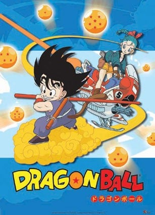
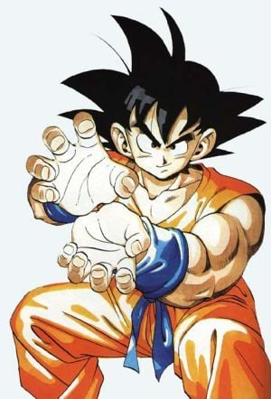
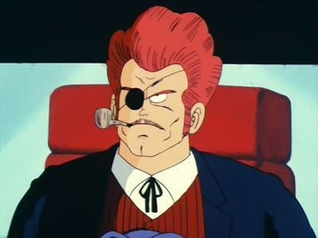
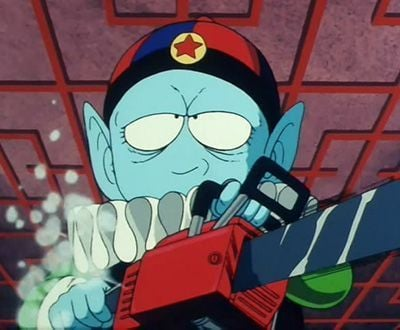
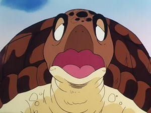
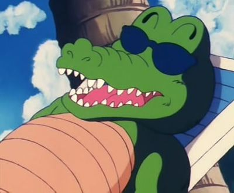
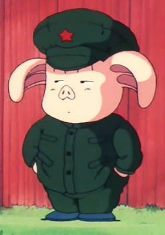
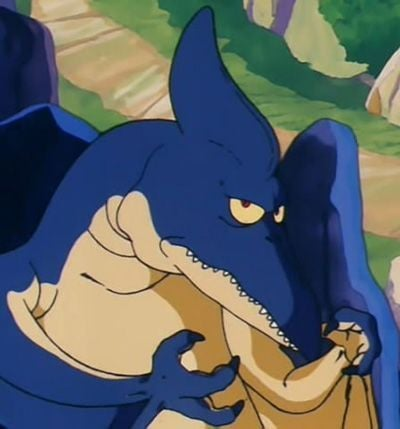
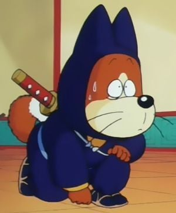

> [!bookinfo|noicon]+ **龙珠**
> 
>
| 日文名 | ドラゴンボール |
|:------: |:------------------------------------------: |
| 类型 | 漫改 |
| 新番 | 1986 年 2 月 |
| 集数 | 共153话 |
| 官网 | [http://www.toei-anim.co.jp/tv/dragon/](https://http://www.toei-anim.co.jp/tv/dragon/) |
| 制作 | 東映アニメーション |
| 导演 |  |
| 脚本 | 井上敏樹,由木義文,菅良幸,平野靖士,照井啓司,雪室俊一,宮崎博子,島田満,小山高生,小黒祐一郎,丸尾みほ,荒川稔久,出手敬 |
| 评分 | 8.2|
| 制片人 |  |

> [!abstract]+ **简介**
> 鸟山明最早在《少年JUMP》周刊连载《龙珠》时，该漫画早期（1-194篇）比较偏重于搞笑，而且打斗一般并不在这儿占主流，因此这个时期，鸟山明的画风对人物性格刻画得很精准，可以让人爆笑起来，因此东映动画公司决定把这个时期的漫画改成一部153集的动画，这也是中国内地在三部《龙珠》系列动画中唯一引进的一部，故也称龙珠TV。而且第一部有很多风格和人物剧情都根源于《西游记》，而且鸟山明的前作《阿拉蕾》中的人物也有客串。

> [!tip]+ **章节列表**
>- [ ] 第1话：布尔玛与孙悟空 (1986-02-26)
>- [ ] 第2话：唉呀呀呀~!球不见了! (1986-03-05)
>- [ ] 第3话：龟仙人的筋斗云 (1986-03-12)
>- [ ] 第4话：抢人妖怪乌龙 (1986-03-19)
>- [ ] 第5话：强大邪恶沙漠的乐平 (1986-03-26)
>- [ ] 第6话：深夜的拜访者 (1986-04-02)
>- [ ] 第7话：烤锅山的牛魔王 (1986-04-09)
>- [ ] 第8话：龟仙人的龟派气功 (1986-04-16)
>- [ ] 第9话：兔子头目的绝招 (1986-04-23)
>- [ ] 第10话：七龙珠被夺!! (1986-04-30)
>- [ ] 第11话：龙终于出现了! (1986-05-07)
>- [ ] 第12话：向神龙许愿 (1986-05-14)
>- [ ] 第13话：悟空的大变身 (1986-05-21)
>- [ ] 第14话：悟空的竞争者?上场!! (1986-05-28)
>- [ ] 第15话：奇妙的女孩拉琪 (1986-06-04)
>- [ ] 第16话：修业・寻找石头 (1986-06-11)
>- [ ] 第17话：拼了命!送牛奶 (1986-06-18)
>- [ ] 第18话：龟仙流的严苛修业 (1986-06-25)
>- [ ] 第19话：天下第一武道会开锣 (1986-07-02)
>- [ ] 第20话：出现了!修业的威力 (1986-07-09)
>- [ ] 第21话：危险!小林 (1986-07-16)
>- [ ] 第22话：乐平 vs. 陈龙 (1986-07-23)
>- [ ] 第23话：出现了!强敌基蓝 (1986-07-30)
>- [ ] 第24话：小林拼死的大攻防战 (1986-08-06)
>- [ ] 第25话：悟空注意!恐怖的天空X字拳 (1986-08-13)
>- [ ] 第26话：决胜战!!龟派气功 (1986-08-20)
>- [ ] 第27话：悟空・最大的危机 (1986-08-27)
>- [ ] 第28话：激烈冲突!!力量对力量 (1986-09-03)
>- [ ] 第29话：再冒险 彷徨湖 (1986-09-10)
>- [ ] 第30话：比拉夫与神秘军团【动画原创】 (1986-09-17)
>- [ ] 第31话：呵呵!假悟空出现【动画原创】 (1986-09-24)
>- [ ] 第32话：消失了!?空中要塞【动画原创】 (1986-10-01)
>- [ ] 第33话：龙的传说【动画原创】 (1986-10-08)
>- [ ] 第34话：无情的红领巾 (1986-10-15)
>- [ ] 第35话：北方少女小雪 (1986-10-22)
>- [ ] 第36话：马斯鲁塔的恐怖 (1986-10-29)
>- [ ] 第37话：忍者村崎登场 (1986-11-05)
>- [ ] 第38话：恐怖!!分身术 (1986-11-12)
>- [ ] 第39话：神秘的人造人8号 (1986-11-19)
>- [ ] 第40话：怎么办悟空!!战栗的布幽 (1986-11-26)
>- [ ] 第41话：马斯鲁塔的末日 (1986-12-03)
>- [ ] 第42话：千钧一发!阿8加油 (1986-12-10)
>- [ ] 第43话：西之都的布尔玛家! (1986-12-17)
>- [ ] 第44话：悟空与朋友危机四起 (1986-12-24)
>- [ ] 第45话：注意!空中陷阱 (1987-01-07)
>- [ ] 第46话：布尔玛的大失败 (1987-01-14)
>- [ ] 第47话：龟屋被发现!! (1987-01-21)
>- [ ] 第48话：布鲁将军开始攻击!! (1987-01-28)
>- [ ] 第49话：拉琪的危机 (1987-02-04)
>- [ ] 第50话：海盗们的陷阱 (1987-02-11)
>- [ ] 第51话：海底巡逻者 (1987-02-18)
>- [ ] 第52话：太棒了!发现宝物 (1987-02-25)
>- [ ] 第53话：恐怖的发光之眼 (1987-03-04)
>- [ ] 第54话：逃呀逃呀!!大逃命 (1987-03-11)
>- [ ] 第55话：追!企鹅村 (1987-03-18)
>- [ ] 第56话：呜哇哇~!小雨坐筋斗云 (1987-03-25)
>- [ ] 第57话：对决!小雨 vs. 布鲁 (1987-04-08)
>- [ ] 第58话：魔境的圣地凯里 (1987-04-15)
>- [ ] 第59话：来了!世界第一的刺客 &quot;桃白白&quot; (1987-04-22)
>- [ ] 第60话：胜负!!龟派气功 vs. 一指功 (1987-04-29)
>- [ ] 第61话：凯里塔的凯里神 (1987-05-06)
>- [ ] 第62话：究竟!?超圣水的功效 (1987-05-13)
>- [ ] 第63话：孙悟空的反击 (1987-05-20)
>- [ ] 第64话：最后的桃白白 (1987-05-27)
>- [ ] 第65话：悟空去吧!突击开始 (1987-06-10)
>- [ ] 第66话：黑绸军必死的攻防 (1987-06-17)
>- [ ] 第67话：雷德统帅死了!! (1987-06-24)
>- [ ] 第68话：最后的七龙珠 (1987-07-01)
>- [ ] 第69话：可爱吗!?水晶婆婆 (1987-07-08)
>- [ ] 第70话：突击!我们五人战士 (1987-07-15)
>- [ ] 第71话：拼死的大流血战 (1987-07-22)
>- [ ] 第72话：悟空上场!恶魔的厕所 (1987-07-29)
>- [ ] 第73话：必杀恶魔光是!? (1987-08-05)
>- [ ] 第74话：神秘的第五名男子 (1987-08-12)
>- [ ] 第75话：激烈冲突!!强敌同志 (1987-08-19)
>- [ ] 第76话：面具男的真面目!? (1987-08-26)
>- [ ] 第77话：比拉夫大作战 (1987-09-02)
>- [ ] 第78话：神龙再现 (1987-09-09)
>- [ ] 第79话：金角跟银角的吃人葫芦 【动画原创】 (1987-09-16)
>- [ ] 第80话：悟空 vs. 天龙 【动画原创】 (1987-09-23)
>- [ ] 第81话：悟空・前进魔界 【动画原创】 (1987-09-30)
>- [ ] 第82话：怪兽猪鹿蝶 【动画原创】 (1987-10-07)
>- [ ] 第83话：悟空快点!天下第一武道会 【动画原创】 (1987-10-14)
>- [ ] 第84话：目标武功天下第一!! (1987-10-21)
>- [ ] 第85话：预赛获胜 (1987-10-28)
>- [ ] 第86话：决定!!8位勇者 (1987-11-04)
>- [ ] 第87话：对决!!乐平 vs. 天津饭 (1987-11-11)
>- [ ] 第88话：乐平晋级!恐怖的天津饭 (1987-11-18)
>- [ ] 第89话：恐怖!!满月的恨 (1987-11-25)
>- [ ] 第90话：那那那!!那是一指功 (1987-12-02)
>- [ ] 第91话：小林反败为胜 (1987-12-09)
>- [ ] 第92话：等一下!孙悟空出现!! (1987-12-16)
>- [ ] 第93话：实力相当!!天津饭 vs. Jacky (1987-12-23)
>- [ ] 第94话：呵呵呵!!新鹤仙流・太阳拳 (1987-12-30)
>- [ ] 第95话：战斗!!悟空 vs. 小林 (1988-01-06)
>- [ ] 第96话：悟空无论如何!?小林的大作战 (1988-01-13)
>- [ ] 第97话：决胜!!果然是武功天下第一!? (1988-01-20)
>- [ ] 第98话：秘技・排球拳 vs. 战斗力量 (1988-01-27)
>- [ ] 第99话：天津饭的烦恼!! (1988-02-03)
>- [ ] 第100话：生或死!?最后的手段 (1988-02-10)

> [!tip]+ **主要角色**
> 
| 角色 | CV | 简介| 角色图片 |
|:----:|:---:|:---:|:--------:|
| 亀仙人 | 宮内幸平 | 武天老師（むてんろうし）と称される武術の達人にして、孫悟飯、牛魔王、孫悟空、クリリン、ヤムチャらの師。守銭奴であの世へ自由に出入り出来る占い師・占いババは実姉。身長165cm、体重44kg。エイジ430年生まれで、年齢は319歳（初登場時）～354歳（原作、『ドラゴンボールZ』終了時）。劇中ではピッコロ大魔王編、魔人ブウ編にて2度、死を迎えている。  はげ頭にサングラス、名前の由来となった背負った大きな亀の甲羅がトレードマーク。私服としてアロハシャツを着ることも。仙人とはいうものの、外見からそれらしさを感じさせるものは長く伸びた白い顎鬚と手にしている杖くらいである。体型は痩せ型であるが、甲羅を背負っているシーンでは、かなり恰幅のよい太った体型で描かれている。  好きな食べ物は宅配ピザ、趣味は昼寝、テレビ鑑賞、読書、インターネット（3つともエッチなものが目的）、テレビゲーム。好きな乗り物はエアワゴン。嫌いなものは男。一人称は「わし」。誕生日はいつもいつも誕生日。戦闘力は第22回天下一武道界時が180。スカウターで計測した戦闘力は、ラディッツ襲来の直後で139（通常時）。  普段は南海の孤島のカメハウスで人語を理解するウミガメ、クリリン一家と共に暮らしており、一時はランチも一緒に住んでいた。姉の占いババとは180歳以上年が離れている（ドラゴンボールの世界における年表参照）。ウミガメから「不老不死の薬を飲んだじゃありませんか」と言われたこともあったが、後に事実ではないと判明（後述）。 |  |
| ジャッキー・チュン |  |  |  |
| 孫悟空 | 野沢雅子 | 孙悟空是日本漫画《七龙珠》和系列改编动画中登场的主角。重情重义、绝不欺骗朋友、喜欢帮助人。 多次救了地球和全人类。成名绝技有龟派气功、界王拳、元气弹等等。 |  |
| レッド総帥 | 内海賢二 |  |  |
| レッドリボン軍 |  | 拥有高科技装备和巨大财力的邪恶军团，名字来自中国的“红卫兵”。由于“红卫兵”在中国属于政治敏感题材，所以部分地区改译成“黑绸军” |  |
| スノ | 渡辺菜生子 |  |  |
| ピラフ | 千葉繁 |  |  |
| 海ガメ | 郷里大輔 | 人語を喋る海亀。 山の中で迷子になっていたところを悟空に助けられ、そのお礼に亀仙人を悟空たちの元へ連れて来た。真面目な性格で、亀仙人のスケベな言動を諫めるお目付け役のような存在。 |  |
| ワニ | 佐藤正治 |  |  |
| ウーロン | 龍田直樹 | エイジ733年生まれ。身長121cm、体重32kg。趣味はパンティー集め。好きなものは女。嫌いなものは男とブス、ブタ肉  様々なものに変化できるスケベな子ブタ。女の子を誘拐して、自分の嫁にしようとしていたが悟空に懲らしめられ仲間になる。登場当初は人民服のような服と帽子を着用。南部変身幼稚園出身で変身能力を学んでいたが、先生のパンツを全部盗んで幼稚園から逃げ出した結果、追い出された過去を持つ[4]。このため変身時間は5分しか持たず、変身後は1分の休憩を要する。また、姿は化けられてもその能力（具体的には、本物どおりの強度）までを有することはできないが、コウモリやロケットに化けた際に飛行能力を有している場面がある。  プーアルとは幼稚園時代の同級生で、幼稚園の頃プーアルがふざけて女の子に変身しているとき「かわいいお嬢さん、俺とつきあわないか!?フフン」と話しかけたのが最初の出会い。2丁目に住んでいる同級生のゼンマイからは「ギャングのウー公」と呼ばれており、プーアルの宿題を何度かぶん取っていた。授業でたまにボンギツネ先生がすごく短いスカートを履いてくるのを楽しみにしていた。  臆病かつめんどくさがり屋な性格でもあり、ピッコロ大魔王の世界征服の報道を見た後も「自分には関係ない」と発言したこともある。また男は嫌いと言いながらも悟空との再会を喜んだり、劇場版では悟飯やクリリンと行動を共にすることも多い。アニメでは八角村の出身という設定が付けられ、その村では豚型の人間が多数住んでおり、ウーロンもその住人の一人であり、このときからスケベだった。  名前の由来は、ウーロン。 |  |
| プテラノドン | 大竹宏 |  |  |
| シュウ | 玄田哲章 |  |  |