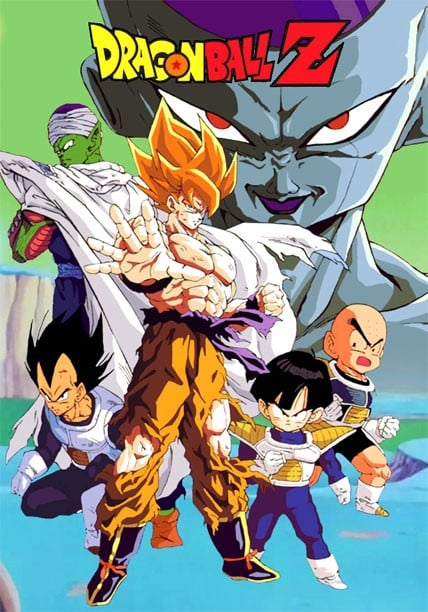
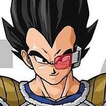
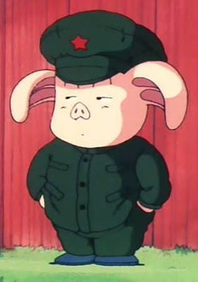
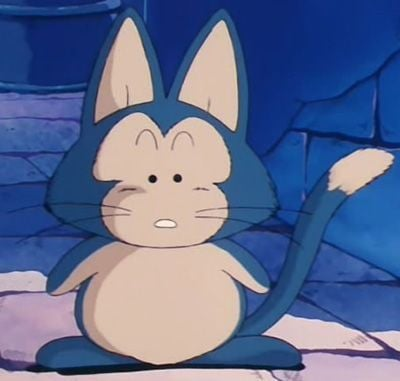
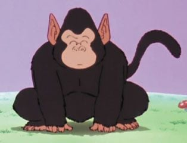

> [!bookinfo|noicon]+ **龙珠Z**
> 
>
| 日文名 | ドラゴンボールZ |
|:------: |:------------------------------------------: |
| 类型 | 漫改 |
| 新番 | 1989 年 4 月 |
| 集数 | 共291话 |
| 官网 | [https://www.toei-anim.co.jp/tv/dragonz](https://https://www.toei-anim.co.jp/tv/dragonz) |
| 制作 | 東映アニメーション |
| 导演 |  |
| 脚本 | 隅沢克之,井上敏樹,吉田玲子,あかほりさとる,久保田雅史,戸田博史,松井亜弥,前川淳,照井啓司,菅良幸,植竹須美男 |
| 评分 | 8.2|
| 制片人 |  |

> [!abstract]+ **简介**
> 龙珠Z（日文：ドラゴンボールZ，英文：DRAGON BALL Z）是指日本漫画家鸟山明的漫画《七龙珠》第195篇-第519篇，因为这期间鸟山明的漫画风格转为超激战，而且故事也和前194篇风格没有太大变化，因此由东映动画公司改编成为独立的动画片。题目中的"Z"代表着ZENKAI(日文"全开")之意。龙珠Z故事发生于《龙珠》后五年的世界，讲述孙悟空和同伴保卫地球的故事。 

> [!tip]+ **章节列表**
>- [ ] 第1话：新的危机 (1989-04-26)
>- [ ] 第2话：悟空的身世 (1989-05-03)
>- [ ] 第3话：太好了! 当今世上最强的搭档! (1989-05-10)
>- [ ] 第4话：短笛的最后绝招! 爱哭的悟饭 (1989-05-17)
>- [ ] 第5话：悟空死了! 只有最后一次的机会 (1989-05-24)
>- [ ] 第6话：阎罗王大震惊 在阴间加油 (1989-06-07)
>- [ ] 第7话：跟恐龙求生! 悟饭辛苦的修练 (1989-06-14)
>- [ ] 第8话：月圆之夜大变身! 悟饭力量的秘密 (1989-06-21)
>- [ ] 第9话：对不起机械人 沙漠中消失的眼泪 【动画原创】 (1989-06-28)
>- [ ] 第10话：悟饭不要哭! 第一次的战斗 【动画原创】 (1989-07-05)
>- [ ] 第11话：宇宙最强的战士赛亚人醒来! 【动画原创】 (1989-07-12)
>- [ ] 第12话：蛇道上睡觉 悟空掉了下去 【动画原创】 (1989-07-19)
>- [ ] 第13话：不准碰! 阎罗王秘密的果实 【动画原创】 (1989-07-26)
>- [ ] 第14话：甘甜的诱惑! 蛇姬的招待 【动画原创】 (1989-08-02)
>- [ ] 第15话：逃离短笛! 呼风唤雨的悟饭 【动画原创】 (1989-08-09)
>- [ ] 第16话：走吧悟饭! 在包子山等待的琪琪 【动画原创】 (1989-08-16)
>- [ ] 第17话：没有明天的镇! 步向胜利的遥远之路 【动画原创】 (1989-08-30)
>- [ ] 第18话：你就是界王? 到达蛇道终点! 【动画原创】 (1989-09-06)
>- [ ] 第19话：决战重力! 擒拿阿布大作战 (1989-09-13)
>- [ ] 第20话：赛亚人传说重提! 悟空的根源 【动画原创】 (1989-09-20)
>- [ ] 第21话：出来吧神龙! 赛亚人到达地球 (1989-09-27)
>- [ ] 第22话：难以置信! 泥土生长的培植人 (1989-10-11)
>- [ ] 第23话：乐平死了! 培植人的可怕 (1989-10-18)
>- [ ] 第24话：再见阿天… 饺子舍身战术 (1989-10-25)
>- [ ] 第25话：天津饭悲鸣!! 最后的气功炮 (1989-11-01)
>- [ ] 第26话：等待几小时! 急速飞行的筋斗云 (1989-11-08)
>- [ ] 第27话：我要打倒你! 悟饭怒气大爆发 (1989-11-22)
>- [ ] 第28话：赛亚人的威猛! 天神和短笛之死 (1989-11-29)
>- [ ] 第29话：爸爸很厉害! 终极的必杀招界王拳 (1989-12-06)
>- [ ] 第30话：超越界限的热战! 悟空对贝吉塔 (1989-12-13)
>- [ ] 第31话：悟空赌上一切希望的最后一招 (1989-12-20)
>- [ ] 第32话：10倍战斗力! 贝吉塔大变身 (1990-01-17)
>- [ ] 第33话：爸爸不能死的! 悟饭的潜在能力 (1990-01-24)
>- [ ] 第34话：出击吧小林! 饱含所有愿望的元气弹 (1990-01-31)
>- [ ] 第35话：奇迹的变故! 超级的赛亚人孙悟饭 (1990-02-07)
>- [ ] 第36话：飞出宇宙! 目标是短笛的故乡 (1990-02-14)
>- [ ] 第37话：神秘的居住所! 寻找天神的太空船 (1990-02-21)
>- [ ] 第38话：向那美克星进发! 等待悟饭们的危机 (1990-02-28)
>- [ ] 第39话：是敌是友? 巨大太空船的小孩 【动画原创】 (1990-03-07)
>- [ ] 第40话：是真的吗? 希望的那美克星 【动画原创】 (1990-03-14)
>- [ ] 第41话：亲切的外星人! 五星珠出现 【动画原创】 (1990-03-21)
>- [ ] 第42话：弗利萨行星第79 贝吉塔复活 【动画原创】 (1990-04-04)
>- [ ] 第43话：集齐七龙珠! 令短笛叔叔复活 【动画原创】 (1990-04-11)
>- [ ] 第44话：新的强敌! 宇宙之王弗利萨 【动画原创】 (1990-04-18)
>- [ ] 第45话：我是宇宙第一! 贝吉塔的野心 (1990-04-25)
>- [ ] 第46话：悟空力量全力展开! 银河内6日修炼 (1990-05-02)
>- [ ] 第47话：攻击意示! 目标是探测器 (1990-05-09)
>- [ ] 第48话：悟饭危险! 死亡追踪者多多利 (1990-05-16)
>- [ ] 第49话：多多利粉碎! 贝吉塔可怕的冲击波 (1990-05-23)
>- [ ] 第50话：逃离燃烧惑星!赌命的龟派气功 【动画原创】 (1990-05-30)
>- [ ] 第51话：勇气百倍!界王下齐集的战士 (1990-06-06)
>- [ ] 第52话：悟空听着!不准挑战弗利萨! (1990-06-20)
>- [ ] 第53话：全身鸡皮疙瘩!尚波的恶魔变身 (1990-06-27)
>- [ ] 第54话：守护希望之星!小林惊人的升级 (1990-07-04)
>- [ ] 第55话：从死亡深渊边界回来的贝吉塔! 【动画原创】 (1990-07-18)
>- [ ] 第56话：战斗力大提升!弗利萨的阴谋粉碎 (1990-08-01)
>- [ ] 第57话：回复精力!100倍重力中的悟空 【动画原创】 (1990-08-08)
>- [ ] 第58话：弗利萨的秘密武器!基纽特种部队 (1990-08-22)
>- [ ] 第59话：布尔玛危险!弗利萨得到四星珠!? 【动画原创】 (1990-08-29)
>- [ ] 第60话：突击!不屈斗志的界王拳与龟派气功 (1990-09-05)
>- [ ] 第61话：迫近的决战!基纽特种部队登场 (1990-09-12)
>- [ ] 第62话：悟空接近!突破弗利萨的天罗网 (1990-09-19)
>- [ ] 第63话：超级魔术?古鲁的愤怒 (1990-09-26)
>- [ ] 第64话：无情的超强人力高之猛攻! (1990-10-24)
>- [ ] 第65话：悟饭死了!?悟空到达战场! (1990-10-31)
>- [ ] 第66话：意外的实力!传说中的超级赛亚人孙悟空 (1990-11-07)
>- [ ] 第67话：红与蓝的光球!契士和巴特出击 (1990-11-14)
>- [ ] 第68话：直接决斗!基纽队长出场 (1990-11-21)
>- [ ] 第69话：兴奋的力量!悟空全力展开攻 (1990-11-28)
>- [ ] 第70话：选择决斗!弗力札迫近大长老 (1990-12-05)
>- [ ] 第71话：怎么了!?是悟空还是基纽? (1990-12-12)
>- [ ] 第72话：出来吧超级神龙!实现我的愿望 (1990-12-09)
>- [ ] 第73话：他不是我!悟饭与父亲决斗 (1991-01-09)
>- [ ] 第74话：大失算!基纽变成青蛙 (1991-01-16)
>- [ ] 第75话：七龙珠齐集…咒语启用 (1991-01-23)
>- [ ] 第76话：天神回来了!超级神龙令短笛复活 (1991-01-30)
>- [ ] 第77话：最强战士诞生?尼尔和短笛合体 (1991-02-06)
>- [ ] 第78话：恶梦的超级变身!战斗力100万的弗力札 (1991-02-13)
>- [ ] 第79话：到此为止?超强恶势袭击悟饭 (1991-02-20)
>- [ ] 第80话：形势逆転!迟来的战士短笛 (1991-02-27)
>- [ ] 第81话：我要打倒弗利萨!充满自信的短笛 (1991-03-06)
>- [ ] 第82话：悟空快出击!弗利萨第2次变身 (1991-03-13)
>- [ ] 第83话：恐怖!弗利萨第3次变身 (1991-03-20)
>- [ ] 第84话：丹迪之死…清使出全部力量吧! (1991-03-27)
>- [ ] 第85话：不能再等的一刻…孙悟空复活 (1991-04-03)
>- [ ] 第86话：高傲的赛亚人 贝吉塔之死! (1991-04-10)
>- [ ] 第87话：我一定要打倒你!超决战的开幕 (1991-04-17)
>- [ ] 第88话：两大力量冲撞!真功夫的肉搏战 (1991-04-24)
>- [ ] 第89话：不用双手来决斗!弗利萨恐怖的宣言 (1991-05-01)
>- [ ] 第90话：无法进展!孙悟空大胆的决定 (1991-05-08)
>- [ ] 第91话：火炎化身!20倍界王拳加龟派气功 (1991-05-15)
>- [ ] 第92话：超特大元气弹!最后的一招 (1991-05-22)
>- [ ] 第93话：守住生存的希望!短笛舍身护卫 (1991-05-29)
>- [ ] 第94话：元气弹的破坏力!谁能生还? (1991-06-05)
>- [ ] 第95话：变身!传说中的超级赛亚人孙悟空 (1991-06-12)
>- [ ] 第96话：怒气爆发!悟空给我报仇 (1991-06-19)
>- [ ] 第97话：那美克星灭亡!?贯穿大地的魔光 (1991-06-26)
>- [ ] 第98话：胜利是我的…求生的最后攻击 (1991-07-10)
>- [ ] 第99话：神龙穿越宇宙!那美克星灭亡迫近 (1991-07-17)
>- [ ] 第100话：我是孙悟空之子!悟饭再度出战 (1991-07-24)

> [!tip]+ **主要角色**
> 
| 角色 | CV | 简介| 角色图片 |
|:----:|:---:|:---:|:--------:|
| ベジータ | 堀川りょう | 赛亚人的王子，是一个强壮、骄傲、寂寞而且严肃的人。贝吉塔的妻子是布尔玛，他们生有一子特兰克斯，一女布拉。虽然贝吉塔的自尊心很强，不过他的实力始终不及主角孙悟空。  贝吉塔的名字ベジータ是来自于英文的vegetable,这也和大多数赛亚人的名字来自蔬菜相一致。 |  |
| 亀仙人 | 増岡弘 | 武天老師（むてんろうし）と称される武術の達人にして、孫悟飯、牛魔王、孫悟空、クリリン、ヤムチャらの師。守銭奴であの世へ自由に出入り出来る占い師・占いババは実姉。身長165cm、体重44kg。エイジ430年生まれで、年齢は319歳（初登場時）～354歳（原作、『ドラゴンボールZ』終了時）。劇中ではピッコロ大魔王編、魔人ブウ編にて2度、死を迎えている。  はげ頭にサングラス、名前の由来となった背負った大きな亀の甲羅がトレードマーク。私服としてアロハシャツを着ることも。仙人とはいうものの、外見からそれらしさを感じさせるものは長く伸びた白い顎鬚と手にしている杖くらいである。体型は痩せ型であるが、甲羅を背負っているシーンでは、かなり恰幅のよい太った体型で描かれている。  好きな食べ物は宅配ピザ、趣味は昼寝、テレビ鑑賞、読書、インターネット（3つともエッチなものが目的）、テレビゲーム。好きな乗り物はエアワゴン。嫌いなものは男。一人称は「わし」。誕生日はいつもいつも誕生日。戦闘力は第22回天下一武道界時が180。スカウターで計測した戦闘力は、ラディッツ襲来の直後で139（通常時）。  普段は南海の孤島のカメハウスで人語を理解するウミガメ、クリリン一家と共に暮らしており、一時はランチも一緒に住んでいた。姉の占いババとは180歳以上年が離れている（ドラゴンボールの世界における年表参照）。ウミガメから「不老不死の薬を飲んだじゃありませんか」と言われたこともあったが、後に事実ではないと判明（後述）。 |  |
| 孫悟空 | 野沢雅子 | 孙悟空是日本漫画《七龙珠》和系列改编动画中登场的主角。重情重义、绝不欺骗朋友、喜欢帮助人。 多次救了地球和全人类。成名绝技有龟派气功、界王拳、元气弹等等。 |  |
| レッドリボン軍 |  | 拥有高科技装备和巨大财力的邪恶军团，名字来自中国的“红卫兵”。由于“红卫兵”在中国属于政治敏感题材，所以部分地区改译成“黑绸军” |  |
| スノ | 田中真弓 |  |  |
| 海ガメ | 郷里大輔 | 人語を喋る海亀。 山の中で迷子になっていたところを悟空に助けられ、そのお礼に亀仙人を悟空たちの元へ連れて来た。真面目な性格で、亀仙人のスケベな言動を諫めるお目付け役のような存在。 |  |
| ウーロン | 龍田直樹 | エイジ733年生まれ。身長121cm、体重32kg。趣味はパンティー集め。好きなものは女。嫌いなものは男とブス、ブタ肉  様々なものに変化できるスケベな子ブタ。女の子を誘拐して、自分の嫁にしようとしていたが悟空に懲らしめられ仲間になる。登場当初は人民服のような服と帽子を着用。南部変身幼稚園出身で変身能力を学んでいたが、先生のパンツを全部盗んで幼稚園から逃げ出した結果、追い出された過去を持つ[4]。このため変身時間は5分しか持たず、変身後は1分の休憩を要する。また、姿は化けられてもその能力（具体的には、本物どおりの強度）までを有することはできないが、コウモリやロケットに化けた際に飛行能力を有している場面がある。  プーアルとは幼稚園時代の同級生で、幼稚園の頃プーアルがふざけて女の子に変身しているとき「かわいいお嬢さん、俺とつきあわないか!?フフン」と話しかけたのが最初の出会い。2丁目に住んでいる同級生のゼンマイからは「ギャングのウー公」と呼ばれており、プーアルの宿題を何度かぶん取っていた。授業でたまにボンギツネ先生がすごく短いスカートを履いてくるのを楽しみにしていた。  臆病かつめんどくさがり屋な性格でもあり、ピッコロ大魔王の世界征服の報道を見た後も「自分には関係ない」と発言したこともある。また男は嫌いと言いながらも悟空との再会を喜んだり、劇場版では悟飯やクリリンと行動を共にすることも多い。アニメでは八角村の出身という設定が付けられ、その村では豚型の人間が多数住んでおり、ウーロンもその住人の一人であり、このときからスケベだった。  名前の由来は、ウーロン。 |  |
| プーアル | 渡辺菜生子 |  |  |
| 神龍 | 内海賢二 |  |  |
| フリーザ | 中尾隆聖 |  |  |
| 孫悟飯 | 野沢雅子 | 青年期は自分の戦力が必要ならば積極的に参戦しているが、ビーデルが天下一武道会参加の話をした時に「そういうのは興味ない」と発言したり、プレイステーション・ポータブル専用のゲーム『ドラゴンボールZ 真武道会』では、「正直、戦うのは好きじゃないが皆を守るためなら頑張れる」と話す場面がある。悟空やベジータのように強さを追求する事には関心が無く、修行をするのは強敵の出現等、必要に駆られた時のみ。そのため、平和な時期が続くと勉強優先で武道家としての修行はしなくなる。だが、ゲームでは勉強の気分転換やコミュニケーションとして悟空やピッコロと組み手をしており、劇場版『ドラゴンボールZ 銀河ギリギリ!!ぶっちぎりの凄い奴』や弟の孫悟天との修行、天下一武道会参加時は楽しんでいる描写がある。また、武道会参加を決める時に「どうせ出るなら優勝したい」と考えたり、悟天やトランクスの超サイヤ人化を知った時に追い抜かれる可能性で焦ったりと、負けず嫌いな部分もある。  チチの教育もあって結婚後は子供の頃からの夢である学者になる。また、アニメのオリジナルエピソードでは青年期にも幼少期同様に恐竜を可愛がっている話がある。学者になった後は修行はしておらず、この時に行われた天下一武道会には出場していない。悟空も悟天には修行をつけたり強制的に武道会に参加させているのに対し、悟飯には言及していない。ピッコロも悟飯を鍛えようとした際に「サイヤ人を倒した後で（学者に）なればいい」と発言しており、ピッコロは悟飯が7年間修行をしていなかった事に対して特に文句を言っておらず、元々悟飯が学者になる事を容認していた。  青年期は悟天と年下のトランクスやデンデ、およびガールフレンドのビーデルには砕けた口調で話す時がある。また、正体を知る前のキビトには「あんた」、スポポビッチには「貴様」「お前」、劇場版で戦ったブロリーに激怒した時は「コノヤロー!」と言うようになり、悪人や正体不明の相手に対しては乱雑になる時がある。ゲーム上での攻撃時ボイスの中にも乱暴的なものがあり、成長とともに性格の細部も微妙に変化している。また、悟空と違い「倒す」ではなく「殺す」と発言している場面も稀にある。  面倒見がよく、悟天やトランクスやデンデと年下の者には慕われており、当初は（超サイヤ人に変身できることがバレたくないためなど）避け気味に接していたビーデルにも丁寧に気のコントロールや舞空術を教え、天下一武道会に至る頃には親密な仲になっている。劇場版では少年期に、動物や奴隷にされていた異星人の世話をしている場面もある。  純粋で素直な面は変わらず子供時代同様に筋斗雲に乗れる。基本的には真面目で堅実で正義感が強く、おっとりとした優等生タイプだが、センスの悪いコスプレを好むなど、天然ボケな面もある。母であるチチ、ブルマやビーデルなど気の強い女性には頭が上がらなかったり、簡単な誘導尋問に引っかかる時も。ブルマ曰く「しっかりしているように見えて、お父さんの血を継いでいる」。だが、悟空のマイペースな言動をたしなめたり、アニメでは無茶をした悟天をアメとムチを使い分けて面倒を見る等しっかり者な長男の面もある。結婚後は落ち着いた大人になっている。  魔人ブウ撃破後のストーリーにあたる劇場版『ドラゴンボールZ 龍拳爆発!!悟空がやらねば誰がやる』では、胡散臭い老人の話をあっさり信じるなどお人よしな部分は健在だが、戦闘で潜在能力を開放すると目つきなど雰囲気が変わり、冷静沈着になる。 |  |
| バブルス | 龍田直樹 |  |  |