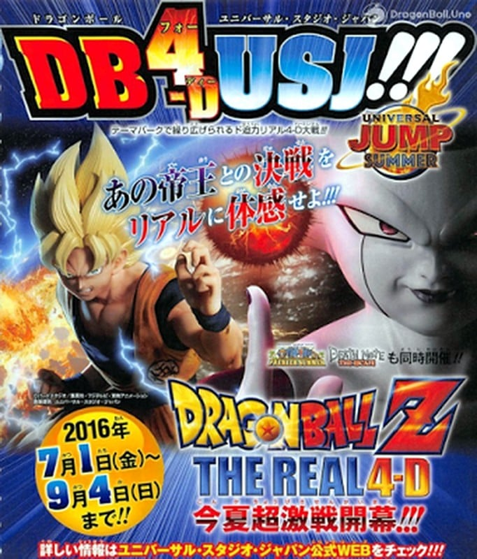

> [!bookinfo|noicon]+ **龙珠Z THE REAL 4D**
> 
>
| 日文名 | ドラゴンボールZ・ザ・リアル 4-D |
|:------: |:------------------------------------------: |
| 类型 | 未知 |
| 新番 | 2016 年 7 月 |
| 集数 | 共0话 |
| 官网 |  |
| 制作 |  |
| 导演 |  |
| 脚本 |  |
| 评分 | 6|
| 制片人 |  |

> [!abstract]+ **简介**
> 『ドラゴンボール』とのコラボレーションでは、同作史上初のフルCGアニメーションによる4Dアトラクション「ドラゴンボールZ・ザ・リアル 4-D」が登場。超サイヤ人・孫悟空と宇宙の帝王・フリーザの大激闘が、パーク完全オリジナルのストーリーとして描かれる。フルCGアニメーションに加え、振動や爆風といった4-D特殊演出によって、比類なき戦闘力で復活したフリーザの容赦ない攻撃や、眼前に迫るド迫力の肉弾戦など、超人バトルを全身で体感できる。

> [!tip]+ **章节列表**
- 暂无章节信息

> [!tip]+ **主要角色**
> 
| 角色 | CV | 简介| 角色图片 |
|:----:|:---:|:---:|:--------:|
| - | - | - | - |