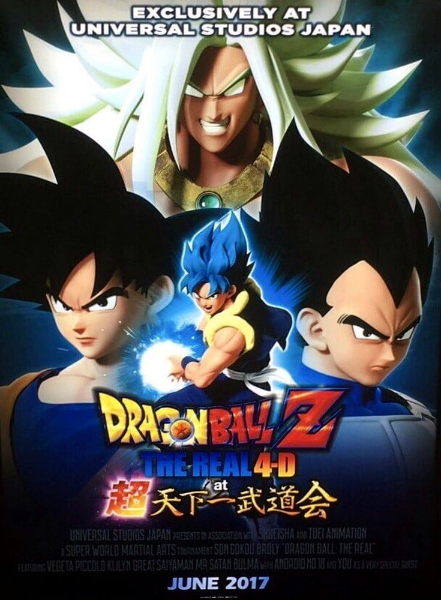

> [!bookinfo|noicon]+ **龙珠Z THE REAL 4D at 超天下一武道会**
> 
>
| 日文名 | ドラゴンボールZ・ザ・リアル 4-D at 超天下一武道会 |
|:------: |:------------------------------------------: |
| 类型 | 未知 |
| 新番 | 2017 年 6 月 |
| 集数 | 共0话 |
| 官网 |  |
| 制作 |  |
| 导演 |  |
| 脚本 |  |
| 评分 | 4.3|
| 制片人 |  |

> [!abstract]+ **简介**
> 2017年6月30日 - 10月1日の期間中、ユニバーサル・スタジオ・ジャパンで開催された。孫悟空とブロリーゴッドとの対決で、孫悟空と共にかめはめ波が撃てる臨場感が味わえる。また、オリジナル3DCG映像で浮遊型観戦ポッドからのリアルで壮絶な空中戦も体感できる。

> [!tip]+ **章节列表**
- 暂无章节信息

> [!tip]+ **主要角色**
> 
| 角色 | CV | 简介| 角色图片 |
|:----:|:---:|:---:|:--------:|
| - | - | - | - |