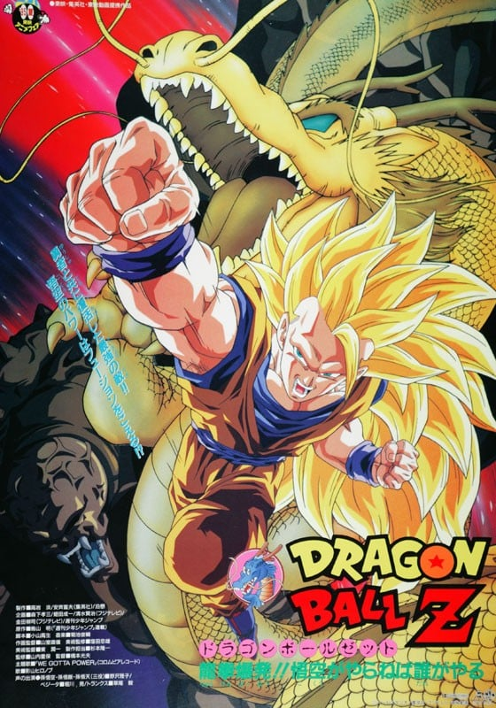
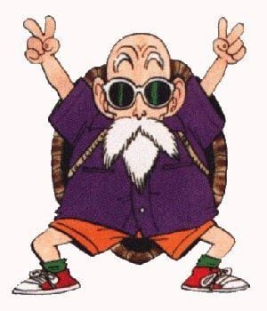
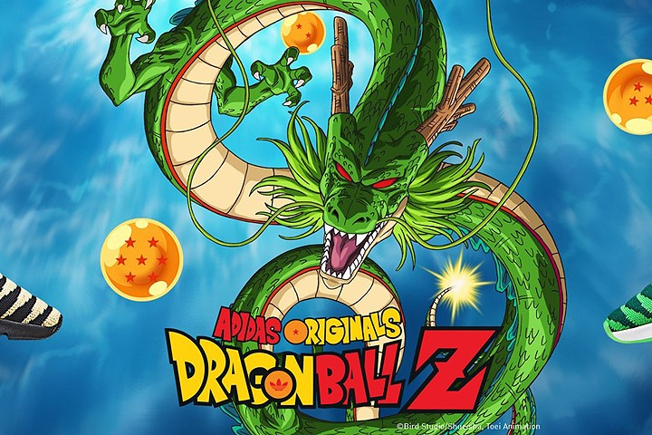
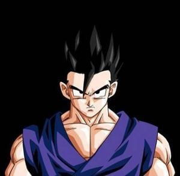
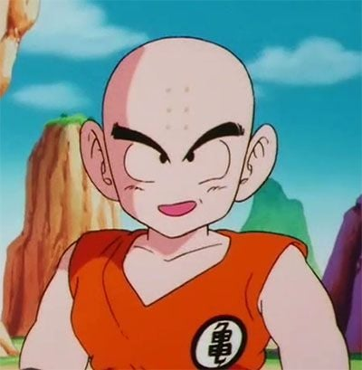
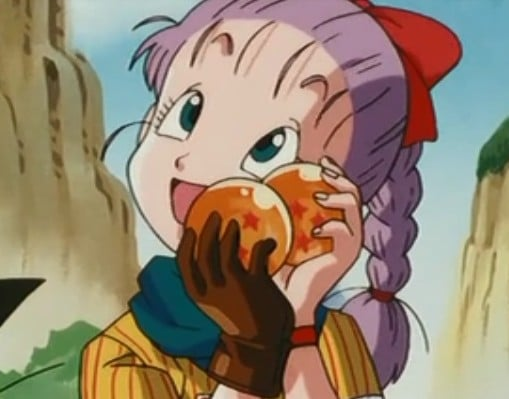
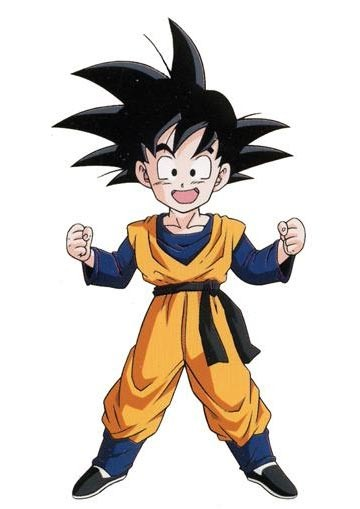
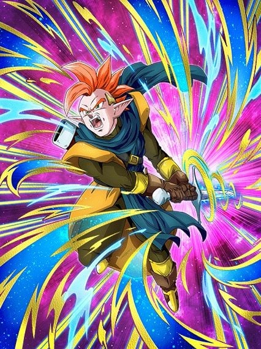
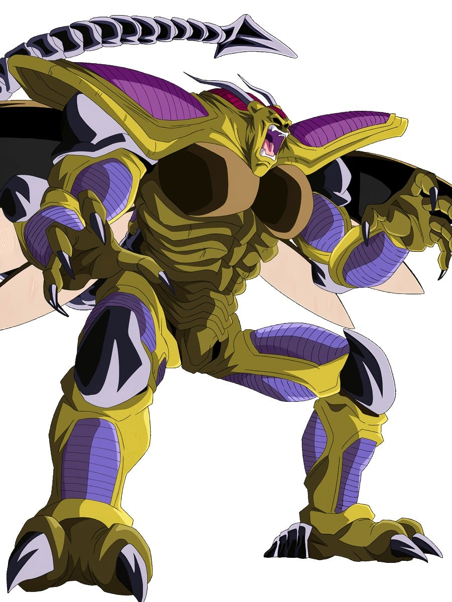
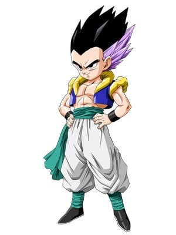

> [!bookinfo|noicon]+ **龙珠Z 龙拳爆发**
> 
>
| 日文名 | ドラゴンボールZ 龍拳爆発!!悟空がやらねば誰がやる |
|:------: |:------------------------------------------: |
| 类型 | 漫改 |
| 新番 | 1995 年 7 月 |
| 集数 | 共1话 |
| 官网 |  |
| 制作 | 東映アニメーション |
| 导演 | 橋本光夫（橋本みつお）,橋本みつお |
| 脚本 | 小山高生 |
| 评分 | 6.8|
| 制片人 |  |

> [!abstract]+ **简介**
> 神秘老人求悟饭帮忙使英雄塔皮欧从盒子中释放，悟饭等人召唤神龙使塔皮欧被释放。但是勇者身上被封印住的魔人也被释放出来并开始破坏，众人先后不敌，特兰克斯拿着勇者之剑切断魔人的尾巴后，超三悟空使出绝技龙拳消灭了魔人。塔皮欧临走前把勇者之剑送给特兰克斯。

> [!tip]+ **章节列表**
>- [ ] 第1话：

> [!tip]+ **主要角色**
> 
| 角色 | CV | 简介| 角色图片 |
|:----:|:---:|:---:|:--------:|
| ベジータ | 堀川りょう | 赛亚人的王子，是一个强壮、骄傲、寂寞而且严肃的人。贝吉塔的妻子是布尔玛，他们生有一子特兰克斯，一女布拉。虽然贝吉塔的自尊心很强，不过他的实力始终不及主角孙悟空。  贝吉塔的名字ベジータ是来自于英文的vegetable,这也和大多数赛亚人的名字来自蔬菜相一致。 |  |
| 亀仙人 | 佐藤正治 | 武天老師（むてんろうし）と称される武術の達人にして、孫悟飯、牛魔王、孫悟空、クリリン、ヤムチャらの師。守銭奴であの世へ自由に出入り出来る占い師・占いババは実姉。身長165cm、体重44kg。エイジ430年生まれで、年齢は319歳（初登場時）～354歳（原作、『ドラゴンボールZ』終了時）。劇中ではピッコロ大魔王編、魔人ブウ編にて2度、死を迎えている。  はげ頭にサングラス、名前の由来となった背負った大きな亀の甲羅がトレードマーク。私服としてアロハシャツを着ることも。仙人とはいうものの、外見からそれらしさを感じさせるものは長く伸びた白い顎鬚と手にしている杖くらいである。体型は痩せ型であるが、甲羅を背負っているシーンでは、かなり恰幅のよい太った体型で描かれている。  好きな食べ物は宅配ピザ、趣味は昼寝、テレビ鑑賞、読書、インターネット（3つともエッチなものが目的）、テレビゲーム。好きな乗り物はエアワゴン。嫌いなものは男。一人称は「わし」。誕生日はいつもいつも誕生日。戦闘力は第22回天下一武道界時が180。スカウターで計測した戦闘力は、ラディッツ襲来の直後で139（通常時）。  普段は南海の孤島のカメハウスで人語を理解するウミガメ、クリリン一家と共に暮らしており、一時はランチも一緒に住んでいた。姉の占いババとは180歳以上年が離れている（ドラゴンボールの世界における年表参照）。ウミガメから「不老不死の薬を飲んだじゃありませんか」と言われたこともあったが、後に事実ではないと判明（後述）。 |  |
| 孫悟空 | 野沢雅子 | 孙悟空是日本漫画《七龙珠》和系列改编动画中登场的主角。重情重义、绝不欺骗朋友、喜欢帮助人。 多次救了地球和全人类。成名绝技有龟派气功、界王拳、元气弹等等。 |  |
| 神龍 | 青森伸 |  |  |
| 孫悟飯 | 野沢雅子 | 青年期は自分の戦力が必要ならば積極的に参戦しているが、ビーデルが天下一武道会参加の話をした時に「そういうのは興味ない」と発言したり、プレイステーション・ポータブル専用のゲーム『ドラゴンボールZ 真武道会』では、「正直、戦うのは好きじゃないが皆を守るためなら頑張れる」と話す場面がある。悟空やベジータのように強さを追求する事には関心が無く、修行をするのは強敵の出現等、必要に駆られた時のみ。そのため、平和な時期が続くと勉強優先で武道家としての修行はしなくなる。だが、ゲームでは勉強の気分転換やコミュニケーションとして悟空やピッコロと組み手をしており、劇場版『ドラゴンボールZ 銀河ギリギリ!!ぶっちぎりの凄い奴』や弟の孫悟天との修行、天下一武道会参加時は楽しんでいる描写がある。また、武道会参加を決める時に「どうせ出るなら優勝したい」と考えたり、悟天やトランクスの超サイヤ人化を知った時に追い抜かれる可能性で焦ったりと、負けず嫌いな部分もある。  チチの教育もあって結婚後は子供の頃からの夢である学者になる。また、アニメのオリジナルエピソードでは青年期にも幼少期同様に恐竜を可愛がっている話がある。学者になった後は修行はしておらず、この時に行われた天下一武道会には出場していない。悟空も悟天には修行をつけたり強制的に武道会に参加させているのに対し、悟飯には言及していない。ピッコロも悟飯を鍛えようとした際に「サイヤ人を倒した後で（学者に）なればいい」と発言しており、ピッコロは悟飯が7年間修行をしていなかった事に対して特に文句を言っておらず、元々悟飯が学者になる事を容認していた。  青年期は悟天と年下のトランクスやデンデ、およびガールフレンドのビーデルには砕けた口調で話す時がある。また、正体を知る前のキビトには「あんた」、スポポビッチには「貴様」「お前」、劇場版で戦ったブロリーに激怒した時は「コノヤロー!」と言うようになり、悪人や正体不明の相手に対しては乱雑になる時がある。ゲーム上での攻撃時ボイスの中にも乱暴的なものがあり、成長とともに性格の細部も微妙に変化している。また、悟空と違い「倒す」ではなく「殺す」と発言している場面も稀にある。  面倒見がよく、悟天やトランクスやデンデと年下の者には慕われており、当初は（超サイヤ人に変身できることがバレたくないためなど）避け気味に接していたビーデルにも丁寧に気のコントロールや舞空術を教え、天下一武道会に至る頃には親密な仲になっている。劇場版では少年期に、動物や奴隷にされていた異星人の世話をしている場面もある。  純粋で素直な面は変わらず子供時代同様に筋斗雲に乗れる。基本的には真面目で堅実で正義感が強く、おっとりとした優等生タイプだが、センスの悪いコスプレを好むなど、天然ボケな面もある。母であるチチ、ブルマやビーデルなど気の強い女性には頭が上がらなかったり、簡単な誘導尋問に引っかかる時も。ブルマ曰く「しっかりしているように見えて、お父さんの血を継いでいる」。だが、悟空のマイペースな言動をたしなめたり、アニメでは無茶をした悟天をアメとムチを使い分けて面倒を見る等しっかり者な長男の面もある。結婚後は落ち着いた大人になっている。  魔人ブウ撃破後のストーリーにあたる劇場版『ドラゴンボールZ 龍拳爆発!!悟空がやらねば誰がやる』では、胡散臭い老人の話をあっさり信じるなどお人よしな部分は健在だが、戦闘で潜在能力を開放すると目つきなど雰囲気が変わり、冷静沈着になる。 |  |
| クリリン | 田中真弓 | 　多林寺弟子（又一说是出身少林）为讨女孩子欢心不远万里划船来找龟仙人习武，与孙悟空为同门师兄弟，早期出镜率较高，曾  前期克林在天下一武道会准决赛和孙悟空决斗，最后输给悟空。之后被比克大魔王的手下铃鼓所杀，后来用龙珠复活。为了备战下一届武道会与其他地球战士到加林塔修行，在三年后的比赛中让短笛刮目相看。再后来克林到那美克星後，被大长老提升潜在功力，那时的战斗力已经强于天津饭，克林也是悟饭的好叔叔，常常在悟饭危急时，出手相救(可惜在悟饭长大后就变成悟饭救他)，他是悟空最好的朋友亦是悟空的死党，他与悟空在龟仙人严厉的训练及武林大会中出生入死，由于他两度被杀，悟空先是为报仇不惜冒死喝下超神水，又一次愤怒变成超级赛亚人。他经常帮助悟空对抗敌人。在沙鲁游戏後和18号结婚，还生了女儿(女儿头发像18号，而且那时小林也长了头发)。在和魔人布欧（魔人普乌）决斗时被变成巧克力吃掉死去，后来被龙珠救活。他在故事的重要性亦在z剧集中赛亚人统治世界中减退。另外在所有z战士中小林也是相貌变化最大的，其他人要么是外星人长相几十年不变要么是单身汉，惟有小林在后期成了老头。 |  |
| ビーデル | 皆口裕子 | 撒旦先生的独生女，实力不错，为人有正义感，喜欢维护正义﹐时常帮助警察们捉贼和救人，后来机缘巧合结识孙悟饭，学会舞空术，并与悟饭相爱。在消灭小布欧不久后，嫁给了孙悟饭，有个女儿小芳。 |  |
| ブルマ | 鶴ひろみ | 布尔玛·布里夫（日文：ブルマ·ブリーフ，英文名：Bulma ，其他译名：布尔玛，布玛，庄子 ），漫画和动画《七龙珠》《龙珠Z》《龙珠GT》中的主要人物。她是一个收集七龙珠为了实现得到浪漫爱情愿望的女孩，收集龙珠的旅途中偶然认识了孙悟空，因而展开了七龙珠的故事。   　年仅16岁的天才科学家、冒险家，万能胶囊公司的千金。是布尔玛最初将孙悟空带出包子山，也是布尔玛教会了天真的小悟空形形色色的常识和礼仪。 布尔玛是孙悟空除了已过世的爷爷外认识的第一个朋友，以及认识的第一位女性。  　　故事一开始，布玛在自己家中找到一颗龙珠，通过调查古书发现集齐七颗龙珠可以召唤能够实现任何愿望的神龙。她为了实现愿望找到白马王子而制作了龙珠雷达，在暑假期间开始寻找龙珠的旅行。布尔玛在包子山寻找龙珠时遇到不肯放下四星球的孙悟空，困扰之时惊讶发现了他的力量和天真，布尔玛决定利用他保护自己。 他们两人在旅途中不断遇到新的朋友和敌人，通过种种冒险集齐龙珠后，不料被皮拉夫一伙抢夺，后来乌龙抢在皮拉夫之前许下了一个想要女生内裤的愿望尔阻止了皮拉夫称霸地球但也让龙珠消散了。不过布尔玛因为在旅途中遇到了乐平所以以后也不再需要寻找龙珠依靠神龙实现愿望了。 在第一部中布玛一直成长到了23岁，后来的冒险中还发生了很多事情。  　　龙珠Z中布玛从28岁成长到了50岁。布尔玛为了复活在赛亚人来袭战役中死亡的战友，决定和小林、悟饭去天神的故乡娜美克星寻找龙珠。最终那美克星被毁，包括那美克星人所有人被神龙传送回了地球。在找到新的星球前布尔玛暂时收留了移居地球的娜美克星人们，一并也收留了后来成为战友的贝吉塔。据未来特兰克斯称，那美克星篇后，布尔玛由于经常会因乐平花心和他吵架，最终还是结束了长达13年的恋情。在弗利萨来到地球的一年半以后，布尔玛和贝吉塔生下了儿子特兰克斯。未来世界的特兰克斯就是乘坐布尔玛制作的时光机来到现在的世界的。布尔玛因为婴儿特兰克斯的眼睛和贝吉塔一样长得有点凶狠所以担心不已，但在得知帅气、友善的神秘少年就是长大后的特兰克斯后松了一口气。在未来世界中的布尔玛和贝吉塔没有结婚，但布欧篇中贝吉塔则有一次将布尔玛称呼为妻子。布欧篇后布尔玛与贝吉塔生下了第二个孩子布拉，她在原作最后的天下第一武道会参观席上登场了。 |  |
| 孫悟天 | 野沢雅子 | 孫悟空とチチの次男であり、孫悟飯の弟。地球人とサイヤ人とのハーフ。悟空がセルとの戦いで死ぬ直前に残していった子供。少年時代の容姿は、父親の悟空に瓜二つだったが、青年になってからは悟空との見分けがつかない為、無理やり髪型を変えている。公式ガイドブックでは、生まれつき尻尾を持たないと解説されている場合と、生まれてすぐに切られたと解説されている場合がある。 |  |
| タピオン | 優希比呂 | 南の銀河、コナッツ星でヒルデガーンを封印した伝説の勇者。ミノシアという弟がいるが、作品冒頭で殺されてしまう。1000年前にコナッツ星で誕生した幻魔人ヒルデガーンをコナッツ星の神から与えられた笛を使ってミノシアと共に抑え込み、神官が上半身・下半身に両断した幻魔人を兄弟2人でそれぞれ封印した。その後、二度とヒルデガーンが蘇らないように体をオルゴールに封印してもらい、それぞれ別々の銀河に流されたが、ヒルデガーン復活を企む魔導師ホイにより下半身の封印が解かれてミノシアは殺され、地球のドラゴンボールにより彼の封印も解かれ悟空たちの前に姿を現す。幻魔人の元となった"魔人様"をコントロールする笛を吹くことで、ヒルデガーンの力を押さえつけ体内に封印することができる。なお、この笛の曲は彼のテーマソングになっている。当初は幻魔人がその身に宿っていることから眠りに就くこともできず、誰も近づけまいと振舞っていたが、そのうちトランクスに心を開き、封印されていたオルゴールをブルマが再現すると約束したことによりカプセルコーポレーションに身を寄せる。しかし一度綻んでしまった封印では歯止めが効かず、下半身と引き合う力でタピオンが封印していた上半身も解放され、ヒルデガーンは完全復活してしまう。劇中では勇者としての使命感から何度か封印している内に自分ごとヒルデガーンを葬るよう頼む場面がある。 戦闘シーンはほとんど無いが、登場時には悟空が「すげえ気だ」と呟き、ベジータですら防いだ後は消耗して意識を失ったヒルデガーンの火炎放射を、封印の笛を吹きながら障壁を張り軽々と凌いで見せた。また、わずかな間だったが完全体となったヒルデガーンを一人で押さえ込んでいる。 最終的には悟空がヒルデガーンを倒し、生き残ったタピオンはブルマのタイムマシンに乗って1000年前に帰還する。その際、自分の剣をトランクスに譲り渡す。 ゲーム『ドラゴンボール ゼノバース2』では、DLCの追加シナリオ「∞の歴史編」でフューに呼び出されて未来トランクスの助っ人として登場。次元は異なるものの未来トランクスを「たくましく成長した」と称賛し、ザマスを封印するべく協力する。最後は弱まったザマスを体内に封印した。 名前の由来はタピオカをもじったもの。タピオン、ミノシアのキャラクターデザインを行った鳥山明がイラストに添えたメモに「“タピオカ”ではあまりにもそのままなので」とある[3]。 |  |
| ヒルデガーン | 青森伸 | 1000年前、コナッツ星の悪の気を吸い取っていた魔人像の霊体が、魔導師たちに邪悪なエネルギーを注ぎ込まれて変身した幻魔人。髑髏のような顔と圧倒的な巨体を持つ。尻尾から人間のエネルギーを吸い取り、戦闘では口から放つ火炎放射と、肉体を自在にエクトプラズム化させ攻撃を回避、攻撃時のみ実体化し[4]相手を翻弄する。蝉のように脱皮し、進化する。コナッツ星を滅亡寸前まで破壊するが、タピオン兄弟が封印のオカリナで力を抑えている隙に、神官の手により、伝説の剣で真っ二つにされた。その後上半身をタピオンに、下半身をミノシアによりそれぞれ封印された。そして年月を経て地球で魔導師ホイの策略により復活を果たす。 最初は下半身のみで現れ街を破壊し、グレートサイヤマンとして駆けつけた悟飯と戦いを繰り広げる。潜在能力を解放した悟飯に一度追い追い詰められた所で、タピオンの封印の笛の音と共に霧散する。その後、上半身の復活により全身の姿が現れる。超サイヤ人3のゴテンクスの「連続死ね死ねミサイル」を食らって1度は沈黙するが、そこから虫のように脱皮し、黒い2本の角、羽の生えたより禍々しい姿の完全体へと進化した。進化後は一瞬で間合いを詰め、超サイヤ人3のゴテンクスをたった一撃で分離に追い込み、さらに進化前以上に実体が読み難くなったことも相まって悟飯やベジータを圧倒し、タピオンの封印の笛の音をもってしても制御不能となるなど猛威を振るう。窮地の中、倒すには攻撃の実体化する一瞬に決めるしかないと見抜いた悟空が放った新技「龍拳」によって倒された。 劇場版公式サイトのマル秘ノートには、ヒルデガーンは超サイヤ人3悟空と対等に渡り合う強敵だが、前作のジャネンバはその超サイヤ人3悟空さえ退けているので、強さでいえば劇場版の敵としては二番目ということになると記載されている[4]。 名前の由来は企画の蛭田成一が「ガーン」とショックを受けるようなデザインをしようとしたこと（蛭田ガーン→ヒルデガーン）から[5][6]。 |  |
| ゴテンクス |  | 悟天和特兰克斯融合后诞生出來的战士 |  |