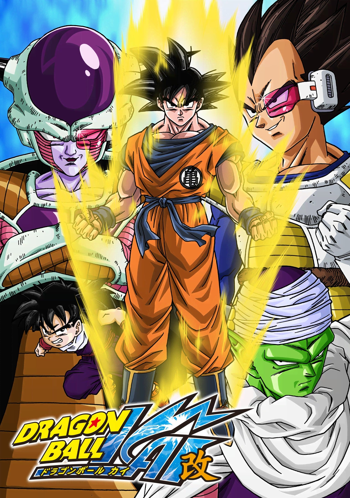
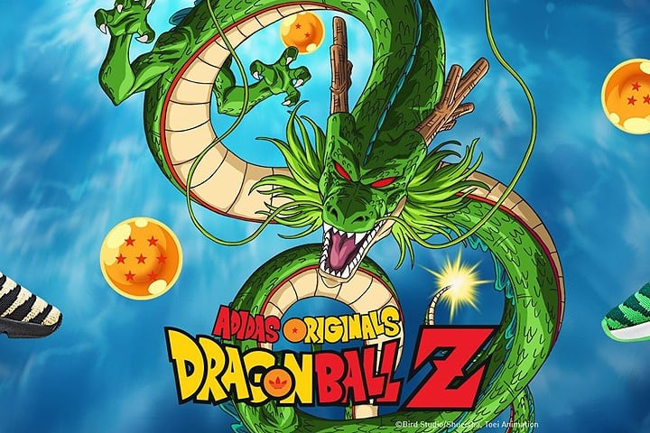
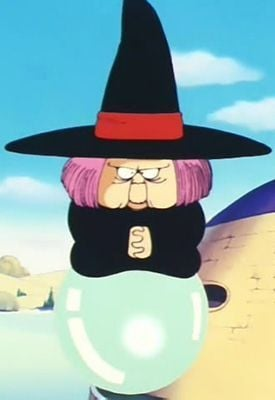
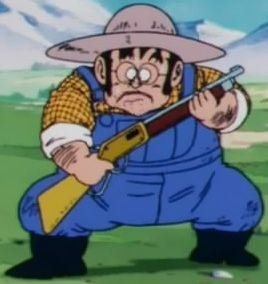
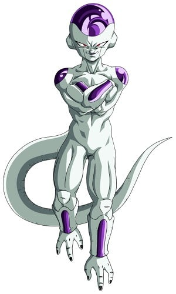
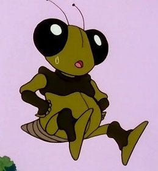

> [!bookinfo|noicon]+ **龙珠改**
> 
>
| 日文名 | ドラゴンボール改 |
|:------: |:------------------------------------------: |
| 类型 | 漫改 |
| 新番 | 2009 年 4 月 |
| 集数 | 共98话 |
| 官网 | [https://www.toei-anim.co.jp/tv/dragon_kai_2009/](https://https://www.toei-anim.co.jp/tv/dragon_kai_2009/) |
| 制作 | 東映アニメーション |
| 导演 |  |
| 脚本 |  |
| 评分 | 7.6|
| 制片人 |  |

> [!abstract]+ **简介**
> 本系列于2009年4月5日开始同系列播出，开播20年为早期作品《七龙珠Z》的再编辑版。除了部分画面、角色和人物造型作出修改外，制作组亦把有关故事浓缩，让剧情发展更流畅。而本作命名为“改”（日语假名：かい）则是代表更新与修改之意。

2009年4月5日起，逢周日于日本富士电视台播放《七龙珠改》。把原本自1989年至1996年播放的《七龙珠Z》，从‘赛亚人篇’开始，为了尽量贴近鸟山明原著漫画的情节，会把原来电视用作“充撑”（动画进度追贴漫画时，因不愿暂停播放而加插的剧情，或故意拉长情节）的加插内容大幅删掉，剧情更加流畅明快。另外，动画会以高解析规格播放，配音和配乐部份会重新制作，尽量邀请原任声优重新配音演绎。

本作只至‘人造人·沙鲁篇’后便停播。直到2014年2月21日官方终于宣布：“将从4月开始播出‘魔人布欧篇’。”并从4月6日开始，每周日早上9点至9点半在日本播出。

> [!tip]+ **章节列表**
>- [ ] 第1话：战斗开幕！孙悟空，我回来了 (2009-04-05)
>- [ ] 第2话：敌人是悟空的哥哥！？最强战士赛亚人的秘密 (2009-04-12)
>- [ ] 第3话：赌上生命的战斗！悟空和短笛舍身猛攻 (2009-04-19)
>- [ ] 第4话：在阴间奔跑吧孙悟空！100万公里的蛇道 (2009-04-26)
>- [ ] 第5话：荒野生存训练！月圆之夜唤醒悟饭 (2009-05-03)
>- [ ] 第6话：到达终点！界王的搞笑训练 (2009-05-10)
>- [ ] 第7话：奋斗10倍重力！悟空啊，修行就是追逐战 (2009-05-17)
>- [ ] 第8话：现身吧神龙！赛亚人终于到达地球 (2009-05-24)
>- [ ] 第9话：乐平奋斗！恐怖的栽培人 (2009-05-31)
>- [ ] 第10话：等着我饺子！天津饭绝叫的气功炮 (2009-06-07)
>- [ ] 第11话：来得及吗孙悟空！？离战斗再开还有3小时 (2009-06-14)
>- [ ] 第12话：短笛流下眼泪…孙悟空愤怒的大反击 (2009-06-21)
>- [ ] 第13话：这就是界王拳！！极限战斗的孙悟空vs贝吉塔 (2009-06-28)
>- [ ] 第14话：冲击龟派气功！贝吉塔执着的大变身 (2009-07-05)
>- [ ] 第15话：陷入危机的悟空！在元气弹上寄托心愿 (2009-07-12)
>- [ ] 第16话：打倒不死身的贝吉塔！创造奇迹吧孙悟饭 (2009-07-19)
>- [ ] 第17话：激战的破晓…希望之星是短笛的故乡 (2009-08-02)
>- [ ] 第18话：云泽比特沉睡的宇宙船！出发，目标那美克星 (2009-08-09)
>- [ ] 第19话：新的强敌！宇宙帝王弗利萨 (2009-08-16)
>- [ ] 第20话：背叛弗利萨！野心燃烧的贝吉塔 (2009-08-23)
>- [ ] 第21话：保卫龙珠！那美克星人总攻击 (2009-08-30)
>- [ ] 第22话：猛追多多利亚的恐怖！向贝吉塔挑明真相 (2009-09-06)
>- [ ] 第23话：暗中活动的贝吉塔！那美克星人惨遭杀戮 (2009-09-13)
>- [ ] 第24话：战友们复活！美战士萨博恶魔的变身 (2009-09-20)
>- [ ] 第25话：小林力量解放！蠢蠢欲动的弗利萨的预感 (2009-09-27)
>- [ ] 第26话：粉碎阴谋！逆袭的贝吉塔vs萨博 (2009-10-04)
>- [ ] 第27话：危机一触即发！悟饭保卫四星珠 (2009-10-11)
>- [ ] 第28话：即将到来的超决战！基纽特种部队参上 (2009-10-18)
>- [ ] 第29话：特种部队先锋！打破古杜的咒缚 (2009-10-25)
>- [ ] 第30话：地狱的利库姆！陪我好好玩吧贝吉塔酱 (2009-11-01)
>- [ ] 第31话：孙悟空终于到达！打倒基纽特种部队 (2009-11-08)
>- [ ] 第32话：强手登场！基纽队长vs孙悟空 (2009-11-15)
>- [ ] 第33话：孙悟空Full Power！基纽还有奇招？ (2009-11-22)
>- [ ] 第34话：惊愕！！悟空变基纽，基纽变悟空！？ (2009-11-29)
>- [ ] 第35话：悟空大逆转！？快出现吧超神龙！ (2009-12-06)
>- [ ] 第36话：激昂，弗利萨逼近！超神龙啊，请实现我的愿望吧！ (2009-12-13)
>- [ ] 第37话：噩梦的超变身！战斗力100万的弗利萨 (2009-12-20)
>- [ ] 第38话：弗利萨凶相毕露！超绝力量袭击悟饭 (2009-12-27)
>- [ ] 第39话：新生短笛登场！激怒弗利萨第二变身 (2010-01-10)
>- [ ] 第40话：弗利萨最后的超变身！超越地狱的恐怖开幕 (2010-01-17)
>- [ ] 第41话：久等的瞬间！孙悟空复活 (2010-01-24)
>- [ ] 第42话：孙悟空打倒弗利萨吧！名门贵族贝吉塔的眼泪 (2010-01-31)
>- [ ] 第43话：孙悟空vs弗利萨！超决战开幕！ (2010-02-07)
>- [ ] 第44话：突破极限的肉搏战！悟空弗利萨基纽再来？ (2010-02-14)
>- [ ] 第45话：20倍界王拳！孤注一掷的龟派气功 (2010-02-21)
>- [ ] 第46话：这是最后的王牌！悟空的特大元气弹 (2010-02-28)
>- [ ] 第47话：觉醒吧传说的战士……超级赛亚人孙悟空！ (2010-03-07)
>- [ ] 第48话：愤怒超级赛亚人！怒吼吧孙悟空！ (2010-03-14)
>- [ ] 第49话：复仇吧孙悟空！星球崩坏倒计时 (2010-03-21)
>- [ ] 第50话：弗利萨决死的全力爆发！实现愿望吧神龙 (2010-03-28)
>- [ ] 第51话：悟空的怒吼！快点实现，起死回生的愿望！ (2010-04-04)
>- [ ] 第52话：快要消失的星球上留下的兩人!這就是最後的決戰啦! (2010-04-11)
>- [ ] 第53话：孙悟空最后的一击……那美克星消逝在宇宙中 (2010-04-18)
>- [ ] 第54话：悟空坠入宇宙……复活吧，超战士们 (2010-04-25)
>- [ ] 第55话：老爸，那就是地球……弗利萨父子反攻 (2010-05-02)
>- [ ] 第56话：我来打倒弗利萨！另一个超级赛亚人 (2010-05-09)
>- [ ] 第57话：孙悟空欢迎回来！迷之少年特兰克斯的告白 (2010-05-16)
>- [ ] 第58话：悟空新招数，瞬间移动！赌上3年后的特训 (2010-05-23)
>- [ ] 第59话：毫无气息的2人组！人造人、出现 (2010-05-30)
>- [ ] 第60话：内在敌人的夹击！？孙悟空vs人造人19号 (2010-06-06)
>- [ ] 第61话：19号毫无胜算！！姗姗来迟的超级贝吉塔 (2010-06-13)
>- [ ] 第62话：比克强袭！！消失的20号和扭曲的未来 (2010-06-20)
>- [ ] 第63话：追击！格罗博士…寻找迷之研究所！ (2010-06-27)
>- [ ] 第64话：17号和18号、以及…！觉醒的人造人们 (2010-07-11)
>- [ ] 第65话：天真烂漫所向无敌！？18号vs贝吉塔 (2010-07-18)
>- [ ] 第66话：恢复一个人的时候到来了…比克最强的决定！ (2010-08-01)
>- [ ] 第67话：另一个时间机器！？布尔玛的推理剧 (2010-08-08)
>- [ ] 第68话：怪物开始行动…出击！超级那美克星人 (2010-08-15)
>- [ ] 第69话：我是你的兄弟！具有悟空气息的怪物 (2010-08-22)
>- [ ] 第70话：周旋的策略、太阳拳！追击人造人沙鲁 (2010-08-29)
>- [ ] 第71话：讨伐神出鬼没的沙鲁！终于复活了、孙悟空 (2010-09-05)
>- [ ] 第72话：超越超级赛亚人！来吧、进入精神时间屋 (2010-09-12)
>- [ ] 第73话：这就是超级那美克星人的力量！17号VS短笛 (2010-09-19)
>- [ ] 第74话：快逃啊17号！短笛、奋不顾身的抗战 (2010-09-26)
>- [ ] 第75话：实力未知数！沉默的战士16号、行动 (2010-10-03)
>- [ ] 第76话：天津饭、视死如归的气功炮！拯救战友、孙悟空 (2010-10-10)
>- [ ] 第77话：超越超级赛亚人！无所畏惧的贝吉塔、讨伐沙鲁 (2010-10-17)
>- [ ] 第78话：沙鲁气息的懊悔！小林、去破坏18号吧 (2010-10-24)
>- [ ] 第79话：然后最壊的情况来临…沙鲁、向18号袭来！ (2010-10-31)
>- [ ] 第80话：形势逆转！完全体沙鲁、终于行动 (2010-11-07)
>- [ ] 第81话：贝吉塔全力的一击！可是却增涨了沙鲁的恐怖 (2010-11-14)
>- [ ] 第82话：超级力量觉醒！超越父亲贝吉塔的特兰克斯 (2010-11-21)
>- [ ] 第83话：电视频道被占据！沙鲁游戏开始放送 (2010-11-28)
>- [ ] 第84话：修行完成！悟空、打倒沙鲁绰绰有余？！ (2010-12-05)
>- [ ] 第85话：失去平静的休息时光！防卫军、向沙鲁发动总攻击 (2010-12-12)
>- [ ] 第86话：新的天神！七龙珠终于复活 (2010-12-19)
>- [ ] 第87话：撒旦军团大暴动！沙鲁游戏开幕 (2010-12-26)
>- [ ] 第88话：决战！沙鲁对孙悟空 (2011-01-09)
>- [ ] 第89话：最高级的战斗！打倒沙鲁吧、孙悟空 (2011-01-16)
>- [ ] 第90话：死战的终结！悟空决断的时侯! (2011-01-23)
>- [ ] 第91话：愤怒的悟饭！沉睡的力量解放 (2011-01-30)
>- [ ] 第92话：消失在空中的眼泪！悟饭、愤怒的超觉醒 (2011-02-06)
>- [ ] 第93话：不再迷茫的斗志！悟饭、粉碎小沙鲁 (2011-02-13)
>- [ ] 第94话：完全体崩坏！炸裂、愤怒的超铁拳 (2011-02-20)
>- [ ] 第95话：再见了大家！这是拯救地球的唯一方法 (2011-03-06)
>- [ ] 第96话：齐心协力！最强也是最后的龟派气功 (2011-03-20)
>- [ ] 第97话：欢笑的离别！迈向新的一天… (2011-03-27)
>- [ ] 第98话：未来迎来和平！悟空之魂永存

> [!tip]+ **主要角色**
> 
| 角色 | CV | 简介| 角色图片 |
|:----:|:---:|:---:|:--------:|
| ベジータ | 堀川りょう | 赛亚人的王子，是一个强壮、骄傲、寂寞而且严肃的人。贝吉塔的妻子是布尔玛，他们生有一子特兰克斯，一女布拉。虽然贝吉塔的自尊心很强，不过他的实力始终不及主角孙悟空。  贝吉塔的名字ベジータ是来自于英文的vegetable,这也和大多数赛亚人的名字来自蔬菜相一致。 |  |
| 亀仙人 | 佐藤正治 | 武天老師（むてんろうし）と称される武術の達人にして、孫悟飯、牛魔王、孫悟空、クリリン、ヤムチャらの師。守銭奴であの世へ自由に出入り出来る占い師・占いババは実姉。身長165cm、体重44kg。エイジ430年生まれで、年齢は319歳（初登場時）～354歳（原作、『ドラゴンボールZ』終了時）。劇中ではピッコロ大魔王編、魔人ブウ編にて2度、死を迎えている。  はげ頭にサングラス、名前の由来となった背負った大きな亀の甲羅がトレードマーク。私服としてアロハシャツを着ることも。仙人とはいうものの、外見からそれらしさを感じさせるものは長く伸びた白い顎鬚と手にしている杖くらいである。体型は痩せ型であるが、甲羅を背負っているシーンでは、かなり恰幅のよい太った体型で描かれている。  好きな食べ物は宅配ピザ、趣味は昼寝、テレビ鑑賞、読書、インターネット（3つともエッチなものが目的）、テレビゲーム。好きな乗り物はエアワゴン。嫌いなものは男。一人称は「わし」。誕生日はいつもいつも誕生日。戦闘力は第22回天下一武道界時が180。スカウターで計測した戦闘力は、ラディッツ襲来の直後で139（通常時）。  普段は南海の孤島のカメハウスで人語を理解するウミガメ、クリリン一家と共に暮らしており、一時はランチも一緒に住んでいた。姉の占いババとは180歳以上年が離れている（ドラゴンボールの世界における年表参照）。ウミガメから「不老不死の薬を飲んだじゃありませんか」と言われたこともあったが、後に事実ではないと判明（後述）。 |  |
| 孫悟空 | 野沢雅子 | 孙悟空是日本漫画《七龙珠》和系列改编动画中登场的主角。重情重义、绝不欺骗朋友、喜欢帮助人。 多次救了地球和全人类。成名绝技有龟派气功、界王拳、元气弹等等。 |  |
| 海ガメ | 藤本たかひろ | 人語を喋る海亀。 山の中で迷子になっていたところを悟空に助けられ、そのお礼に亀仙人を悟空たちの元へ連れて来た。真面目な性格で、亀仙人のスケベな言動を諫めるお目付け役のような存在。 |  |
| ウーロン | 龍田直樹 | エイジ733年生まれ。身長121cm、体重32kg。趣味はパンティー集め。好きなものは女。嫌いなものは男とブス、ブタ肉  様々なものに変化できるスケベな子ブタ。女の子を誘拐して、自分の嫁にしようとしていたが悟空に懲らしめられ仲間になる。登場当初は人民服のような服と帽子を着用。南部変身幼稚園出身で変身能力を学んでいたが、先生のパンツを全部盗んで幼稚園から逃げ出した結果、追い出された過去を持つ[4]。このため変身時間は5分しか持たず、変身後は1分の休憩を要する。また、姿は化けられてもその能力（具体的には、本物どおりの強度）までを有することはできないが、コウモリやロケットに化けた際に飛行能力を有している場面がある。  プーアルとは幼稚園時代の同級生で、幼稚園の頃プーアルがふざけて女の子に変身しているとき「かわいいお嬢さん、俺とつきあわないか!?フフン」と話しかけたのが最初の出会い。2丁目に住んでいる同級生のゼンマイからは「ギャングのウー公」と呼ばれており、プーアルの宿題を何度かぶん取っていた。授業でたまにボンギツネ先生がすごく短いスカートを履いてくるのを楽しみにしていた。  臆病かつめんどくさがり屋な性格でもあり、ピッコロ大魔王の世界征服の報道を見た後も「自分には関係ない」と発言したこともある。また男は嫌いと言いながらも悟空との再会を喜んだり、劇場版では悟飯やクリリンと行動を共にすることも多い。アニメでは八角村の出身という設定が付けられ、その村では豚型の人間が多数住んでおり、ウーロンもその住人の一人であり、このときからスケベだった。  名前の由来は、ウーロン。 |  |
| 神龍 | 内海賢二 |  |  |
| 占いババ | 田中真弓 | 龟仙人的姐姐 |  |
| 農夫 | 園部啓一 | 被拉蒂兹评价为“战斗力只有5的渣渣”的存在。 |  |
| フリーザ | 中尾隆聖 |  |  |
| 孫悟飯 | 野沢雅子 | 青年期は自分の戦力が必要ならば積極的に参戦しているが、ビーデルが天下一武道会参加の話をした時に「そういうのは興味ない」と発言したり、プレイステーション・ポータブル専用のゲーム『ドラゴンボールZ 真武道会』では、「正直、戦うのは好きじゃないが皆を守るためなら頑張れる」と話す場面がある。悟空やベジータのように強さを追求する事には関心が無く、修行をするのは強敵の出現等、必要に駆られた時のみ。そのため、平和な時期が続くと勉強優先で武道家としての修行はしなくなる。だが、ゲームでは勉強の気分転換やコミュニケーションとして悟空やピッコロと組み手をしており、劇場版『ドラゴンボールZ 銀河ギリギリ!!ぶっちぎりの凄い奴』や弟の孫悟天との修行、天下一武道会参加時は楽しんでいる描写がある。また、武道会参加を決める時に「どうせ出るなら優勝したい」と考えたり、悟天やトランクスの超サイヤ人化を知った時に追い抜かれる可能性で焦ったりと、負けず嫌いな部分もある。  チチの教育もあって結婚後は子供の頃からの夢である学者になる。また、アニメのオリジナルエピソードでは青年期にも幼少期同様に恐竜を可愛がっている話がある。学者になった後は修行はしておらず、この時に行われた天下一武道会には出場していない。悟空も悟天には修行をつけたり強制的に武道会に参加させているのに対し、悟飯には言及していない。ピッコロも悟飯を鍛えようとした際に「サイヤ人を倒した後で（学者に）なればいい」と発言しており、ピッコロは悟飯が7年間修行をしていなかった事に対して特に文句を言っておらず、元々悟飯が学者になる事を容認していた。  青年期は悟天と年下のトランクスやデンデ、およびガールフレンドのビーデルには砕けた口調で話す時がある。また、正体を知る前のキビトには「あんた」、スポポビッチには「貴様」「お前」、劇場版で戦ったブロリーに激怒した時は「コノヤロー!」と言うようになり、悪人や正体不明の相手に対しては乱雑になる時がある。ゲーム上での攻撃時ボイスの中にも乱暴的なものがあり、成長とともに性格の細部も微妙に変化している。また、悟空と違い「倒す」ではなく「殺す」と発言している場面も稀にある。  面倒見がよく、悟天やトランクスやデンデと年下の者には慕われており、当初は（超サイヤ人に変身できることがバレたくないためなど）避け気味に接していたビーデルにも丁寧に気のコントロールや舞空術を教え、天下一武道会に至る頃には親密な仲になっている。劇場版では少年期に、動物や奴隷にされていた異星人の世話をしている場面もある。  純粋で素直な面は変わらず子供時代同様に筋斗雲に乗れる。基本的には真面目で堅実で正義感が強く、おっとりとした優等生タイプだが、センスの悪いコスプレを好むなど、天然ボケな面もある。母であるチチ、ブルマやビーデルなど気の強い女性には頭が上がらなかったり、簡単な誘導尋問に引っかかる時も。ブルマ曰く「しっかりしているように見えて、お父さんの血を継いでいる」。だが、悟空のマイペースな言動をたしなめたり、アニメでは無茶をした悟天をアメとムチを使い分けて面倒を見る等しっかり者な長男の面もある。結婚後は落ち着いた大人になっている。  魔人ブウ撃破後のストーリーにあたる劇場版『ドラゴンボールZ 龍拳爆発!!悟空がやらねば誰がやる』では、胡散臭い老人の話をあっさり信じるなどお人よしな部分は健在だが、戦闘で潜在能力を開放すると目つきなど雰囲気が変わり、冷静沈着になる。 |  |
| バブルス | 藤本たかひろ |  |  |
| グレゴリー | 沼田祐介 |  |  |