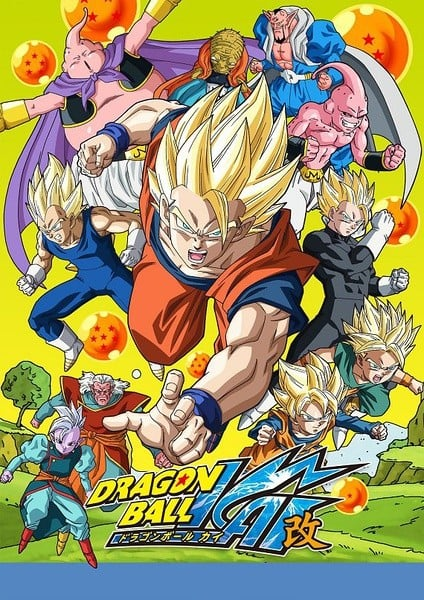
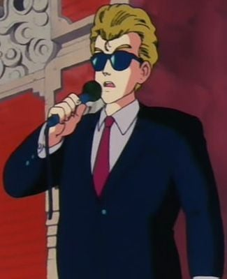
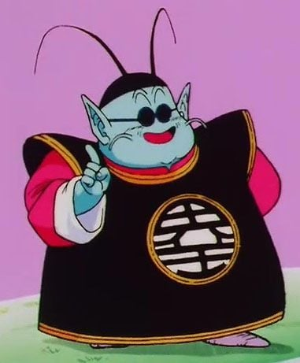
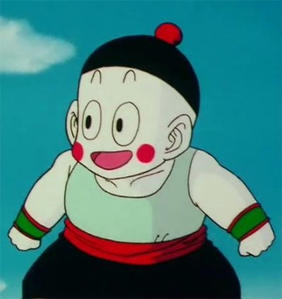
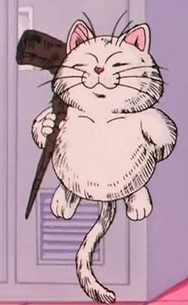
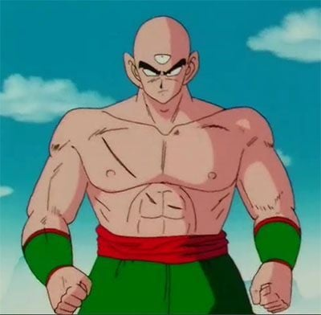
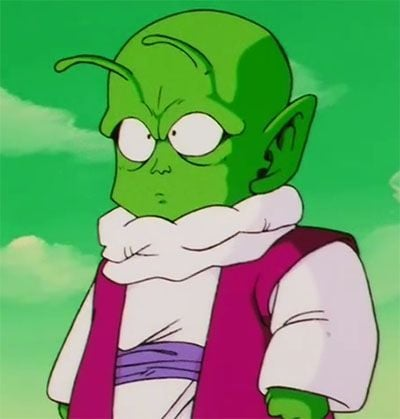
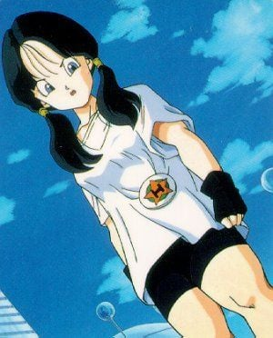

> [!bookinfo|noicon]+ **龙珠改 魔人布欧篇**
> 
>
| 日文名 | ドラゴンボール改 魔人ブウ編 |
|:------: |:------------------------------------------: |
| 类型 | 漫改 |
| 新番 | 2014 年 4 月 |
| 集数 | 共61话 |
| 官网 | [http://www.toei-anim.co.jp/tv/dragon_kai/](https://http://www.toei-anim.co.jp/tv/dragon_kai/) |
| 制作 | 東映アニメーション |
| 导演 |  |
| 脚本 |  |
| 评分 | 7.5|
| 制片人 |  |

> [!abstract]+ **简介**
> 

> [!tip]+ **章节列表**
>- [ ] 第99话：那之后7年！今天开始悟饭是高中生 (2014-04-06)
>- [ ] 第100话：被发现了！新英雄是孙悟饭 (2014-04-13)
>- [ ] 第101话：悟饭是老师！比迪尔的舞空术入门 (2014-04-20)
>- [ ] 第102话：Dragon Team全员集合！归来的孙悟空！！ (2014-04-27)
>- [ ] 第103话：大家吃惊了！悟天和特兰克斯的激战！！ (2014-05-04)
>- [ ] 第104话：波澜起伏的预感…谜之战士出现！！ (2014-05-11)
>- [ ] 第105话：怎么了比克！！第一回合意外的结果 (2014-05-18)
>- [ ] 第106话：比迪尔惨败 悟饭压不住的怒气！！ (2014-05-25)
>- [ ] 第107话：令人恐怖的魔人秘密 黑幕出现！！ (2014-06-01)
>- [ ] 第108话：极恶魔导士巴菲迪亚和黑暗魔界的王达普拉的圈套 (2014-06-08)
>- [ ] 第109话：不要小看超级赛亚人！贝吉塔和悟空能量全开！ (2014-06-15)
>- [ ] 第110话：天下第一会是谁的！？混战的决赛！！ (2014-06-22)
>- [ ] 第111话：后生可畏！！大苦战的18号 (2014-06-29)
>- [ ] 第112话：真打登场！展开进攻的魔王！！ (2014-07-06)
>- [ ] 第113话：复活吧邪恶之心 破坏王子贝吉塔！ (2014-07-13)
>- [ ] 第114话：最强是我！激战 悟空VS贝吉塔 (2014-07-20)
>- [ ] 第115话：复活前的倒计时 击碎巴菲迪的美梦吧！ (2014-08-03)
>- [ ] 第116话：解开的封印！？悟饭抵抗的龟派气功 (2014-08-10)
>- [ ] 第117话：直面绝望！？魔人布欧的恐怖之处 (2014-08-17)
>- [ ] 第118话：变成零食吧！饥饿魔人的恐怖能量 (2014-08-24)
>- [ ] 第119话：我来收拾掉魔人布欧 贝吉塔最后的死战！ (2014-08-31)
>- [ ] 第120话：为了所爱…高傲战士的最后时刻！ (2014-09-07)
>- [ ] 第121话：恶梦再来 不死之身的怪物 魔人布欧！ (2014-09-14)
>- [ ] 第122话：打倒布欧的秘策 其名为融合！ (2014-09-21)
>- [ ] 第123话：终于看见了！微弱的希望 觉醒吧战士们！！ (2014-09-28)
>- [ ] 第124话：寻找阻碍者 巴比迪的复仇作战开始！ (2014-10-05)
>- [ ] 第125话：试炼之时 获得传说之力吧！ (2014-10-12)
>- [ ] 第126话：阻止魔人布欧 极限！超级赛亚人3！！ (2014-10-19)
>- [ ] 第127话：初见真正的价值 逆反的布欧！ (2014-10-26)
>- [ ] 第128话：造型太丑！？特训、融合的姿势！ (2014-11-02)
>- [ ] 第129话：再见 各位！！孙悟空回到那个世界去了 (2014-11-09)
>- [ ] 第130话：找到了、悟饭！在界王神界的猛特训！ (2014-11-16)
>- [ ] 第131话：诞生！！合体超战士 其名为 悟天克斯！！ (2014-11-23)
>- [ ] 第132话：能打倒魔人的是谁？ 最强的男人出动！！ (2014-11-30)
>- [ ] 第133话：能力提升还在继续！？完成！超级悟天克斯！ (2014-12-07)
>- [ ] 第134话：由愤怒而生的 另一个魔人！ (2014-12-14)
>- [ ] 第135话：布欧吃了布欧 新魔人袭来！！ (2014-12-21)
>- [ ] 第136话：向悲惨结局勇往直前！倒计时1小时！！ (2014-12-28)
>- [ ] 第137话：特训结束！这样就结束了魔人布欧 (2015-01-11)
>- [ ] 第138话：用鬼魂来击退布欧 必杀！神风拳！！ (2015-01-18)
>- [ ] 第139话：悟天克斯的隐藏绝技 变身！超悟天克斯3！！ (2015-01-25)
>- [ ] 第140话：忘乎所以！布欧布欧排球！ (2015-02-01)
>- [ ] 第141话：大家久等了！新生悟饭，朝地球进发！！ (2015-02-08)
>- [ ] 第142话：压倒布欧！ 究极悟饭的超级力量！！ (2015-02-15)
>- [ ] 第143话：布欧的诡计 吸收悟天克斯！？ (2015-03-01)
>- [ ] 第144话：大界王神的好主意！复活吧孙悟空！！ (2015-03-15)
>- [ ] 第145话：奇迹只有一次… 悟空和那家伙的超合体能行吗 (2015-03-22)
>- [ ] 第146话：天下无敌！究极战士贝吉特 (2015-03-29)
>- [ ] 第147话：布欧的绝招！被吸收了的战士们！！ (2015-04-05)
>- [ ] 第148话：救出悟饭他们！悟空和贝吉塔的潜入作战！ (2015-04-12)
>- [ ] 第149话：从体内紧急逃出！ 布欧最坏的逆变身！！ (2015-04-19)
>- [ ] 第150话：消灭地球！！ 初始布欧的残酷一击 (2015-04-26)
>- [ ] 第151话：最后的顶级决战！ 在界王神界做出了结！！ (2015-05-03)
>- [ ] 第152话：加油啊 卡卡罗特！ 你是No.1！！ (2015-05-10)
>- [ ] 第153话：决战在一分钟 贝吉塔赌上生命争取时间！ (2015-05-17)
>- [ ] 第154话：灵机闪现的秘密计谋 给我实现2个愿望吧！ (2015-05-24)
>- [ ] 第155话：把元气分给我吧！ 做出巨大的元气弹！！ (2015-05-31)
>- [ ] 第156话：世界的救世主就是你！ 大家的元气弹完成了！！ (2015-06-07)
>- [ ] 第157话：真不愧是最强孙悟空！！ 消灭魔人布欧 (2015-06-14)
>- [ ] 第158话：10年后…… 久违的天下第一武道会！ (2015-06-21)
>- [ ] 第159话：要更强！ 悟空的梦想不会结束！！ (2015-06-28)

> [!tip]+ **主要角色**
> 
| 角色 | CV | 简介| 角色图片 |
|:----:|:---:|:---:|:--------:|
| ベジータ | 堀川りょう | 赛亚人的王子，是一个强壮、骄傲、寂寞而且严肃的人。贝吉塔的妻子是布尔玛，他们生有一子特兰克斯，一女布拉。虽然贝吉塔的自尊心很强，不过他的实力始终不及主角孙悟空。  贝吉塔的名字ベジータ是来自于英文的vegetable,这也和大多数赛亚人的名字来自蔬菜相一致。 |  |
| 孫悟空 | 野沢雅子 | 孙悟空是日本漫画《七龙珠》和系列改编动画中登场的主角。重情重义、绝不欺骗朋友、喜欢帮助人。 多次救了地球和全人类。成名绝技有龟派气功、界王拳、元气弹等等。 |  |
| スノ | 田中真弓 |  |  |
| 海ガメ |  | 人語を喋る海亀。 山の中で迷子になっていたところを悟空に助けられ、そのお礼に亀仙人を悟空たちの元へ連れて来た。真面目な性格で、亀仙人のスケベな言動を諫めるお目付け役のような存在。 |  |
| 司会者 | 内海賢二 |  |  |
| 孫悟飯 | 野沢雅子 | 青年期は自分の戦力が必要ならば積極的に参戦しているが、ビーデルが天下一武道会参加の話をした時に「そういうのは興味ない」と発言したり、プレイステーション・ポータブル専用のゲーム『ドラゴンボールZ 真武道会』では、「正直、戦うのは好きじゃないが皆を守るためなら頑張れる」と話す場面がある。悟空やベジータのように強さを追求する事には関心が無く、修行をするのは強敵の出現等、必要に駆られた時のみ。そのため、平和な時期が続くと勉強優先で武道家としての修行はしなくなる。だが、ゲームでは勉強の気分転換やコミュニケーションとして悟空やピッコロと組み手をしており、劇場版『ドラゴンボールZ 銀河ギリギリ!!ぶっちぎりの凄い奴』や弟の孫悟天との修行、天下一武道会参加時は楽しんでいる描写がある。また、武道会参加を決める時に「どうせ出るなら優勝したい」と考えたり、悟天やトランクスの超サイヤ人化を知った時に追い抜かれる可能性で焦ったりと、負けず嫌いな部分もある。  チチの教育もあって結婚後は子供の頃からの夢である学者になる。また、アニメのオリジナルエピソードでは青年期にも幼少期同様に恐竜を可愛がっている話がある。学者になった後は修行はしておらず、この時に行われた天下一武道会には出場していない。悟空も悟天には修行をつけたり強制的に武道会に参加させているのに対し、悟飯には言及していない。ピッコロも悟飯を鍛えようとした際に「サイヤ人を倒した後で（学者に）なればいい」と発言しており、ピッコロは悟飯が7年間修行をしていなかった事に対して特に文句を言っておらず、元々悟飯が学者になる事を容認していた。  青年期は悟天と年下のトランクスやデンデ、およびガールフレンドのビーデルには砕けた口調で話す時がある。また、正体を知る前のキビトには「あんた」、スポポビッチには「貴様」「お前」、劇場版で戦ったブロリーに激怒した時は「コノヤロー!」と言うようになり、悪人や正体不明の相手に対しては乱雑になる時がある。ゲーム上での攻撃時ボイスの中にも乱暴的なものがあり、成長とともに性格の細部も微妙に変化している。また、悟空と違い「倒す」ではなく「殺す」と発言している場面も稀にある。  面倒見がよく、悟天やトランクスやデンデと年下の者には慕われており、当初は（超サイヤ人に変身できることがバレたくないためなど）避け気味に接していたビーデルにも丁寧に気のコントロールや舞空術を教え、天下一武道会に至る頃には親密な仲になっている。劇場版では少年期に、動物や奴隷にされていた異星人の世話をしている場面もある。  純粋で素直な面は変わらず子供時代同様に筋斗雲に乗れる。基本的には真面目で堅実で正義感が強く、おっとりとした優等生タイプだが、センスの悪いコスプレを好むなど、天然ボケな面もある。母であるチチ、ブルマやビーデルなど気の強い女性には頭が上がらなかったり、簡単な誘導尋問に引っかかる時も。ブルマ曰く「しっかりしているように見えて、お父さんの血を継いでいる」。だが、悟空のマイペースな言動をたしなめたり、アニメでは無茶をした悟天をアメとムチを使い分けて面倒を見る等しっかり者な長男の面もある。結婚後は落ち着いた大人になっている。  魔人ブウ撃破後のストーリーにあたる劇場版『ドラゴンボールZ 龍拳爆発!!悟空がやらねば誰がやる』では、胡散臭い老人の話をあっさり信じるなどお人よしな部分は健在だが、戦闘で潜在能力を開放すると目つきなど雰囲気が変わり、冷静沈着になる。 |  |
| 北の界王 | 八奈見乗児 | 负责管理北银河的神 |  |
| 餃子 | 江森浩子 |  |  |
| カリン | 永井一郎 |  |  |
| 天津飯 | 緑川光 |  |  |
| デンデ | 平野綾 |  |  |
| ビーデル | 柿沼紫乃 | 撒旦先生的独生女，实力不错，为人有正义感，喜欢维护正义﹐时常帮助警察们捉贼和救人，后来机缘巧合结识孙悟饭，学会舞空术，并与悟饭相爱。在消灭小布欧不久后，嫁给了孙悟饭，有个女儿小芳。 |  |