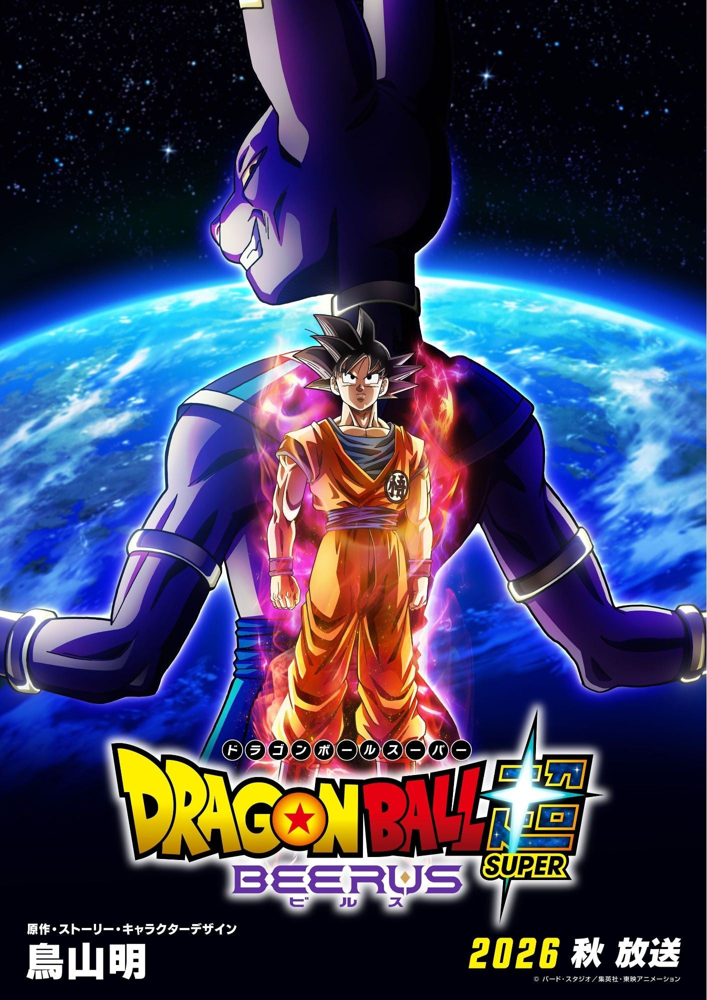
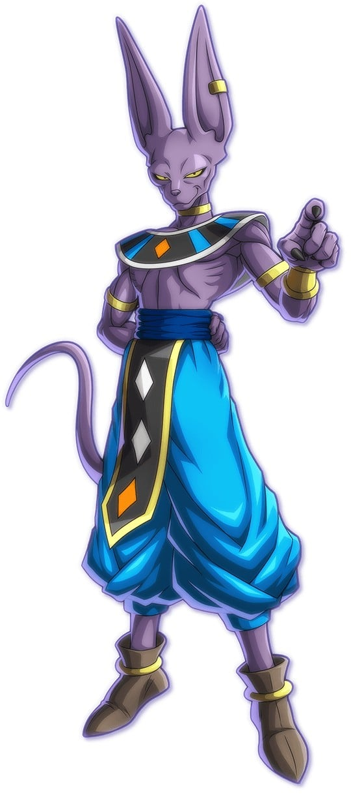

> [!bookinfo|noicon]+ **龙珠超 比鲁斯**
> 
>
| 日文名 | ドラゴンボール超 ビルス |
|:------: |:------------------------------------------: |
| 类型 | 漫改 |
| 新番 | 0 年 0 月 |
| 集数 | 共0话 |
| 官网 | [https://dragonball-super.com/](https://https://dragonball-super.com/) |
| 制作 |  |
| 导演 |  |
| 脚本 |  |
| 评分 | 0|
| 制片人 |  |

> [!abstract]+ **简介**
> 鳥山明先生による世界的大人気漫画作品『DRAGON BALL』（ドラゴンボール）。TVアニメ・映画・ゲームなど様々なメディアミックスでファンを魅了しながら、モンスタータイトルとして全世界で桁外れの人気を誇る。
そして、2026年―。鳥山明先生が原作・ストーリー・キャラクターデザインを手掛けるアニメ『ドラゴンボール超』が『ドラゴンボール超 ビルス』として新たに始動！ 本作では、大幅な新規カットの追加や描き直し、さらに物語の再構築を行い“エンハンスド”。最新の映像表現により、バトルシーンのさらなる臨場感と、より精密な原作再現がほどこされたエンハンスド版としてここに登場する。

魔人ブウとの壮絶な闘いから数年が経ち、地球は束の間の平和を取り戻していた。
時を同じくして、長い眠りから目覚めた破壊神・ビルス。
星々を破壊する圧倒的な力を持つビルスの目覚めを、界王や界王神たちですら畏れをもって見守っていたのだが…そのさなか、フリーザを倒したサイヤ人の噂を聞きつけたビルスは、突如悟空の前に現れるー。
かつてない力を持つビルスの襲来により、消滅の危機に直面する地球・・・破壊神と悟空たちの宇宙を揺るがす超絶バトルが幕を開ける――。

> [!tip]+ **章节列表**
- 暂无章节信息

> [!tip]+ **主要角色**
> 
| 角色 | CV | 简介| 角色图片 |
|:----:|:---:|:---:|:--------:|
| 孫悟空 | 野沢雅子 | 孙悟空是日本漫画《七龙珠》和系列改编动画中登场的主角。重情重义、绝不欺骗朋友、喜欢帮助人。 多次救了地球和全人类。成名绝技有龟派气功、界王拳、元气弹等等。 |  |
| ビルス |  | 维持第7宇宙的平衡，执掌破坏的神。一旦心情不好就会以压倒性的力量将周围的星球和生命破坏。非常喜欢美味的食物。寻找着在梦中见到的、可能成为自己对手的超级赛亚人之神。 |  |