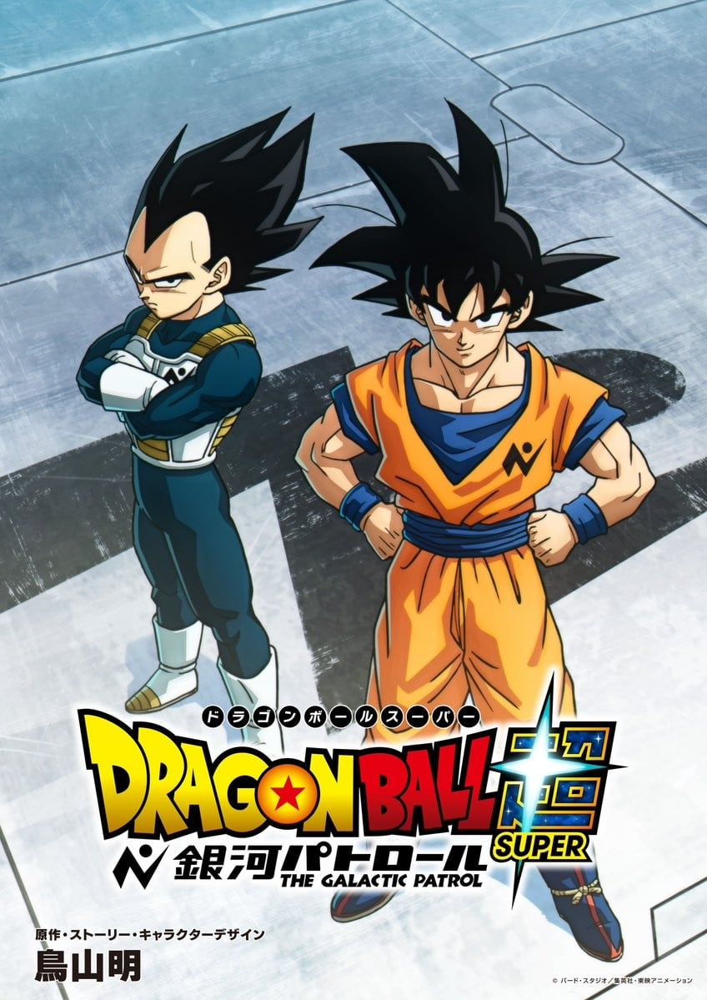

> [!bookinfo|noicon]+ **龙珠超 银河巡警篇**
> 
>
| 日文名 | ドラゴンボール超 銀河パトロール |
|:------: |:------------------------------------------: |
| 类型 | 漫改 |
| 新番 | 0 年 0 月 |
| 集数 | 共0话 |
| 官网 |  |
| 制作 | 東映アニメーション |
| 导演 |  |
| 脚本 |  |
| 评分 | 7|
| 制片人 |  |

> [!abstract]+ **简介**
> 

> [!tip]+ **章节列表**
- 暂无章节信息

> [!tip]+ **主要角色**
> 
| 角色 | CV | 简介| 角色图片 |
|:----:|:---:|:---:|:--------:|
| ベジータ |  | 赛亚人的王子，是一个强壮、骄傲、寂寞而且严肃的人。贝吉塔的妻子是布尔玛，他们生有一子特兰克斯，一女布拉。虽然贝吉塔的自尊心很强，不过他的实力始终不及主角孙悟空。  贝吉塔的名字ベジータ是来自于英文的vegetable,这也和大多数赛亚人的名字来自蔬菜相一致。 |  |
| 孫悟空 | 野沢雅子 | 孙悟空是日本漫画《七龙珠》和系列改编动画中登场的主角。重情重义、绝不欺骗朋友、喜欢帮助人。 多次救了地球和全人类。成名绝技有龟派气功、界王拳、元气弹等等。 |  |
| 加克 | 花江夏樹 | 加克是鸟山明的作品《银河巡警加克》、《龙珠Z：复活的F》和《龙珠超》中的角色，由花江夏树配音，是一个正义热血的战士。 |  |